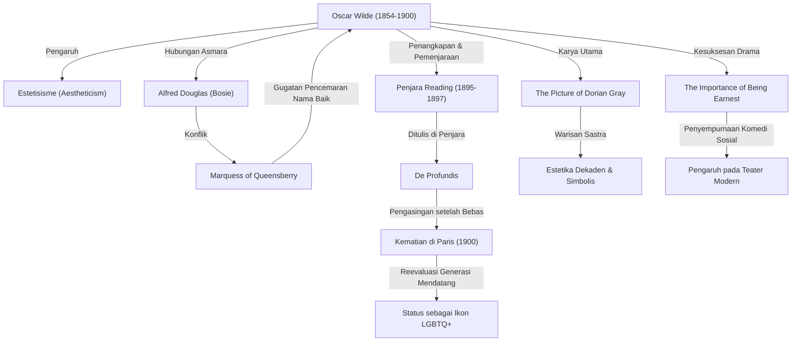

Dalam dunia sastra Inggris pada akhir abad ke-19, Oscar Wilde adalah seorang penulis yang bersinar lebih gemilang daripada siapa pun, namun juga jatuh ke titik terendah yang paling kelam. Filosofi estetisisme yang ia tinggalkan—"seni demi seni" (*art for art's sake*)—terus memberikan pengaruh bagi banyak kreator dan seniman hingga hari ini. Artikel ini mengupas secara mendalam kehidupan dramatisnya, karya-karyanya, serta pengaruhnya bagi generasi mendatang.

## Berkembangnya Bakat dan Pelopor Estetisisme

Oscar Fingal O'Flahertie Wills Wilde lahir pada 16 Oktober 1854 di Dublin, Irlandia. Tumbuh dalam lingkungan keluarga yang berbudaya—ayahnya adalah seorang dokter mata terkemuka dan ibunya seorang penyair nasionalis—ia telah menunjukkan bakat luar biasa dalam bidang bahasa dan sastra sejak usia muda. Setelah menempuh pendidikan di Trinity College Dublin dan melanjutkan ke Universitas Oxford, ia sangat dipengaruhi oleh para pemikir seperti John Ruskin dan Walter Pater, hingga akhirnya mendalami "Estetisisme" (*Aestheticism*).

Estetisisme adalah aliran pemikiran yang memandang "keindahan" sebagai nilai tertinggi, serta lebih mengutamakan kesempurnaan artistik dibandingkan moralitas atau kegunaan praktis. Wilde menjadi primadona masyarakat kelas atas berkat gaya berpakaiannya yang mencolok serta percakapannya yang cerdas dan memikat, seraya mempraktikkan filosofi uniknya bahwa "kehidupan meniru seni".

## Puncak Kejayaan: Kesuksesan Drama dan Novel

Dari akhir dekade 1880-an hingga 1890-an, Wilde mencapai puncak kejayaannya sebagai dramawan dan novelis. Dirilis pada tahun 1890, satu-satunya novel panjang karyanya, *The Picture of Dorian Gray* (Lukisan Dorian Gray), menggambarkan kemerosotan moral seorang pemuda yang memperoleh kemudaan dan ketampanan abadi, yang mengguncang keras nilai-nilai moral era Victoria saat itu. Meskipun dikritik oleh sebagian kalangan sebagai karya yang "tidak bermoral", gaya bahasanya yang dekaden dan indah memikat banyak pembaca.

Selain itu, naskah komedi sosial (*comedy of manners*) seperti *Lady Windermere's Fan* dan *The Importance of Being Earnest* meraih kesuksesan besar di panggung-panggung London. Naskah dramanya dengan tajam menyindir kemunafikan dan kesombongan kaum elit, namun tetap sarat dengan humor yang anggun dan aforisme (epigram), yang senantiasa mengundang gelak tawa penonton.

## Jalan Menuju Kehancuran: Pertemuan dengan Alfred Douglas

Namun, nasib Wilde yang berada di puncak kejayaan berbalik kelam setelah pertemuannya dengan seorang bangsawan muda, Lord Alfred Douglas (dikenal dengan panggilan Bosie). Wilde menjalin hubungan asmara sesama jenis yang mendalam dengannya, yang memicu kemarahan ayah Bosie, Marquess of Queensberry.

Merasa dihina secara terang-terangan oleh sang Marquess, Wilde menuntutnya atas tuduhan pencemaran nama baik. Namun, dalam proses persidangan, hubungan sesama jenisnya (yang saat itu merupakan tindak pidana di Inggris) justru terbongkar, sehingga Wilde ditangkap dan didakwa atas pelanggaran kesusilaan berat (*gross indecency*). Pada tahun 1895, ia dinyatakan bersalah dan dijatuhi hukuman dua tahun kerja paksa yang berat di Penjara Reading (*Reading Gaol*).

## Penderitaan di Penjara dan Akhir Hidup yang Sepi

Kehidupan penjara menggerogoti fisik dan mental Wilde hingga ke batas kemampuannya. Ditulis selama periode ini, *De Profundis* mencurahkan secara mendalam dinamika cinta dan benci terhadap Bosie, perenungan atas karya seninya sendiri, serta rasa penebusan dosa secara Kristiani.

Setelah dibebaskan pada tahun 1897, Wilde seakan diasingkan dari Inggris dan melarikan diri ke Prancis. Mengubah namanya menjadi "Sebastian Melmoth", ia menjalani kehidupan terlunta-lunta dalam kemiskinan dan kesendirian. Sebagian besar sahabat dan pendukung masa lalunya telah meninggalkannya. Pada 30 November 1900, ia mengembuskan napas terakhirnya di sebuah hotel sederhana di Paris akibat meningitis pada usia 46 tahun. Sesaat sebelum meninggal, ia berpindah keyakinan ke Katolik dan konon meninggalkan kutipan cerdas terakhirnya: "Kertas dindingku dan aku sedang bertarung sampai mati. Salah satu dari kami harus pergi."

## Pengaruh bagi Generasi Mendatang: Ikon LGBTQ dan Kata-Kata Abadi

Setelah kematian Wilde, apresiasi terhadap dirinya berubah drastis seiring berjalannya waktu. Sejak pertengahan abad ke-20, ketika pandangan masyarakat terhadap hubungan sesama jenis mulai bergeser, ia dievaluasi kembali sebagai "sosok jenius yang ditindas oleh masyarakat konservatif" dan "ikon pelopor LGBTQ+".

Selain itu, banyak epigram terkenalnya (seperti "Satu-satunya cara untuk menyingkirkan godaan adalah dengan menyerah padanya" dan "Pria selalu ingin menjadi cinta pertama seorang wanita, sedangkan wanita selalu ingin menjadi cinta terakhir seorang pria") masih sering dikutip dalam budaya populer modern, film, maupun literatur.

Kehidupan Oscar Wilde, meminjam kata-katanya sendiri, adalah sebuah eksperimen megah untuk menjadikan "hidupnya sendiri sebagai sebuah karya seni teragung". Kehidupannya yang sarat dengan benturan antara cahaya dan kegelapan, kejayaan dan kehancuran, terus menggugah kita hari ini mengenai kekuatan seni yang begitu luar biasa sekaligus tentang intoleransi dalam masyarakat.
