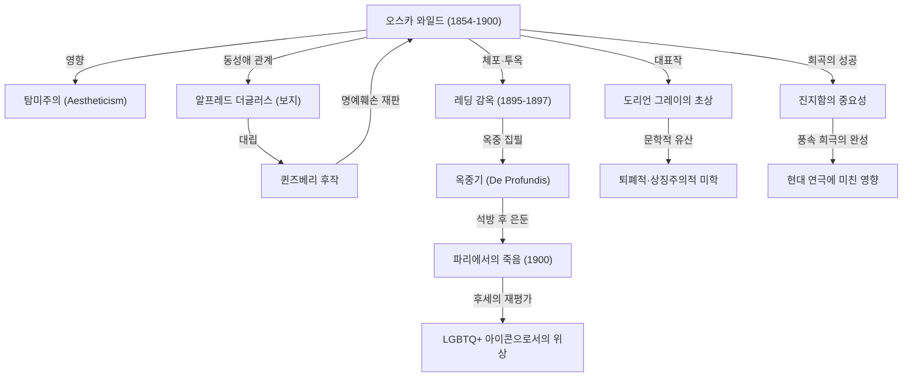

19세기 말 영국 문학계에서 누구보다 화려하게 빛났고, 누구보다 깊은 나락으로 추락했던 작가, 오스카 와일드. 그가 남긴 "예술을 위한 예술"이라는 탐미주의 철학은 오늘날에 이르기까지 수많은 창작자와 예술가들에게 끊임없이 영감을 주고 있습니다. 본 글에서는 그의 극적인 생애와 대표 작품들, 그리고 후대에 남긴 영향에 대해 깊이 있게 살펴봅니다.

## 재능의 개화와 탐미주의의 기수

오스카 핑걸 오플래허티 윌스 와일드는 1854년 10월 16일 아일랜드 더블린에서 태어났습니다. 저명한 안과의사였던 아버지와 민족주의 시인이었던 어머니를 둔 문화적인 가정환경에서 자란 그는 어릴 적부터 어학과 문학에서 비범한 재능을 보였습니다. 더블린의 트리니티 칼리지를 거쳐 옥스퍼드 대학교에 진학한 그는 존 러스킨과 월터 페이터 같은 사상가들에게 깊은 영향을 받으며 '탐미주의(Aestheticism)'에 심취하게 됩니다.

탐미주의란 '미(美)'야말로 최고의 가치이며, 도덕이나 실용성보다 예술적 완성도를 중시하는 사상입니다. 와일드는 화려한 옷차림과 기지 넘치는 대화로 사교계의 총아가 되었으며, "인생은 예술을 모방한다"라는 자신만의 독창적인 철학을 실천에 옮겼습니다.

## 영화의 정점: 희곡과 소설의 성공

1880년대 후반부터 1890년대에 걸쳐 와일드는 극작가이자 소설가로서 전성기를 맞이합니다. 1890년에 발표된 유일한 장편 소설 《도리언 그레이의 초상》은 영원한 젊음과 미모를 얻은 청년의 타락을 그리며, 당시 빅토리아 시대의 도덕관을 크게 뒤흔들었습니다. 일각에서는 "부도덕하다"라는 비난을 받았지만, 특유의 퇴폐적이면서도 아름다운 문체는 수많은 독자들을 매료시켰습니다.

또한 《윈더미어 경 부인의 부채》, 《진지함의 중요성》 등의 풍속 희극은 런던 무대에서 커다란 성공을 거두었습니다. 그의 희곡들은 상류사회의 위선과 허영을 예리하게 풍자하면서도 세련된 유머와 경구(에피그램)로 가득 차 관객들을 폭소의 도가니로 몰아넣었습니다.

## 파멸을 향한 길: 알프레드 더글러스와의 만남

하지만 영광의 정점에 섰던 와일드의 운명은 젊은 귀족 알프레드 더글러스 경(통칭 '보지')과의 만남으로 인해 급격히 어두워집니다. 와일드는 그와 열렬한 동성애 관계에 빠져들었으나, 이는 보지의 아버지였던 퀸즈베리 후작의 거센 분노를 샀습니다.

후작으로부터 공공연한 모욕을 당한 와일드는 그를 명예훼손 혐의로 고소합니다. 그러나 재판 과정에서 오히려 와일드 자신의 동성애 행위(당시 영국에서는 범죄)가 폭로되었고, 결국 와일드는 '풍기문란죄'로 체포되어 기소되고 맙니다. 1895년 유죄 판결을 받은 그는 레딩 감옥에서 2년 동안 가혹한 중노동형을 치러야 했습니다.

## 감옥에서의 고뇌와 고독한 최후

수감 생활은 와일드의 육체와 정신을 한계까지 갉아먹었습니다. 이 시기에 집필된 《옥중기(De Profundis)》에는 보지를 향한 애증, 자신의 예술에 대한 반성, 그리고 기독교적 속죄 의식이 깊이 새겨져 있습니다.

1897년 형기를 마치고 석방된 와일드는 마치 영국에서 추방당하듯 프랑스로 건너갔습니다. 그는 이름을 '세바스찬 멜모스'로 바꾸고 빈곤과 고독 속에서 방랑 생활을 이어갔습니다. 과거의 친구들과 지지자들 대부분은 그를 외면했습니다. 1900년 11월 30일, 그는 파리의 초라한 호텔에서 뇌수막염으로 숨을 거두었습니다. 향년 46세였습니다. 임종 직전 가톨릭으로 개종하였으며, "벽지와 내가 결투를 벌이고 있다. 둘 중 하나는 떠나야 한다"라는 마지막 경구를 남긴 것으로 전해집니다.

## 후대에 미친 영향: LGBTQ 아이콘과 영원한 명언

와일드가 세상을 떠난 후, 그에 대한 평가는 시대의 흐름과 함께 크게 달라졌습니다. 20세기 중반 이후 동성애에 대한 사회적 시선이 변화함에 따라, 그는 '보수적인 사회에 의해 박해받은 천재', 'LGBTQ+의 선구적 아이콘'으로 재조명받기 시작했습니다.

또한 그가 남긴 수많은 경구("유혹을 없애는 유일한 방법은 그 유혹에 굴복하는 것이다", "남자는 항상 여자의 첫사랑이 되기를 원하고, 여자는 항상 남자의 마지막 사랑이 되기를 원한다" 등)는 오늘날 대중문화, 영화, 문학에서도 끊임없이 인용되고 있습니다.

오스카 와일드의 삶은 그의 표현을 빌리자면 "자신의 인생을 가장 위대한 예술 작품"으로 빚어내고자 했던 웅대한 실험이었습니다. 빛과 그림자, 영광과 파멸이 교차했던 그의 생애는 예술이 지닌 치명적일 만큼 강렬한 힘과 사회의 불관용성을 오늘날의 우리에게도 여전히 묻고 있습니다.
