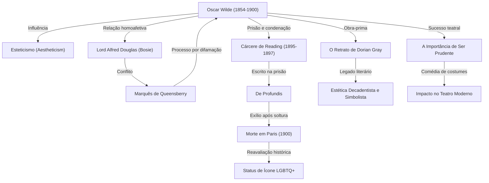

No cenário literário britânico do final do século XIX, ninguém brilhou com tanto esplendor — nem caiu tão profundamente em desgraça — quanto Oscar Wilde. Sua filosofia do esteticismo, sintetizada no lema "a arte pela arte", continua a influenciar criadores e artistas até os dias de hoje. Neste artigo, aprofundamos a análise sobre sua vida dramática, suas obras fundamentais e seu legado para a posteridade.

## O Despertar do Talento e o Expoente do Esteticismo

Oscar Fingal O'Flahertie Wills Wilde nasceu em 16 de outubro de 1854, em Dublin, Irlanda. Criado em um ambiente familiar culto — filho de um renomado oftalmologista e de uma poetisa de inclinação nacionalista —, demonstrou desde cedo um talento extraordinário para línguas e literatura. Após frequentar o Trinity College, em Dublin, ingressou na Universidade de Oxford, onde foi profundamente influenciado por pensadores como John Ruskin e Walter Pater, vivenciando o batismo intelectual no "Esteticismo" (Aestheticism).

O esteticismo defendia que a "beleza" é o valor supremo, priorizando a perfeição artística em detrimento da moralidade ou da utilidade prática. Com suas vestimentas extravagantes e uma sagacidade ímpar em suas conversas, Wilde tornou-se o queridinho da alta sociedade, colocando em prática sua filosofia singular de que "a vida imita a arte".

## O Auge da Glória: Sucesso no Teatro e no Romance

Entre o final da década de 1880 e a de 1890, Wilde atingiu o ápice de sua carreira como dramaturgo e romancista. Publicado em 1890, seu único romance, *O Retrato de Dorian Gray* (The Picture of Dorian Gray), narra a degradação de um jovem que obtém a juventude e a beleza eternas, abalando profundamente os padrões morais da era vitoriana. Embora tenha sido rotulado como "imoral" por alguns críticos, seu estilo refinado, decadente e belo fascinou multidões de leitores.

Além disso, comédias de costumes como *O Leque de Lady Windermere* e *A Importância de Ser Prudente* (The Importance of Being Earnest) alcançaram enorme sucesso nos palcos londrinos. Suas peças satirizavam com acidez a hipocrisia e a vaidade da aristocracia, enquanto transbordavam de humor sofisticado e epigramas memoráveis, encantando plateias e arrancando gargalhadas entusiasmadas.

## O Caminho para a Ruína: O Encontro com Lord Alfred Douglas

Contudo, no zênite de sua glória, o destino de Wilde sofreu uma reviravolta trágica com o encontro com o jovem aristocrata Lord Alfred Douglas (apelidado de "Bosie"). Wilde envolveu-se em um relacionamento homossexual apaixonado com ele, o que despertou a fúria do pai de Bosie, o Marquês de Queensberry.

Insultado publicamente pelo marquês, Wilde decidiu processá-lo por difamação. No entanto, durante o julgamento, suas próprias práticas homossexuais — consideradas crime na Grã-Bretanha da época — foram expostas. Wilde acabou preso e processado sob a acusação de "grave atentado ao pudor" (gross indecency). Em 1895, foi condenado a dois anos de prisão com trabalhos forçados no cárcere de Reading (Reading Gaol).

## O Sofrimento na Prisão e o Fim Solitário

O período de encarceramento devastou o corpo e o espírito de Wilde até o limite. Na famosa carta-ensaio escrita durante esse período, *De Profundis*, ele expressou de forma pungente o amor e o ressentimento em relação a Bosie, a autorreflexão sobre sua arte e um forte sentimento cristão de redenção.

Após ser libertado em 1897, Wilde partiu para a França como um exilado. Adotando o pseudônimo de "Sebastian Melmoth", viveu como um errante, imerso na pobreza e na solidão, abandonado pela maioria de seus antigos amigos e admiradores. Em 30 de novembro de 1900, sucumbiu a uma meningite em um modesto hotel de Paris, aos 46 anos. Converteu-se ao catolicismo em seu leito de morte, deixando como última frase espirituosa: "O meu papel de parede e eu estamos travando um duelo mortal. Um de nós dois tem que ir embora."

## O Legado para a Posteridade: Ícone LGBTQ+ e Palavras Imortais

Após a morte de Wilde, a percepção de sua figura transformou-se radicalmente ao longo do tempo. A partir de meados do século XX, com a evolução da visão social sobre a homossexualidade, ele passou a ser celebrado e reavaliado como um "gênio perseguido por uma sociedade conservadora" e um "ícone pioneiro do movimento LGBTQ+".

Além disso, seus inúmeros epigramas — como *"A única maneira de se livrar de uma tentação é ceder a ela"* ou *"Os homens sempre querem ser o primeiro amor de uma mulher; as mulheres gostam de ser o último romance de um homem"* — continuam a ser amplamente citados na cultura pop, no cinema e na literatura contemporânea.

A vida de Oscar Wilde foi, parafraseando suas próprias palavras, um grandioso experimento de transformar a própria existência na maior de todas as obras de arte. Em uma trajetória marcada pelo entrelaçamento de luz e sombra, glória e ruína, sua biografia continua a interpelar o mundo moderno sobre a força vertiginosa da arte e os perigos da intolerância social.
