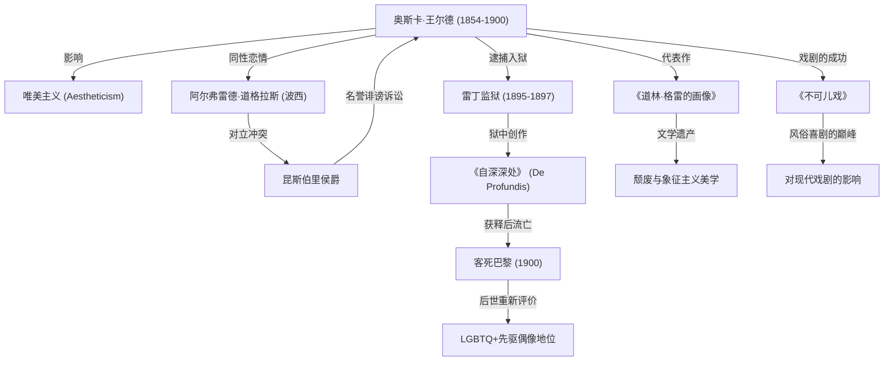

在19世纪末的英国文坛上，奥斯卡·王尔德无疑是绽放得最为绚烂、却也坠落得最深沉的作家。他所留下的“为艺术而艺术”的唯美主义哲学，直至今日仍持续影响着无数的创作者与艺术家。本文将深入探讨他极具戏剧性的一生、主要代表作以及他对后世的深远影响。

## 展露锋芒与唯美主义的旗手

奥斯卡·芬加尔·奥弗莱厄蒂·威尔斯·王尔德于1854年10月16日出生在爱尔兰都柏林。父亲是著名的眼科医生，母亲是一位民族主义诗人，在充满文化气息的家庭氛围中成长的王尔德，自幼便展现出非同寻常的语言和文学天赋。在都柏林圣三一学院完成学业后，他考入牛津大学，深受约翰·罗斯金与沃尔特·佩特等思想家的熏陶，接受了“唯美主义（Aestheticism）”的洗礼。

唯美主义主张“美”是至高无上的价值，强调艺术的纯粹与完成度应凌驾于道德与实用性之上。王尔德凭借华丽考究的着装与充满机智的谈吐迅速成为社交界的宠儿，身体力行地践行着自己“生活模仿艺术”的独特哲学。

## 鼎盛时期：戏剧与小说的辉煌成就

19世纪80年代后半期至90年代，王尔德作为剧作家和小说的创作者迎来了事业的绝顶时期。1890年发表的唯一一部长篇小说《道林·格雷的画像》，讲述了一位获得永恒青春与美貌的青年走向堕落的故事，对当时维多利亚时代的道德观念造成了巨大冲击。尽管该作品受到部分保守人士“不道德”的批判，但其颓废而华美的文笔吸引了无数读者。

此外，《温夫人的扇子》与《不可儿戏》（又译《真诚最要紧》）等风俗喜剧在伦敦舞台上大获成功。他的戏剧作品在辛辣讽刺上流社会伪善与虚荣的同时，处处洋溢着洗练优雅的幽默与警句（格言），令剧场观众捧腹倾倒。

## 走向毁灭：与阿尔弗雷德·道格拉斯的邂逅

然而，正值荣耀巅峰的王尔德，其命运却因邂逅年轻贵族阿尔弗雷德·道格拉斯勋爵（通称“波西”）而急转直下。王尔德与他陷入了炽热的同性恋情，而这也彻底激怒了波西的父亲——昆斯伯里侯爵。

遭到侯爵公开侮辱的王尔德愤而以诽谤罪将其告上法庭。然而在审理过程中，局势急转直下，王尔德自身的同性恋行为（在当时的英国被视为违法犯罪）反被曝光，导致他因“严重猥亵罪”（风纪败坏罪）遭到逮捕和起诉。1895年，王尔德被判有罪，被迫在雷丁监狱服两年严酷的重劳役。

## 牢狱的煎熬与孤独的终局

牢狱生活从身心两方面将王尔德摧残到了极限。在服刑期间，他写下了长篇信作《自深深处》（*De Profundis*），字里行间深刻记录了他对波西的爱恨交织、对自身艺术的沉痛反思，以及基督教式的赎罪意识。

1897年获释后，王尔德犹如被驱逐出境般辗转前往法国。他化名为“塞巴斯蒂安·梅尔莫斯”，在贫困与孤寂中过着流亡生活。曾经的朋友和支持者大多对他弃之不顾。1900年11月30日，王尔德因脑膜炎在巴黎一家简陋的旅馆中撒手人寰，享年46岁。据传，他在临终前皈依了天主教，并留下了人生中最后一句传世警句：“我的壁纸正在和我决斗，我们之间必须有一个离开。”

## 对后世的影响：LGBTQ+先驱与不朽的名言

王尔德逝世后，世人对他的评价随着时代的前进而发生了巨大改变。20世纪中叶以后，随着社会对同性恋态度的转变与包容，他开始被重新评价为“遭保守社会迫害的天才”与“LGBTQ+的先驱象征”。

此外，他留下的诸多名言警句（如“摆脱诱惑的唯一方法就是向其屈服”、“男人总希望成为女人的初恋，而女人则希望成为男人的最后归宿”等），在当今的流行文化、电影及文学中仍被频繁引用。

借用奥斯卡·王尔德自己的话来说，他的一生就是一场宏大的实验——“将自己的人生创作为最伟大的艺术作品”。光荣与阴影、辉煌与毁灭交织的传奇生涯，向现代社会持续发问，叩问着艺术那近乎危险的力量以及社会的偏狭与不容。
