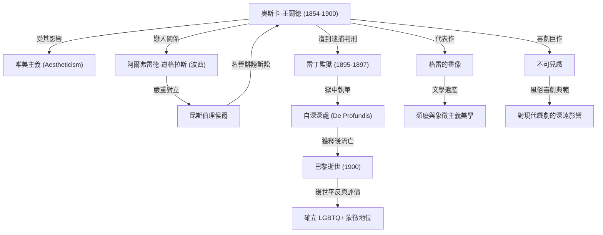

在19世紀末的英國文學界，奧斯卡·王爾德（Oscar Wilde）無疑是一位比任何人都更加璀璨耀眼，卻也比任何人都跌得更深的作家。他所留下的「為藝術而藝術」（Art for art's sake）這項唯美主義哲學，時至今日仍持續影響著無數的創作者與藝術家。本文將深入探討他充滿戲劇性的傳奇人生、經典作品，以及對後世的深遠影響。

## 才華初綻與唯美主義的旗手

奧斯卡·芬葛·歐佛拉赫提·威爾斯·王爾德（Oscar Fingal O'Flahertie Wills Wilde）於1854年10月16日出生於愛爾蘭都柏林。父親是著名的眼科醫生，母親則是富有民族主義情懷的詩人。在極具文化底蘊的家庭環境中成長的他，自幼便展現出在語言與文學方面的非凡天賦。他在都柏林聖三一學院（Trinity College Dublin）求學後，進一步前往牛津大學深造，深受約翰·羅斯金（John Ruskin）與華特·佩特（Walter Pater）等思想家的啟發，接受了「唯美主義（Aestheticism）」的洗禮。

所謂唯美主義，是指主張「美」具有至高無上的價值，比起道德教化或實用功能，更重視藝術本身純粹的完美境界。王爾德憑藉華麗前衛的穿著與機智風趣的談吐，迅速成為倫敦社交圈的寵兒，並身體力行地實踐了他那句獨到的哲學名言——「生活模仿藝術」。

## 榮耀巔峰：劇作與小說的輝煌成就

在1880年代後半至1890年代，王爾德作為劇作家與小說家迎來了他事業的巔峰。1890年發表的唯一長篇小說《格雷的畫像》（The Picture of Dorian Gray），描繪了一位獲得永恆青春與絕世美貌的青年逐漸走向墮落的過程，劇烈撼動了當時維多利亞時代的道德觀念。雖然該書在部分保守人士眼中被抨擊為「不道德」，但其頹廢而優雅的文筆卻深深吸引了無數讀者。

此外，他的《溫夫人的扇子》（Lady Windermere's Fan）與《不可兒戲》（The Importance of Being Earnest）等風俗喜劇在倫敦舞台上大獲成功。他的劇作在辛辣諷刺上流社會的偽善與虛榮的同時，亦充滿了精練巧妙的幽默與雋永警句（Epigram），使台下觀眾笑聲不斷、讚嘆連連。

## 走向毀滅：與阿爾弗雷德·道格拉斯的相遇

然而，處於榮耀頂點的王爾德，命運卻因邂逅年輕貴族阿爾弗雷德·道格拉斯勳爵（Lord Alfred Douglas，暱稱「波西」Bosie）而發生了急遽逆轉。王爾德與他陷入了狂熱的同性戀情，但這段關係徹底激怒了波西的父親——昆斯伯理侯爵（Marquess of Queensberry）。

遭到侯爵公開羞辱的王爾德，憤而對侯爵提起了名譽誹謗訴訟。然而，在審理過程中，王爾德自身的同性性行為（在當時的英國被視為違法犯罪）反被揭露，導致王爾德因「嚴重猥褻罪」（Gross Indecency）遭到逮捕與起訴。1895年，他被判有罪，並被押往雷丁監獄（Reading Gaol），被迫服了兩年極其嚴酷的苦役。

## 囹圄之苦與孤寂的終局

漫長而痛苦的牢獄生活，將王爾德的身心消磨殆盡。在此期間寫就的長信《自深深處》（De Profundis，又譯《獄中記》），深刻傾訴了他對波西的愛恨交加、對自身藝術生涯的反省，以及蘊含基督教意涵的救贖之思。

1897年獲釋後，彷彿被英國社會放逐一般的王爾德輾轉前往法國。他化名為「塞巴斯蒂安·梅爾莫斯」（Sebastian Melmoth），在極度貧困與孤獨中度日。昔日的大多數朋友與崇拜者紛紛離他而去。1900年11月30日，他因腦膜炎在巴黎一家破舊的旅館內溘然長逝，享年46歲。據傳他在臨終前皈依了天主教，並留下了最後的傳世幽默警句：「我和這壁紙正在決一死戰，我們之中有一個人非得離開不可。」

## 對後世的影響：LGBTQ象徵與不朽的箴言

王爾德逝世後，世人對他的評價隨著時代演變產生了巨大的轉變。進入20世紀中葉後，隨著社會對同性戀的觀點逐漸轉變，他開始被重新評價為「遭受保守社會迫害的天才」以及「LGBTQ+運動的先驅象徵」。

此外，他所留下的無數機智警句（例如「擺脫誘惑的唯一方法，就是屈服於誘惑」、「男人總希望成為女人的初戀，女人則希望成為男人最後的戀人」等），至今仍在現代流行文化、電影與文學作品中廣泛被引用。

奧斯卡·王爾德的人生，借用他自己的話來說，就是一場試圖「將自己的人生雕琢成最偉大藝術品」的宏大實驗。在光與影、榮耀與破滅交織的傳奇歲月中，他所展現出的藝術那近乎危險的迷人力量，以及當時社會的偏狹不容，至今依然在向現代人提出深邃的叩問。
