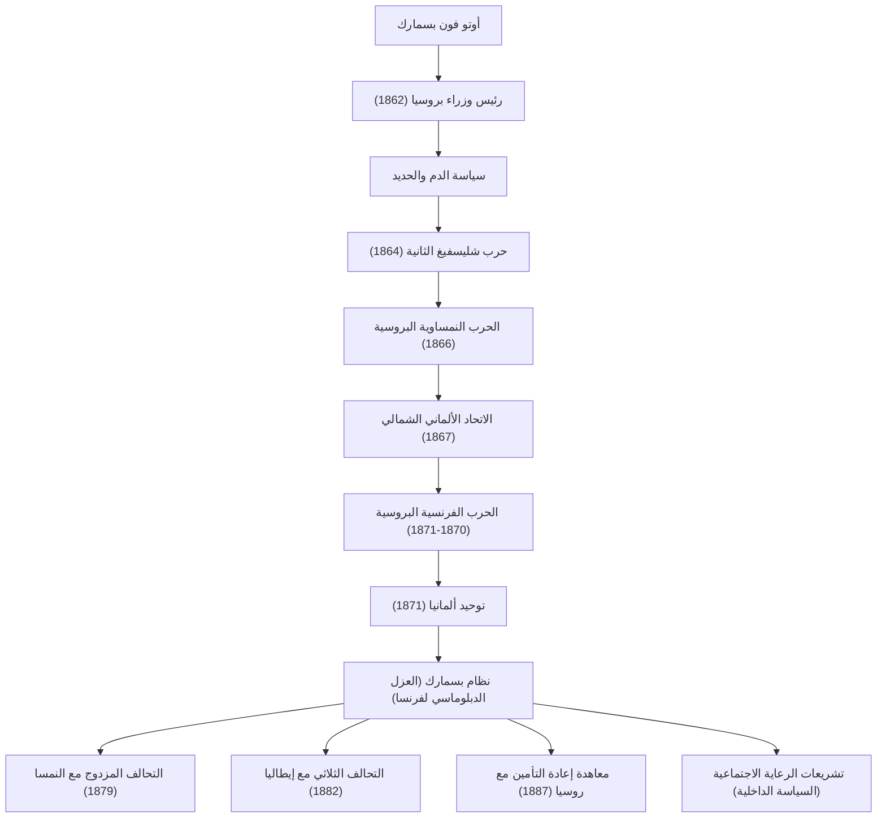

كان أوتو فون بسمارك (1815-1898)، المعروف باسم "المستشار الحديدي"، رجل دولة بروسيًا وألمانيًا وشخصية واقعية فذة قادت الدبلوماسية الأوروبية في أواخر القرن التاسع عشر. لقد وحد الدول الألمانية المجزأة من خلال القوة العسكرية والدبلوماسية البارعة، وبنى إمبراطورية ألمانية قوية. لا تزال حياته وأفكاره وتأثيره على الأجيال القادمة تقدم دروسًا بالغة الأهمية في السياسة الدولية الحديثة. يتتبع هذا المقال خطواته من كونه نبيلًا ريفيًا في بروسيا إلى أن أصبح قائدًا عظيمًا يحرك مجرى تاريخ العالم.

### رحلة حياته: من يونكر إلى مستشار بروسيا

ولد بسمارك عام 1815 في عائلة من طبقة النبلاء الملاك (اليونكرز) على الضفة الشرقية لنهر الإلبه في مملكة بروسيا. وعلى الرغم من أنه عاش حياة طائشة مليئة بالمبارزة والشرب خلال أيام دراسته الجامعية، إلا أن اهتمامه بالسياسة تعمق تدريجيًا وبرز كسياسي محافظ. دعم نظرية الحق الإلهي للملوك وعارض بشدة الليبرالية والديمقراطية.

جاءت نقطة التحول في عام 1862. قام الملك فيلهلم الأول ملك بروسيا، الذي كان في صراع مع البرلمان حول الإصلاحات العسكرية، بتعيين بسمارك رئيسًا للوزراء كورقة رابحة للسيطرة على البرلمان. بعد فترة وجيزة من توليه منصبه، ألقى بسمارك خطابه الشهير "الدم والحديد"، متجاهلاً حق البرلمان في مناقشة الميزانية. أعلن أن "القضايا الكبرى في العصر لن تُحل من خلال الخطب وقرارات الأغلبية، بل من خلال الحديد والدم"، ومضى قدمًا في توسع عسكري متهور. أصبحت هذه القيادة القوية لاحقًا القوة الدافعة لعملية التوحيد.

### الطريق إلى التوحيد الألماني: ثلاث حروب ودبلوماسية بارعة

كان أعظم إنجازات بسمارك هو توحيد المناطق الألمانية التي ظلت مجزأة منذ العصور الوسطى في إمبراطورية ضخمة واحدة في أقل من عشر سنوات. وبناءً على حسابات دقيقة واستراتيجية دبلوماسية واقعية، أثار عن قصد ثلاث حروب لتحقيق التوحيد.

1. **حرب الدنمارك (1864)**: أولاً، تحالف مع النمسا، المنافس القديم، وحارب الدنمارك للاستيلاء على دوقيتي شليسفيغ وهولشتاين.
2. **الحرب النمساوية البروسية (1866)**: بعد ذلك، عمق صراعه مع النمسا حول إدارة الأراضي المكتسبة وشن حربًا مفاجئة. بفضل الأسلحة الحديثة والنقل بالسكك الحديدية، حقق الجيش البروسي انتصارًا ساحقًا في سبعة أسابيع فقط، وأقصى النمسا وأنشأ "الاتحاد الألماني الشمالي".
3. **الحرب الفرنسية البروسية (1870-1871)**: من أجل توحيد دول الجنوب الألماني المتبقية، كان هناك حاجة إلى عدو خارجي. استغل بسمارك حادثة برقية إمس لاستفزاز نابليون الثالث ملك فرنسا لإعلان الحرب. بعد سحق الجيش الفرنسي، أعلنت بروسيا بفخر تشكيل "الإمبراطورية الألمانية" بقيادة فيلهلم الأول كإمبراطور في قاعة المرايا في قصر فرساي، رمز العدو فرنسا (1871).

### نظام بسمارك و"العصا والجزرة" في السياسة الداخلية

بعد تحقيق الحلم الذي طال انتظاره المتمثل في توحيد ألمانيا، أصبح بسمارك فجأة "المدافع عن السلام في أوروبا". من أجل بقاء الإمبراطورية الألمانية القوية حديثة الولادة في وسط أوروبا، كان من الضروري عزل فرنسا دبلوماسيًا، التي حُرمت من أراضيها وكانت تحترق بالرغبة في الانتقام. نفذ **سياسة واقعية (Realpolitik)** خالية من الأيديولوجيات والعواطف، وبنى شبكة معقدة من التحالفات (ما يسمى "نظام بسمارك") مع النمسا وروسيا وإيطاليا وغيرها. ومن خلال الحفاظ على هذا التوازن الماهر للقوى، نعمت أوروبا بفترة سلام طويلة استمرت حوالي 40 عامًا.

في السياسة الداخلية، نفذ سياسة "العصا والجزرة" الشهيرة. فمن ناحية، قمع بوحشية المعارضين المناهضين للنظام من خلال "صراع الثقافة" (Kulturkampf) لقمع الكنيسة الكاثوليكية وقوانين قمع الاشتراكيين (العصا). ومن ناحية أخرى، كان رائدًا في إنشاء أول نظام تأمين اجتماعي في العالم (اشتراكية الدولة)، والذي تضمن التأمين الصحي والتأمين ضد حوادث العمل وتأمين الشيخوخة والعجز (الجزرة). كانت هذه السياسة، التي تهدف إلى تخفيف استياء الطبقة العاملة ودمجهم في نظام الدولة، محاولة تاريخية ورائدة تعتبر أصل دولة الرفاهية الحديثة.

### الفلسفة والتأثير العميق على الأجيال القادمة

يكمن جوهر الفلسفة السياسية لبسمارك في البراغماتية الشاملة والسعي وراء مصالح الدولة. وترك وراءه مقولة مفادها أن "السياسة هي فن الممكن"، معطيًا الأولوية لتعظيم المصلحة الوطنية وتوازن القوى الفعلي على الأخلاق والمثالية.

ومع ذلك، بعد صراع مع الإمبراطور الشاب فيلهلم الثاني، الذي اعتلى العرش عام 1890، استقال بسمارك من منصب المستشار وسط أسف شديد. بمجرد رحيل بسمارك الذي يتمتع بإحساس عبقري بالتوازن، بدأت شبكة التحالفات المعقدة التي بناها في الانهيار تدريجياً. أثارت "السياسة العالمية" التوسعية لفيلهلم الثاني حذر بريطانيا وروسيا، مما أدى في النهاية إلى عزل ألمانيا وتوجهها نحو النهاية الكارثية للحرب العالمية الأولى.

لا يزال إرث بسمارك مثيرًا للجدل اليوم. فبينما يُنسب إليه الفضل في بناء دولة موحدة قوية وإنشاء نظام رفاهية، يُشار أيضًا إلى أن تجاهله للسياسة البرلمانية وإنشاء نظام سلطوي من أعلى إلى أسفل بقيادة الإمبراطور قد أدى إلى عدم نضج الديمقراطية في المجتمع الألماني اللاحق. ومع ذلك، لا تزال مهارته الدبلوماسية الاستثنائية وواقعيته الباردة تتألق كدروس خالدة يجب على قادة الدول تعلمها في المجتمع الدولي الحديث الذي يزداد تعقيدًا.

### الإنجازات ومخطط الشبكة الدبلوماسية

يوجد أدناه مخطط انسيابي يوضح عملية التوحيد الألماني بقيادة بروسيا والتي قادها بسمارك، وشبكة التحالفات (نظام بسمارك) التي بناها بعد التوحيد.

