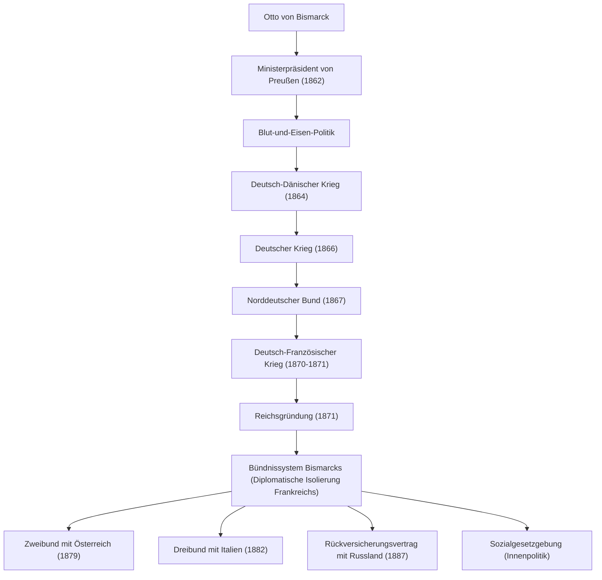

Otto von Bismarck (1815–1898), bekannt als der „Eiserne Kanzler“, war ein Politiker Preußens und des Deutschen Reiches sowie ein herausragender Realist (Praktiker der Realpolitik), der die europäische Diplomatie in der zweiten Hälfte des 19. Jahrhunderts maßgeblich prägte. Sein Leben, seine Gedanken und sein Einfluss auf die Nachwelt, indem er die zersplitterten deutschen Staaten durch militärische Macht und geschickte Diplomatie einte und das mächtige Deutsche Reich schuf, bieten bis heute äußerst wichtige Lehren für die moderne internationale Politik. Dieser Artikel zeichnet seinen Lebensweg nach, von einem ländlichen preußischen Gebiet bis hin zu dem Giganten, der die Weltgeschichte bewegte.

### Lebensweg: Vom Junker zum preußischen Ministerpräsidenten

Bismarck wurde 1815 in eine adlige Gutsbesitzerfamilie (Junker) am Ostufer der Elbe im Königreich Preußen geboren. Während seiner Universitätszeit führte er ein ungestümes Leben voller Duelle und Trinkgelage, vertiefte jedoch allmählich sein Interesse an der Politik und trat als konservativer Politiker hervor. Er unterstützte die Lehre vom Gottesgnadentum der Könige und wandte sich entschieden gegen Liberalismus und Demokratie.

Der Wendepunkt kam 1862. Der preußische König Wilhelm I., der sich mit dem Parlament über Heeresreformen im Konflikt befand, ernannte Bismarck als Trumpfkarte zur Unterdrückung des Parlaments zum Ministerpräsidenten. Kurz nach seinem Amtsantritt ignorierte Bismarck das Budgetrecht des Parlaments und hielt seine berühmte „Blut und Eisen“-Rede. Er erklärte, dass „die großen Fragen der Zeit nicht durch Reden und Majoritätsbeschlüsse, sondern durch Eisen und Blut“ gelöst würden, und erzwang eine rücksichtslose militärische Aufrüstung. Diese starke Führung wurde zur treibenden Kraft für das spätere Einigungsprojekt.

### Der Weg zur Reichsgründung: Drei Kriege und geschickte Diplomatie

Bismarcks größte Leistung bestand darin, die seit dem Mittelalter zersplitterte deutsche Region in knapp zehn Jahren zu einem gewaltigen Reich zu vereinen. Basierend auf akribischen Berechnungen und einer kühlen diplomatischen Strategie provozierte er absichtlich drei Kriege, um die Einigung zu erreichen.

1. **Deutsch-Dänischer Krieg (1864)**: Zunächst verbündete er sich mit dem langjährigen Rivalen Österreich und kämpfte gegen Dänemark, um die Herzogtümer Schleswig und Holstein zu erobern.
2. **Deutscher Krieg (1866)**: Anschließend vertiefte er den Konflikt mit Österreich über die Verwaltung der erworbenen Gebiete und begann einen Blitzkrieg. Mit modernen Waffen und dem Eisenbahntransport errang die preußische Armee in nur sieben Wochen einen überwältigenden Sieg und gründete den „Norddeutschen Bund“ unter Ausschluss Österreichs.
3. **Deutsch-Französischer Krieg (1870-1871)**: Um die verbliebenen süddeutschen Staaten zu integrieren, wurde ein äußerer Feind benötigt. Bismarck nutzte die Emser Depesche, um den französischen Kaiser Napoleon III. zur Kriegserklärung zu provozieren. Nachdem Preußen die französische Armee vernichtend geschlagen hatte, proklamierte es stolz die Gründung des „Deutschen Reiches“ mit Wilhelm I. als Kaiser im Spiegelsaal des Schlosses von Versailles, dem Symbol des Feindes Frankreich (1871).

### Bismarcksches System und „Zuckerbrot und Peitsche“ in der Innenpolitik

Nachdem er das lang ersehnte Ziel der Reichsgründung erreicht hatte, wandelte sich Bismarck zum „Verteidiger des europäischen Friedens“. Um das mächtige Deutsche Reich im Herzen Europas zu erhalten, war es unerlässlich, das rachsüchtige und um Territorium beraubte Frankreich diplomatisch zu isolieren. Er entwickelte eine von Ideologie und Emotionen befreite **Realpolitik** und baute komplexe Bündnisse (das sogenannte „Bismarcksches Bündnissystem“) mit Österreich, Russland, Italien und anderen auf. Die Aufrechterhaltung dieses geschickten Gleichgewichts der Kräfte brachte Europa eine fast 40-jährige Friedensperiode.

In der Innenpolitik setzte er seine berühmte Politik von „Zuckerbrot und Peitsche“ um. Einerseits unterdrückte er Oppositionelle rücksichtslos (Peitsche) durch den Kulturkampf gegen die katholische Kirche und das Sozialistengesetz, andererseits leistete er weltweit Pionierarbeit bei der Schaffung von Sozialversicherungen (Kranken-, Unfall-, Invaliditäts- und Altersversicherung) als eine Form des Staatssozialismus (Zuckerbrot). Diese Politik, die darauf abzielte, die Unzufriedenheit der Arbeiterklasse zu besänftigen und sie in das Staatssystem zu integrieren, war ein historischer und innovativer Versuch, der als Ursprung des modernen Wohlfahrtsstaates gelten kann.

### Philosophie und tiefgreifender Einfluss auf die Nachwelt

Die Wurzel von Bismarcks politischer Philosophie ist das Streben nach kompromisslosem Pragmatismus und Staatsräson. Er prägte den Satz „Die Politik ist die Kunst des Möglichen“ und stellte die Maximierung nationaler Interessen und die reale Machtbalance über Moral und Idealismus.

Jedoch geriet er 1890 mit dem jungen, frisch gekrönten Kaiser Wilhelm II. in Konflikt und wurde gezwungen, als Kanzler zurückzutreten. Nach dem Ausscheiden Bismarcks, der über ein geniales Gleichgewichtsgefühl verfügte, zerfiel das komplexe Bündnisnetzwerk, das er aufgebaut hatte, allmählich. Wilhelms II. expansionistische „Weltpolitik“ rief die Wachsamkeit Großbritanniens und Russlands hervor, was letztlich zur Isolierung Deutschlands führte und in das verheerende Ende des Ersten Weltkriegs mündete.

Bismarcks Vermächtnis wird bis heute kontrovers diskutiert. Während seine enormen Leistungen beim Aufbau eines starken Einheitsstaates und der Schaffung eines Sozialsystems anerkannt werden, wird auch darauf hingewiesen, dass seine Geringschätzung der parlamentarischen Politik und die Festigung eines autoritären Regimes unter der Führung des Kaisers zur Unreife der Demokratie in der späteren deutschen Gesellschaft beitrugen. Dennoch leuchten sein außergewöhnliches diplomatisches Geschick und sein kühler Realismus weiterhin als zeitloser Text, von dem Staatsmänner in der zunehmend komplexen heutigen internationalen Gemeinschaft lernen können.

### Veranschaulichung der Leistungen und des diplomatischen Netzwerks

Das folgende Flussdiagramm zeigt den von Preußen unter Bismarcks Führung initiierten Prozess der Reichsgründung und das danach aufgebaute Bündnisnetzwerk (Bismarcksches Bündnissystem).

