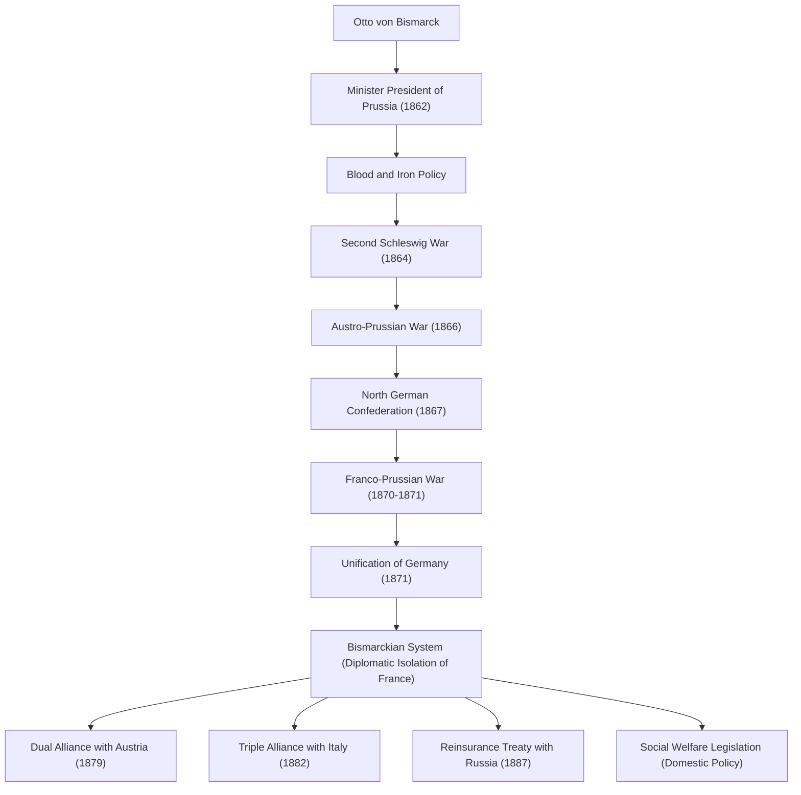

Otto von Bismarck (1815–1898), known as the "Iron Chancellor," was a Prussian and German statesman and an exceptional realist who drove European diplomacy in the late 19th century. His life, philosophy, and legacy of uniting fragmented German states through military force and adroit diplomacy to build a powerful German Empire continue to offer crucial lessons in modern international politics. This article traces his footsteps from a rural Prussian backwater to a colossus who moved world history.

### The Footsteps of a Lifetime: From Junker to Prussian Prime Minister

Bismarck was born in 1815 into a Junker (landed noble) family on the east bank of the Elbe River in the Kingdom of Prussia. During his university years, he lived a wild life characterized by dueling and drinking, but he gradually deepened his interest in politics, distinguishing himself as a conservative politician. He supported the divine right of kings and stood strongly against liberalism and democracy.

A turning point arrived in 1862. King Wilhelm I of Prussia, clashing with the parliament over military reforms, appointed Bismarck as Prime Minister as a trump card to suppress the opposition. Shortly after taking office, Bismarck delivered his famous "Blood and Iron" speech, disregarding the parliament's right to deliberate on the budget. He declared, "The great questions of the time will not be resolved by speeches and majority decisions... but by iron and blood," and forced through what seemed like a reckless military expansion. This intense leadership became the driving force behind the subsequent unification enterprise.

### The Path to German Unification: Three Wars and Masterful Diplomacy

Bismarck's greatest achievement was unifying the German regions—fragmented since the Middle Ages—into a single massive empire in just under ten years. Based on meticulous calculation and cold diplomatic strategy, he deliberately provoked three wars to achieve unification.

1. **Second Schleswig War (1864)**: First, he allied with long-time rival Austria to fight Denmark, capturing the duchies of Schleswig and Holstein.
2. **Austro-Prussian War (1866)**: Next, deepening conflicts with Austria over the management of the acquired territories, he launched a lightning war. Utilizing modern weapons and railway transport, the Prussian army won a crushing victory in just seven weeks, establishing the "North German Confederation" that excluded Austria.
3. **Franco-Prussian War (1870–1871)**: An external enemy was necessary to integrate the remaining southern German states. Using the Ems Dispatch incident, Bismarck provoked Emperor Napoleon III of France into declaring war. After shattering the French army, Prussia triumphantly proclaimed the establishment of the "German Empire" with Wilhelm I as Emperor in the Hall of Mirrors at the Palace of Versailles, the symbol of their enemy France (1871).

### The Bismarckian System and "Carrot and Stick" in Domestic Politics

After achieving the long-held dream of German unification, Bismarck transformed into a "defender of European peace." For the powerful German Empire born in the heart of Europe to survive, it was essential to diplomatically isolate France, which was burning for revenge over its lost territories. Deploying **Realpolitik**, free from ideology and emotion, he constructed a complex web of alliances (the so-called "Bismarckian System") with Austria, Russia, Italy, and others. The maintenance of this skillful balance of power brought a long peace of about 40 years to Europe.

In domestic politics, he implemented his famous "carrot and stick" policies. While ruthlessly suppressing opposition through the Kulturkampf (culture struggle) against the Catholic Church and the Anti-Socialist Laws (the stick), he pioneered the world's first social insurance systems, including health, accident, and old-age/disability insurance (the carrot). This policy, aimed at mitigating the discontent of the working class and integrating them into the state system, was a historic and epoch-making endeavor that can be considered the origin of the modern welfare state.

### Philosophy and Profound Impact on Posterity

At the core of Bismarck's political philosophy were thorough pragmatism and the pursuit of reason of state. He left behind the words, "Politics is the art of the possible," prioritizing the maximization of national interest and the realistic balance of power over morality or idealism.

However, conflicting with the young Emperor Wilhelm II who ascended the throne in 1890, he was forced to resign as Chancellor, much to the regret of many. After the departure of Bismarck, who possessed an ingenious sense of balance, the complex network of alliances he built gradually collapsed. Wilhelm II's expansionist "Weltpolitik" (World Policy) drew the alarm of Britain and Russia, resulting in Germany's isolation and its subsequent descent into the catastrophic conclusion of World War I.

Debate continues today regarding Bismarck's legacy. While celebrated for the monumental achievements of building a strong unified nation and creating a welfare system, he is also criticized for marginalizing parliamentary politics and establishing a top-down authoritarian regime crowned by the Emperor, which arguably led to the immaturity of democracy in later German society. Nevertheless, his extraordinary diplomatic skill and cold realism continue to shine brilliantly as an enduring text from which national leaders should learn in today's increasingly complex international society.

### Diagram of Achievements and Diplomatic Network

Below is a flowchart illustrating the process of Prussian-led German unification directed by Bismarck and the alliance network (Bismarckian System) built after unification.

