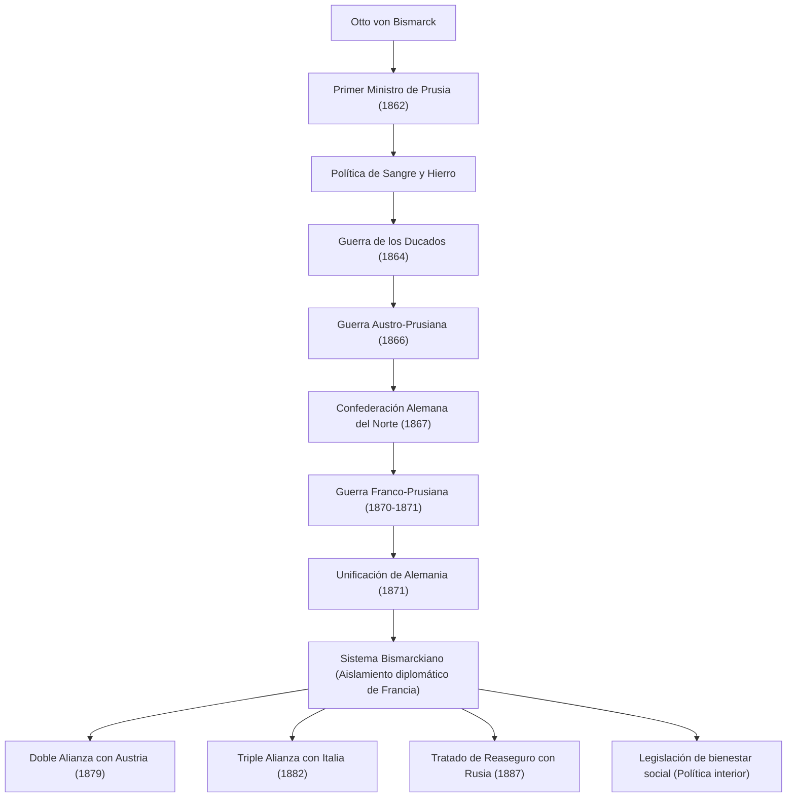

Otto von Bismarck (1815–1898), conocido como el "Canciller de Hierro", fue un estadista prusiano y alemán, y un realista excepcional que lideró la diplomacia europea a finales del siglo XIX. Su vida, sus ideas y su legado al unir los fragmentados estados alemanes a través de la fuerza militar y una hábil diplomacia para construir un poderoso Imperio Alemán siguen ofreciendo lecciones cruciales en la política internacional moderna. Este artículo sigue sus pasos, desde su origen en una zona rural de Prusia hasta convertirse en un coloso que movió la historia mundial.

### Los pasos de toda una vida: De Junker a Primer Ministro de Prusia

Bismarck nació en 1815 en el seno de una familia de la nobleza terrateniente (Junker) en la orilla oriental del río Elba, en el Reino de Prusia. Durante sus años universitarios, llevó una vida desenfrenada caracterizada por los duelos y la bebida, pero gradualmente profundizó su interés por la política, destacándose como un político conservador. Apoyaba el derecho divino de los reyes y se oponía firmemente al liberalismo y la democracia.

El punto de inflexión llegó en 1862. El rey Guillermo I de Prusia, enfrentado al parlamento por las reformas militares, nombró a Bismarck como Primer Ministro como su carta de triunfo para reprimir a la oposición. Poco después de asumir el cargo, Bismarck pronunció su famoso discurso de "Sangre y Hierro", ignorando el derecho del parlamento a deliberar sobre el presupuesto. Declaró: "Las grandes cuestiones de la época no se resolverán mediante discursos y decisiones de la mayoría... sino mediante hierro y sangre", y forzó una expansión militar que parecía temeraria. Este intenso liderazgo se convirtió en la fuerza impulsora detrás de la posterior empresa de unificación.

### El camino hacia la unificación alemana: Tres guerras y una diplomacia magistral

El mayor logro de Bismarck fue unificar las regiones alemanas —fragmentadas desde la Edad Media— en un solo imperio masivo en menos de diez años. Basándose en cálculos meticulosos y una fría estrategia diplomática, provocó deliberadamente tres guerras para lograr la unificación.

1. **Guerra de los Ducados (1864)**: Primero, se alió con su antiguo rival, Austria, para luchar contra Dinamarca, capturando los ducados de Schleswig y Holstein.
2. **Guerra Austro-Prusiana (1866)**: Luego, profundizando los conflictos con Austria sobre la administración de los territorios adquiridos, lanzó una guerra relámpago. Utilizando armas modernas y transporte ferroviario, el ejército prusiano obtuvo una aplastante victoria en solo siete semanas, estableciendo la "Confederación Alemana del Norte" que excluía a Austria.
3. **Guerra Franco-Prusiana (1870–1871)**: Era necesario un enemigo externo para integrar a los estados restantes del sur de Alemania. Aprovechando el incidente del Telegrama de Ems, Bismarck provocó al emperador Napoleón III de Francia para que declarara la guerra. Tras destrozar al ejército francés, Prusia proclamó triunfalmente el establecimiento del "Imperio Alemán" con Guillermo I como Emperador en la Galería de los Espejos del Palacio de Versalles, el símbolo de su enemiga Francia (1871).

### El sistema bismarckiano y el "palo y la zanahoria" en la política interior

Después de alcanzar el anhelado sueño de la unificación alemana, Bismarck se transformó en un "defensor de la paz europea". Para que el poderoso Imperio Alemán, nacido en el corazón de Europa, sobreviviera, era esencial aislar diplomáticamente a Francia, que ardía en deseos de venganza por sus territorios perdidos. Desplegando la **Realpolitik**, libre de ideologías y emociones, construyó una compleja red de alianzas (el llamado "Sistema Bismarckiano") con Austria, Rusia, Italia y otros. El mantenimiento de este hábil equilibrio de poder trajo una larga paz de unos 40 años a Europa.

En la política interior, implementó sus famosas políticas del "palo y la zanahoria". Mientras reprimía implacablemente a la oposición a través del Kulturkampf (lucha cultural) contra la Iglesia Católica y las Leyes Antisocialistas (el palo), fue pionero en los primeros sistemas de seguros sociales del mundo, incluyendo seguros de salud, accidentes y vejez/invalidez (la zanahoria). Esta política, destinada a mitigar el descontento de la clase trabajadora e integrarla en el sistema estatal, fue un esfuerzo histórico y trascendental que puede considerarse el origen del estado de bienestar moderno.

### Filosofía y profundo impacto en la posteridad

En el núcleo de la filosofía política de Bismarck se encontraban un pragmatismo absoluto y la búsqueda de la razón de Estado. Dejó tras de sí la frase: "La política es el arte de lo posible", priorizando la maximización del interés nacional y el equilibrio realista de poder sobre la moralidad o el idealismo.

Sin embargo, al entrar en conflicto con el joven emperador Guillermo II, que ascendió al trono en 1890, se vio obligado a dimitir como Canciller, para pesar de muchos. Tras la partida de Bismarck, que poseía un ingenioso sentido del equilibrio, la compleja red de alianzas que había construido se derrumbó gradualmente. La política expansionista de Guillermo II ("Weltpolitik") despertó la alarma de Gran Bretaña y Rusia, lo que resultó en el aislamiento de Alemania y su posterior descenso hacia el final catastrófico de la Primera Guerra Mundial.

Hoy en día, el debate sobre el legado de Bismarck continúa. Si bien se le celebra por los monumentales logros de construir una nación unificada fuerte y crear un sistema de bienestar, también se le critica por marginar la política parlamentaria y establecer un régimen autoritario jerárquico coronado por el Emperador, lo que podría argumentarse que condujo a la inmadurez de la democracia en la sociedad alemana posterior. Sin embargo, su extraordinaria habilidad diplomática y su frío realismo siguen brillando como un texto imperecedero del cual los líderes nacionales deberían aprender en la sociedad internacional cada vez más compleja de hoy.

### Diagrama de logros y red diplomática

A continuación se muestra un diagrama de flujo que ilustra el proceso de unificación alemana liderado por Prusia y dirigido por Bismarck, y la red de alianzas (Sistema Bismarckiano) construida después de la unificación.

