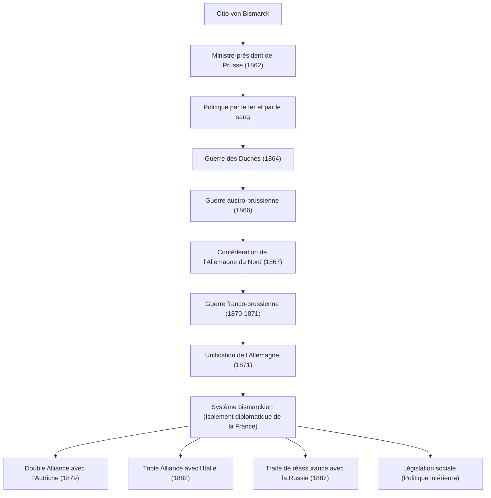

Otto von Bismarck (1815-1898), surnommé le « Chancelier de fer », était un homme d'État prussien et allemand, ainsi qu'un réaliste exceptionnel qui a dirigé la diplomatie européenne dans la seconde moitié du XIXe siècle. Il a unifié les États allemands divisés par la force militaire et une diplomatie habile, bâtissant ainsi un puissant Empire allemand. Sa vie, ses pensées et son influence sur les générations ultérieures continuent de fournir des leçons extrêmement importantes dans la politique internationale contemporaine. Cet article retrace son parcours, de la campagne prussienne jusqu'à devenir un leader majeur ayant façonné l'histoire mondiale.

### Parcours de vie : De Junker à Chancelier de Prusse

Bismarck est né en 1815 dans une famille de la noblesse terrienne (Junker) sur la rive est de l'Elbe, dans le Royaume de Prusse. Bien qu'il ait mené une vie de débauche marquée par les duels et la boisson pendant ses années universitaires, il s'est progressivement intéressé à la politique et s'est imposé comme un homme politique conservateur. Il soutenait la théorie du droit divin des rois et s'opposait fermement au libéralisme et à la démocratie.

Le tournant s'est produit en 1862. Le roi Guillaume Ier de Prusse, en conflit avec le parlement au sujet des réformes militaires, a nommé Bismarck au poste de ministre-président comme ultime recours pour contrôler le parlement. Peu après sa prise de fonction, Bismarck a prononcé son célèbre discours « par le fer et par le sang », ignorant le droit du parlement de débattre du budget. Il a déclaré que « les grandes questions de notre temps ne seront pas résolues par des discours et des votes à la majorité, mais par le fer et le sang », et a poussé en avant une expansion militaire considérée comme téméraire. Ce leadership fort est devenu plus tard la force motrice du processus d'unification.

### Le chemin de l'unification allemande : Trois guerres et une diplomatie habile

La plus grande réalisation de Bismarck a été d'unifier les régions allemandes, divisées depuis le Moyen Âge, en un seul empire gigantesque en moins de dix ans. Sur la base de calculs minutieux et d'une stratégie diplomatique réaliste, il a intentionnellement provoqué trois guerres pour accomplir l'unification.

1. **La guerre des Duchés (1864)** : Tout d'abord, il s'est allié à l'Autriche, rival de longue date, et a combattu le Danemark pour s'emparer des duchés de Schleswig et Holstein.
2. **La guerre austro-prussienne (1866)** : Ensuite, il a aggravé son conflit avec l'Autriche concernant la gestion des territoires acquis et a lancé une guerre éclair. Utilisant des armes modernes et le transport ferroviaire, l'armée prussienne a remporté une victoire écrasante en seulement sept semaines, excluant l'Autriche et établissant la « Confédération de l'Allemagne du Nord ».
3. **La guerre franco-prussienne (1870-1871)** : Pour intégrer les États restants du sud de l'Allemagne, un ennemi extérieur était nécessaire. Bismarck a utilisé l'incident de la dépêche d'Ems pour provoquer Napoléon III de France à déclarer la guerre. Après avoir écrasé l'armée française, la Prusse a fièrement proclamé la formation de l'« Empire allemand » sous l'empereur Guillaume Ier dans la galerie des Glaces du château de Versailles, symbole de la France ennemie (1871).

### Le système bismarckien et « la carotte et le bâton » en politique intérieure

Après avoir réalisé le rêve tant attendu de l'unification allemande, Bismarck s'est soudainement transformé en « défenseur de la paix en Europe ». Pour que le puissant Empire allemand nouvellement né au centre de l'Europe survive, il était essentiel d'isoler diplomatiquement la France, qui avait été privée de ses territoires et brûlait d'un désir de vengeance. Il a mis en pratique une **Realpolitik (politique réaliste)** exempte d'idéologies et d'émotions, et a construit un réseau complexe d'alliances (le soi-disant « système bismarckien ») avec l'Autriche, la Russie, l'Italie et d'autres. Grâce au maintien de cet habile équilibre des pouvoirs, l'Europe a connu une longue période de paix de près de 40 ans.

En politique intérieure, il a mis en œuvre la célèbre politique de « la carotte et le bâton ». D'une part, il a impitoyablement réprimé l'opposition anti-système par le Kulturkampf (combat pour la civilisation) visant à supprimer l'Église catholique et par les lois antisocialistes (le bâton). D'autre part, il a été le premier au monde à créer un système d'assurance sociale (socialisme d'État), comprenant l'assurance maladie, l'assurance accidents du travail, ainsi que l'assurance vieillesse et invalidité (la carotte). Cette politique, visant à apaiser le mécontentement de la classe ouvrière et à l'intégrer dans le système étatique, a été une tentative historique et novatrice considérée comme l'origine de l'État-providence moderne.

### Philosophie et influence profonde sur les générations futures

Au cœur de la philosophie politique de Bismarck se trouvaient un pragmatisme absolu et la poursuite de la raison d'État. Il a laissé derrière lui l'adage selon lequel « la politique est l'art du possible », accordant la priorité à la maximisation de l'intérêt national et à l'équilibre réel des pouvoirs plutôt qu'à la morale ou à l'idéalisme.

Cependant, après un conflit avec le jeune empereur Guillaume II, monté sur le trône en 1890, Bismarck a dû démissionner de son poste de chancelier, à son grand regret. Une fois que Bismarck, doté d'un génie de l'équilibre, fut parti, le réseau complexe d'alliances qu'il avait construit commença progressivement à s'effondrer. La « Weltpolitik » (politique mondiale) expansionniste de Guillaume II a suscité la méfiance de la Grande-Bretagne et de la Russie, conduisant finalement à l'isolement de l'Allemagne et la précipitant vers la conclusion catastrophique de la Première Guerre mondiale.

L'héritage de Bismarck reste controversé aujourd'hui. Bien qu'il soit reconnu pour la construction d'un État unifié puissant et la création d'un système de protection sociale, on souligne également que son mépris de la politique parlementaire et la mise en place d'un système autoritaire descendant dirigé par l'empereur ont contribué à l'immaturité de la démocratie dans la société allemande ultérieure. Néanmoins, son extraordinaire habileté diplomatique et son réalisme froid continuent de briller comme une leçon intemporelle pour les dirigeants nationaux dans la communauté internationale complexe d'aujourd'hui.

### Schéma des réalisations et du réseau diplomatique

Voici un organigramme montrant le processus d'unification allemande mené par la Prusse et dirigé par Bismarck, ainsi que le réseau d'alliances (système bismarckien) qu'il a construit après l'unification.

