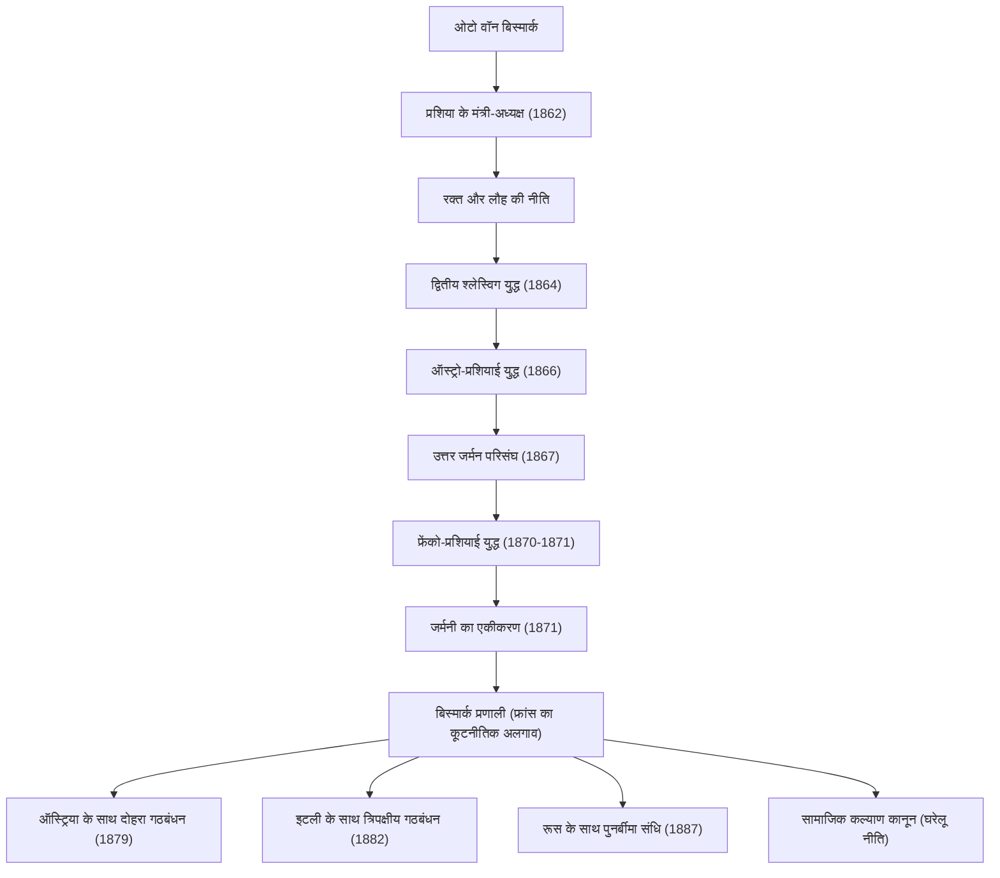

ओटो वॉन बिस्मार्क (1815-1898) एक प्रशियाई और जर्मन साम्राज्य के राजनेता थे, जिन्हें "लौह चांसलर" (Iron Chancellor) के रूप में जाना जाता है, और एक असाधारण यथार्थवादी थे जिन्होंने 19वीं सदी के उत्तरार्ध में यूरोपीय कूटनीति का नेतृत्व किया। उन्होंने सैन्य बल और कुशल कूटनीति के माध्यम से बिखरे हुए जर्मन राज्यों को एकजुट किया और एक शक्तिशाली जर्मन साम्राज्य का निर्माण किया। उनका जीवन, विचार और बाद की पीढ़ियों पर उनका प्रभाव आज भी आधुनिक अंतर्राष्ट्रीय राजनीति में अत्यंत महत्वपूर्ण सबक प्रदान करते हैं। इस लेख में, हम उनके उन कदमों को जानेंगे जिसके द्वारा वे प्रशिया के एक ग्रामीण इलाके से विश्व इतिहास को दिशा देने वाले एक महान नेता के रूप में उभरे।

### जीवन का सफर: जंकर से प्रशिया के चांसलर तक

बिस्मार्क का जन्म 1815 में प्रशिया साम्राज्य में एल्बे नदी के पूर्वी तट पर एक ज़मींदार कुलीन (जंकर) परिवार में हुआ था। यद्यपि उन्होंने अपने विश्वविद्यालय के दिनों में द्वंद्वयुद्ध और शराब पीने में एक लापरवाह जीवन व्यतीत किया, लेकिन धीरे-धीरे राजनीति में उनकी रुचि गहरी हो गई और वे एक रूढ़िवादी राजनेता के रूप में प्रमुखता से उभरे। उन्होंने राजाओं के दैवीय अधिकार (Divine Right of Kings) के सिद्धांत का समर्थन किया और उदारवाद और लोकतंत्र का कड़ा विरोध किया।

टर्निंग पॉइंट 1862 में आया। सैन्य सुधारों को लेकर संसद से टकराव कर रहे प्रशिया के राजा विल्हेम प्रथम ने संसद को नियंत्रित करने के लिए बिस्मार्क को अंतिम उपाय के रूप में प्रधानमंत्री नियुक्त किया। पदभार ग्रहण करने के तुरंत बाद, बिस्मार्क ने संसद के बजट अधिकारों की अनदेखी करते हुए अपना प्रसिद्ध "रक्त और लौह" (Blood and Iron) भाषण दिया। उन्होंने घोषणा की, "आज के बड़े सवाल भाषणों और बहुमत के प्रस्तावों से नहीं, बल्कि लोहे और रक्त से हल किए जाएंगे," और सैन्य विस्तार को आगे बढ़ाया, जिसे उस समय दुस्साहसिक माना गया था। यही मजबूत नेतृत्व बाद में एकीकरण की प्रक्रिया का प्रेरक बल बन गया।

### जर्मन एकीकरण का मार्ग: तीन युद्ध और कुशल कूटनीति

बिस्मार्क की सबसे बड़ी उपलब्धि केवल दस वर्षों में उन जर्मन क्षेत्रों को एक विशाल साम्राज्य में एकजुट करना था, जो मध्य युग से विभाजित थे। उन्होंने सावधानीपूर्वक गणनाओं और यथार्थवादी कूटनीतिक रणनीतियों के आधार पर जानबूझकर तीन युद्ध शुरू किए और एकीकरण हासिल किया।

1. **डेनमार्क का युद्ध (1864)**: सबसे पहले, उन्होंने ऑस्ट्रिया, जो लंबे समय से प्रतिद्वंद्वी था, के साथ गठबंधन किया और डेनमार्क से लड़कर श्लेस्विग और होलस्टीन की डचियों पर कब्जा कर लिया।
2. **ऑस्ट्रो-प्रशियाई युद्ध (1866)**: इसके बाद, उन्होंने अधिग्रहित क्षेत्रों के प्रबंधन को लेकर ऑस्ट्रिया के साथ अपना संघर्ष तेज कर दिया और अचानक युद्ध छेड़ दिया। आधुनिक हथियारों और रेलवे परिवहन का उपयोग करते हुए, प्रशिया की सेना ने केवल सात सप्ताह में एक बड़ी जीत हासिल की, ऑस्ट्रिया को बाहर कर दिया और "उत्तर जर्मन परिसंघ" की स्थापना की।
3. **फ्रेंको-प्रशियाई युद्ध (1870-1871)**: शेष दक्षिणी जर्मन राज्यों को एकजुट करने के लिए एक बाहरी दुश्मन की आवश्यकता थी। एम्स डिस्पैच की घटना (Ems Dispatch) का उपयोग करते हुए, बिस्मार्क ने फ्रांस के नेपोलियन तृतीय को उकसाया और युद्ध शुरू कर दिया। फ्रांसीसी सेना को कुचलने के बाद, प्रशिया ने 1871 में वर्साय के महल के दर्पण कक्ष (जो कि दुश्मन देश फ्रांस का प्रतीक था) में विल्हेम प्रथम के तहत "जर्मन साम्राज्य" के गठन की घोषणा की।

### बिस्मार्क की व्यवस्था और घरेलू राजनीति में "गाजर और छड़ी" (Carrot and Stick)

जर्मन एकीकरण के अपने लंबे समय से संजोए गए सपने को पूरा करने के बाद, बिस्मार्क ने "यूरोप में शांति के रक्षक" की भूमिका अपना ली। यूरोप के केंद्र में नवगठित शक्तिशाली जर्मन साम्राज्य के अस्तित्व को बनाए रखने के लिए, उस फ्रांस को कूटनीतिक रूप से अलग-थलग करना आवश्यक था, जिसे अपने क्षेत्र से वंचित कर दिया गया था और जो बदला लेने की आग में जल रहा था। उन्होंने विचारधारा और भावनाओं से मुक्त होकर **यथार्थवादी राजनीति (Realpolitik)** का अभ्यास किया, और ऑस्ट्रिया, रूस, इटली और अन्य के साथ जटिल गठबंधनों का एक नेटवर्क (तथाकथित "बिस्मार्क प्रणाली") बनाया। इस कुशल शक्ति संतुलन (Balance of Power) को बनाए रखकर, यूरोप में लगभग 40 वर्षों तक शांति बनी रही।

घरेलू राजनीति में, उन्होंने प्रसिद्ध "गाजर और छड़ी" (Carrot and Stick) नीति लागू की। एक ओर उन्होंने कैथोलिक चर्च को दबाने के लिए "संस्कृति संघर्ष" (Kulturkampf) शुरू किया और समाजवादी-विरोधी कानूनों के माध्यम से विरोधियों को सख्ती से दबाया (छड़ी)। वहीं दूसरी ओर, उन्होंने दुनिया की पहली सामाजिक बीमा प्रणाली (राज्य समाजवाद) की शुरुआत की, जिसमें स्वास्थ्य बीमा, दुर्घटना बीमा और वृद्धावस्था एवं विकलांगता बीमा शामिल थे (गाजर)। इस नीति का उद्देश्य मजदूर वर्ग के असंतोष को शांत करना और उन्हें राज्य प्रणाली में एकीकृत करना था, जो आधुनिक कल्याणकारी राज्य की दिशा में एक ऐतिहासिक और अभूतपूर्व प्रयास था।

### दर्शन और बाद की पीढ़ियों पर गहरा प्रभाव

बिस्मार्क के राजनीतिक दर्शन के मूल में पूर्ण व्यवहारवाद (Pragmatism) और राज्य के हितों की खोज थी। उन्होंने कहा था, "राजनीति संभावनाओं की कला है," नैतिकता या आदर्शवाद पर राष्ट्रीय हित और वास्तविक शक्ति संतुलन को प्राथमिकता देते हुए।

हालाँकि, युवा सम्राट विल्हेम द्वितीय के साथ टकराव के बाद, जो 1890 में सिंहासन पर बैठे, बिस्मार्क को अफसोस के साथ चांसलर के पद से इस्तीफा देना पड़ा। एक बार जब बिस्मार्क (जिनमें संतुलन की असाधारण भावना थी) चले गए, तो उनके द्वारा बनाया गया जटिल गठबंधन नेटवर्क धीरे-धीरे ढहने लगा। विल्हेम द्वितीय की विस्तारवादी "विश्व नीति" (Weltpolitik) ने ब्रिटेन और रूस को सतर्क कर दिया, जिसके परिणामस्वरूप जर्मनी अलग-थलग पड़ गया और अंततः प्रथम विश्व युद्ध के विनाशकारी परिणाम की ओर अग्रसर हुआ।

बिस्मार्क की विरासत आज भी विवादास्पद है। जबकि उन्हें एक शक्तिशाली एकीकृत राज्य के निर्माण और कल्याणकारी प्रणाली की स्थापना का श्रेय दिया जाता है, उन पर संसदीय राजनीति की अनदेखी करने और सम्राट के तहत ऊपर-से-नीचे तक एक सत्तावादी व्यवस्था स्थापित करने का भी आरोप है, जिसने बाद में जर्मन समाज में लोकतंत्र के विकास को धीमा कर दिया। फिर भी, उनकी असाधारण कूटनीतिक कुशलता और ठंडी यथार्थवादी राजनीति जटिल होती जा रही आधुनिक अंतरराष्ट्रीय प्रणाली में राष्ट्रीय नेताओं के लिए एक शाश्वत और महत्वपूर्ण सबक बनी हुई है।

### उपलब्धियां और कूटनीतिक नेटवर्क का आरेख

नीचे एक फ़्लोचार्ट दिया गया है, जो प्रशिया के नेतृत्व में जर्मन एकीकरण प्रक्रिया को दर्शाता है जिसका नेतृत्व बिस्मार्क ने किया था, और एकीकरण के बाद उनके द्वारा बनाया गया गठबंधन नेटवर्क (बिस्मार्क प्रणाली) दिखाता है।

