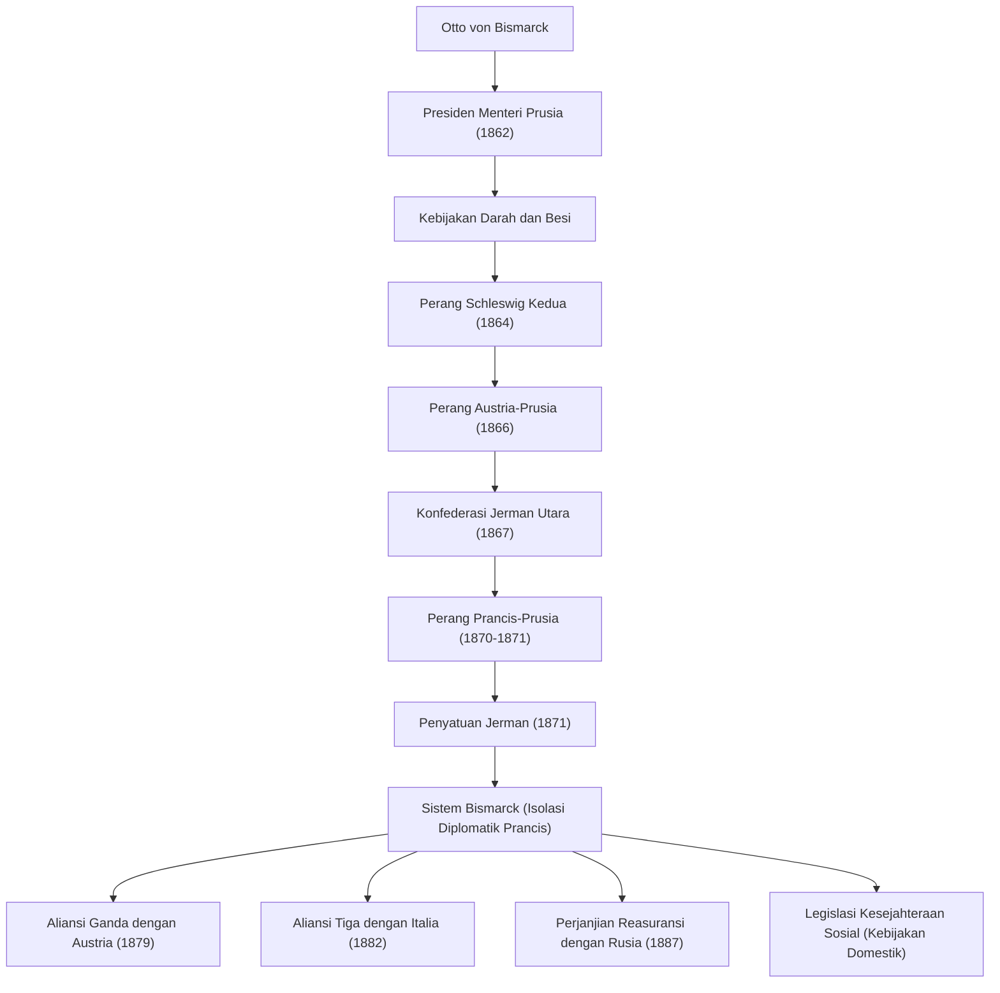

Otto von Bismarck (1815–1898), yang dikenal dengan julukan "Kanselir Besi", adalah seorang politisi Prusia dan Kekaisaran Jerman, serta seorang realis (praktisi Realpolitik) terkemuka yang memimpin diplomasi Eropa pada paruh kedua abad ke-19. Kehidupan, pemikiran, dan dampaknya pada generasi mendatang, dengan menyatukan negara-negara Jerman yang terpecah melalui kekuatan militer dan diplomasi yang terampil untuk membangun Kekaisaran Jerman yang kuat, terus memberikan pelajaran penting bagi politik internasional kontemporer. Artikel ini menelusuri jejaknya, dari daerah pedesaan Prusia hingga tumbuh menjadi raksasa yang menggerakkan sejarah dunia.

### Jejak Kehidupan: Dari Junker Menjadi Perdana Menteri Prusia

Bismarck lahir pada tahun 1815 di keluarga bangsawan pemilik tanah (Junker) di tepi timur Sungai Elbe, Kerajaan Prusia. Selama masa universitasnya, ia menjalani kehidupan yang liar, penuh dengan duel dan mabuk-mabukan, tetapi secara bertahap memperdalam minatnya pada politik, dan muncul sebagai politikus konservatif. Ia mendukung teori hak ilahi raja dan mengambil sikap yang sangat menentang liberalisme dan demokrasi.

Titik baliknya terjadi pada tahun 1862. Raja Prusia Wilhelm I, yang berkonflik dengan parlemen mengenai reformasi militer, menunjuk Bismarck sebagai perdana menteri sebagai kartu trufnya untuk menekan parlemen. Segera setelah menjabat, Bismarck mengabaikan hak parlemen untuk membahas anggaran dan menyampaikan pidatonya yang terkenal, "Darah dan Besi". Menyatakan bahwa "pertanyaan-pertanyaan besar pada masa kita tidak akan diselesaikan dengan pidato-pidato dan resolusi-resolusi mayoritas, tetapi dengan besi dan darah", ia memaksakan ekspansi militer yang sembrono. Kepemimpinan yang kuat ini menjadi kekuatan pendorong bagi proyek penyatuan di kemudian hari.

### Jalan Menuju Penyatuan Jerman: Tiga Perang dan Diplomasi Cerdik

Pencapaian terbesar Bismarck adalah menyatukan wilayah Jerman, yang telah terpecah sejak Abad Pertengahan, menjadi satu kekaisaran besar dalam waktu kurang dari sepuluh tahun. Berdasarkan perhitungan yang cermat dan strategi diplomasi yang dingin, ia sengaja memicu tiga perang untuk mencapai penyatuan.

1. **Perang Schleswig Kedua (1864)**: Pertama, ia bersekutu dengan saingan lama, Austria, dan berperang melawan Denmark untuk merebut Kadipaten Schleswig dan Holstein.
2. **Perang Austria-Prusia (1866)**: Selanjutnya, ia memperdalam konflik dengan Austria mengenai administrasi wilayah yang diperoleh dan memulai perang kilat. Menggunakan persenjataan modern dan transportasi kereta api, tentara Prusia meraih kemenangan telak hanya dalam waktu tujuh minggu, mendirikan "Konfederasi Jerman Utara" dengan mengecualikan Austria.
3. **Perang Prancis-Prusia (1870-1871)**: Untuk mengintegrasikan sisa negara-negara Jerman bagian selatan, diperlukan musuh dari luar. Bismarck menggunakan Insiden Telegram Ems untuk memprovokasi Napoleon III dari Prancis agar memulai perang. Setelah menghancurkan tentara Prancis, Prusia dengan bangga memproklamasikan berdirinya "Kekaisaran Jerman", dengan Wilhelm I sebagai kaisar, di Aula Kaca Istana Versailles, simbol musuh Prancis (1871).

### Sistem Bismarck dan "Wortel dan Tongkat" dalam Kebijakan Domestik

Setelah mencapai tujuan yang telah lama didambakan yaitu penyatuan Jerman, Bismarck berubah menjadi "pembela perdamaian Eropa". Agar Kekaisaran Jerman yang kuat, yang lahir di pusat Eropa, dapat bertahan hidup, sangat penting untuk mengisolasi Prancis secara diplomatis, yang telah kehilangan wilayah dan terbakar oleh dendam. Ia mengembangkan **Realpolitik** (politik realistis) yang bebas dari ideologi dan emosi, membangun aliansi yang kompleks (yang disebut "Sistem Bismarck") dengan Austria, Rusia, Italia, dan negara lainnya. Pemeliharaan keseimbangan kekuasaan yang terampil ini membawa perdamaian jangka panjang ke Eropa selama sekitar 40 tahun.

Dalam kebijakan domestik, ia menerapkan kebijakan "wortel dan tongkat" yang terkenal. Di satu sisi, ia dengan kejam menekan oposisi (tongkat) melalui perjuangan budaya (Kulturkampf) melawan Gereja Katolik dan Hukum Anti-Sosialis, namun di sisi lain, ia memelopori penciptaan sistem jaminan sosial (asuransi kesehatan, asuransi kecelakaan, serta asuransi cacat dan hari tua) yang merupakan bentuk sosialisme negara (wortel). Kebijakan ini, yang bertujuan untuk meredakan ketidakpuasan kelas pekerja dan mengintegrasikan mereka ke dalam sistem negara, merupakan upaya historis dan inovatif yang dapat dikatakan sebagai cikal bakal negara kesejahteraan modern.

### Filsafat dan Pengaruh Mendalam pada Generasi Berikutnya

Akar dari filosofi politik Bismarck adalah pencarian pragmatisme yang tiada henti dan alasan negara (reason of state). Ia meninggalkan ungkapan bahwa "politik adalah seni dari kemungkinan", memprioritaskan pemaksimalan kepentingan nasional dan keseimbangan kekuatan nyata di atas moralitas dan idealisme.

Namun, pada tahun 1890, ia berkonflik dengan kaisar muda Wilhelm II yang naik takhta, dan terpaksa mengundurkan diri sebagai kanselir. Setelah kepergian Bismarck yang memiliki rasa keseimbangan yang jenius, jaringan aliansi rumit yang telah dibangunnya perlahan-lahan runtuh. Kebijakan ekspansionis Wilhelm II yang dikenal sebagai "Kebijakan Dunia" (Weltpolitik) menimbulkan kewaspadaan dari Inggris dan Rusia, yang pada akhirnya mengisolasi Jerman dan membawanya menuju akhir yang menghancurkan di Perang Dunia I.

Masih ada pro dan kontra mengenai warisan yang ditinggalkan oleh Bismarck. Sementara pencapaian besarnya dalam membangun negara kesatuan yang kuat dan menciptakan sistem kesejahteraan diakui, juga ditunjukkan bahwa pengabaiannya terhadap politik parlementer dan konsolidasi rezim otoriter dari atas ke bawah yang dipimpin oleh kaisar telah melahirkan ketidakmatangan demokrasi dalam masyarakat Jerman berikutnya. Meskipun demikian, keterampilan diplomasinya yang luar biasa dan realisme yang dingin terus bersinar sebagai teks abadi yang harus dipelajari oleh para pemimpin nasional dalam komunitas internasional saat ini yang semakin kompleks.

### Ilustrasi Pencapaian dan Jaringan Diplomasi

Berikut ini adalah diagram alir yang menunjukkan proses penyatuan Jerman yang dipimpin oleh Prusia di bawah arahan Bismarck, dan jaringan aliansi (Sistem Bismarck) yang dibangun setelah penyatuan.

