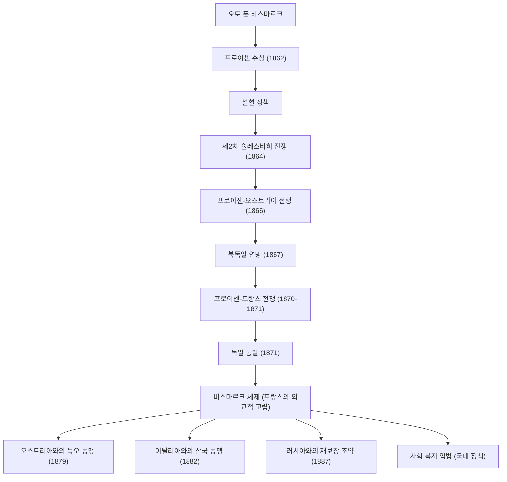

오토 폰 비스마르크(1815년~1898년)는 '철혈 재상'이라는 별명으로 잘 알려진 프로이센 및 독일 제국의 정치인이자, 19세기 후반 유럽 외교를 주도한 희대의 현실 정치인(리얼리스트)입니다. 무력과 교묘한 외교를 통해 분열되어 있던 독일의 여러 국가들을 통일하고 강력한 독일 제국을 건설한 그의 생애와 사상, 그리고 후세에 미친 영향은 현대 국제 정치에서도 매우 중요한 교훈을 계속해서 제공하고 있습니다. 본 글에서는 프로이센의 시골에서 세계 역사를 움직이는 거물로 성장한 그의 발자취를 추적합니다.

### 생애의 발자취: 융커에서 프로이센 수상으로

비스마르크는 1815년 프로이센 왕국 엘베강 동쪽 연안의 지주 귀족(융커) 가정에서 태어났습니다. 대학 시절에는 결투와 음주로 방탕한 생활을 보냈으나, 점차 정치에 대한 관심을 심화시키며 보수파 정치인으로 두각을 나타냈습니다. 그는 왕권신수설을 지지하고 자유주의와 민주주의에는 강하게 반대하는 입장을 취했습니다.

전환점이 찾아온 것은 1862년입니다. 군제 개혁을 둘러싸고 의회와 대립하던 프로이센 국왕 빌헬름 1세는 의회를 억누르기 위한 비장의 카드로 비스마르크를 수상에 임명했습니다. 취임 직후 비스마르크는 의회의 예산 심의권을 무시하는 형태로 그 유명한 '철혈 연설'을 합니다. "현대의 대문제는 연설이나 다수결에 의해서가 아니라 철과 피에 의해서만 해결된다"고 선언하며, 무모하다고도 할 수 있는 군비 확장을 강행했습니다. 이 강력한 리더십이 훗날 통일 사업의 원동력이 됩니다.

### 독일 통일로의 여정: 세 번의 전쟁과 교묘한 외교

비스마르크의 가장 큰 업적은 중세 이래 뿔뿔이 분열되어 있던 독일 지역을 불과 10년도 채 되지 않아 하나의 거대한 제국으로 통합한 것입니다. 그는 치밀한 계산과 냉철한 외교 전략을 바탕으로 3개의 전쟁을 의도적으로 일으켜 통일을 이룩했습니다.

1. **제2차 슐레스비히 전쟁 (1864년)**: 먼저 오랜 라이벌이었던 오스트리아와 손을 잡고 덴마크와 싸워 슐레스비히-홀슈타인 두 공국을 탈취했습니다.
2. **프로이센-오스트리아 전쟁 (1866년)**: 다음으로 획득한 영토의 관리를 둘러싸고 오스트리아와 대립을 심화시켜 전격적으로 개전합니다. 근대적인 무기와 철도 수송을 구사한 프로이센군은 불과 7주 만에 대승을 거두고, 오스트리아를 배제한 '북독일 연방'을 성립시켰습니다.
3. **프로이센-프랑스 전쟁 (1870년~1871년)**: 마지막으로 남은 남독일 국가들을 통합하기 위해서는 외부의 적이 필요했습니다. 비스마르크는 엠스 전보 사건을 계기로 프랑스의 나폴레옹 3세를 도발하여 개전으로 이끌었습니다. 프랑스군을 분쇄한 프로이센은 적국 프랑스의 상징인 베르사유 궁전 거울의 방에서 빌헬름 1세를 황제로 하는 '독일 제국'의 성립을 고조차게 선언했습니다 (1871년).

### 비스마르크 체제와 내정에서의 '당근과 채찍'

독일 통일이라는 숙원을 달성한 후, 비스마르크는 돌연 '유럽 평화의 옹호자'로 변모합니다. 유럽의 중심에 탄생한 강력한 독일 제국이 존속하기 위해서는 영토를 빼앗기고 복수심에 불타는 프랑스를 외교적으로 고립시키는 것이 필수적이었기 때문입니다. 그는 이데올로기나 감정에 얽매이지 않는 **현실 정치(리얼폴리틱스)**를 전개하여 오스트리아, 러시아, 이탈리아 등과 복잡한 동맹 관계(이른바 '비스마르크 체제')를 구축했습니다. 이 교묘한 세력 균형(밸런스 오브 파워)의 유지 덕분에 유럽에는 약 40년에 걸친 장기적인 평화가 찾아왔습니다.

내정에서는 유명한 '당근과 채찍' 정책을 실시했습니다. 가톨릭 교회를 탄압하는 문화 투쟁(쿨투어캄프)이나 사회주의자 진압법을 통해 반체제파를 철저히 억누르는(채찍) 한편, 세계 최초로 질병 보험, 산재 보험, 노령 및 폐질 보험 등의 사회 보험 제도(국가 사회주의)를 창설했습니다(당근). 노동자 계급의 불만을 누그러뜨리고 국가 체제에 편입시키는 것을 목적으로 한 이 정책은 현대 복지 국가의 기원이라고도 할 수 있는 역사적이고 획기적인 시도였습니다.

### 철학과 후세에 미친 깊은 영향

비스마르크 정치 철학의 근저에 있는 것은 철저한 프래그머티즘(실용주의)과 국가 이성의 추구입니다. 그는 "정치는 가능성의 예술이다"라는 말을 남겼으며, 도덕이나 이상주의보다 국익의 극대화와 현실의 힘의 균형을 최우선으로 삼았습니다.

그러나 1890년 즉위한 젊은 황제 빌헬름 2세와 대립하게 되고, 아쉬움 속에서도 수상을 사임하게 됩니다. 천재적인 균형 감각을 가졌던 비스마르크가 떠난 후, 그가 구축했던 복잡한 동맹망은 서서히 붕괴해 갔습니다. 빌헬름 2세의 팽창주의적인 '세계 정책'은 영국과 러시아의 경계를 불러일으켰고, 결과적으로 독일은 고립되어 제1차 세계 대전이라는 파멸적인 결말로 치닫게 됩니다.

비스마르크가 남긴 유산에 대해서는 오늘날에도 찬반양론이 존재합니다. 강력한 통일 국가 건설과 복지 제도의 창설이라는 위업의 이면에는, 의회 정치를 경시하고 황제를 정점으로 하는 위로부터의 권위주의적인 체제를 결정지은 것이 훗날 독일 사회에서 민주주의의 미성숙을 낳았다는 지적도 있습니다. 그럼에도 불구하고 그의 탁월한 외교 수완과 냉철한 현실주의는 복잡해지는 현대 국제 사회에서 국가 지도자가 배워야 할 불후의 텍스트로서 찬란하게 빛나고 있습니다.

### 업적과 외교 네트워크 도해

다음은 비스마르크가 주도한 프로이센 주도의 독일 통일 과정과 통일 후 구축한 동맹 네트워크(비스마르크 체제)를 보여주는 플로우차트입니다.

