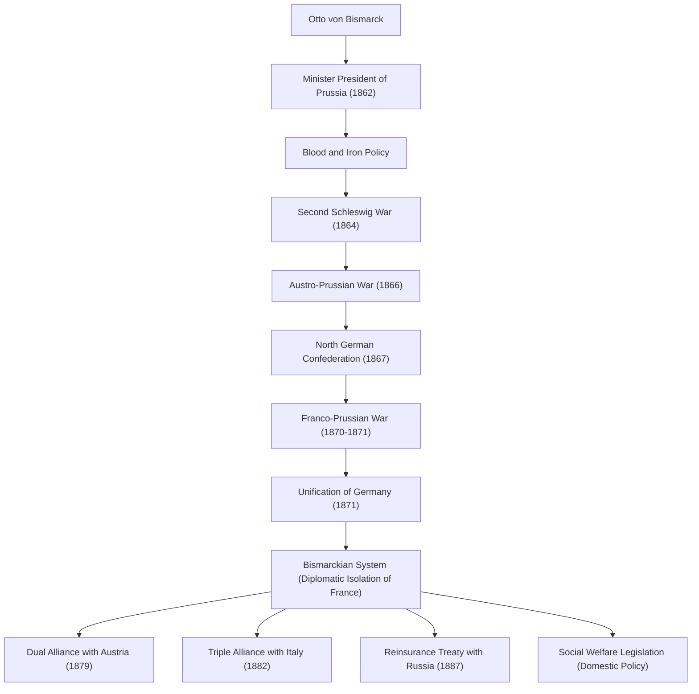

オットー・フォン・ビスマルク（1815年〜1898年）は、「鉄血宰相」の異名で知られるプロイセン及びドイツ帝国の政治家であり、19世紀後半のヨーロッパ外交を牽引した希代のリアリスト（現実政治家）です。バラバラであったドイツの諸邦を武力と巧みな外交によって統一し、強大なドイツ帝国を築き上げた彼の生涯と思想、そして後世への影響は、現代の国際政治においても極めて重要な教訓を与え続けています。本稿では、プロイセンの片田舎から世界の歴史を動かす巨魁へと成長した彼の足跡をたどります。

### 生涯の足跡：ユンカーからプロイセン宰相へ

ビスマルクは1815年、プロイセン王国エルベ川東岸の地主貴族（ユンカー）の家庭に生まれました。大学時代は決闘や飲酒に明け暮れる奔放な生活を送っていましたが、徐々に政治への関心を深め、保守派の政治家として頭角を現していきます。彼は王権神授説を支持し、自由主義や民主主義には強く反対する立場をとりました。

転機が訪れたのは1862年です。軍制改革をめぐって議会と対立していたプロイセン国王ヴィルヘルム1世は、議会を抑え込むための切り札としてビスマルクを首相に任命しました。就任直後、ビスマルクは議会の予算審議権を無視する形で有名な「鉄血演説」を行います。「現代の大問題は演説や多数決によってではなく、鉄と血によってのみ解決される」と宣言し、無謀とも言える軍備拡張を強行しました。この強烈なリーダーシップが、後の統一事業の原動力となっていきます。

### ドイツ統一への道程：三つの戦争と巧みな外交

ビスマルクの最大の功績は、中世以来バラバラに分断されていたドイツ地域を、わずか10年足らずで一つの巨大な帝国にまとめ上げたことです。彼は綿密な計算と冷徹な外交戦略に基づき、3つの戦争を意図的に引き起こして統一を成し遂げました。

1. **デンマーク戦争（1864年）**：まず、長年のライバルであったオーストリアと手を組み、デンマークと戦ってシュレースヴィヒ＝ホルシュタイン両公国を奪取しました。
2. **普墺戦争（1866年）**：次に、獲得した領土の管理をめぐってオーストリアと対立を深め、電撃的に開戦します。近代的な兵器と鉄道輸送を駆使したプロイセン軍はわずか7週間で大勝し、オーストリアを排除した「北ドイツ連邦」を成立させました。
3. **普仏戦争（1870年〜1871年）**：最後に残された南ドイツ諸邦を統合するためには、外敵が必要でした。ビスマルクはエムス電報事件を機にフランスのナポレオン3世を挑発して開戦に持ち込みます。フランス軍を粉砕したプロイセンは、敵国フランスの象徴であるヴェルサイユ宮殿の鏡の間で、ヴィルヘルム1世を皇帝とする「ドイツ帝国」の成立を高らかに宣言しました（1871年）。

### ビスマルク体制と内政における「アメとムチ」

ドイツ統一という悲願を達成した後、ビスマルクは一転して「ヨーロッパの平和の擁護者」となります。ヨーロッパの中心に誕生した強大なドイツ帝国が存続するためには、領土を奪われ復讐に燃えるフランスを外交的に孤立させることが不可欠だったからです。彼はイデオロギーや感情にとらわれない**現実政治（リアルポリティクス）**を展開し、オーストリア、ロシア、イタリアなどと複雑な同盟関係（いわゆる「ビスマルク体制」）を構築しました。この巧みな勢力均衡（バランス・オブ・パワー）の維持により、ヨーロッパには約40年にわたる長期の平和がもたらされました。

内政においては、有名な「アメとムチ」の政策を実施しました。カトリック教会を弾圧する文化闘争（クルトゥルカンプ）や、社会主義者鎮圧法によって反体制派を徹底的に抑え込む（ムチ）一方で、世界に先駆けて疾病保険、労災保険、養老・廃疾保険などの社会保険制度（国家社会主義）を創設しました（アメ）。労働者階級の不満を和らげ、国家体制に組み込むことを目的としたこの政策は、現代の福祉国家の源流とも言える歴史的かつ画期的な試みでした。

### 哲学と後世への深い影響

ビスマルクの政治哲学の根底にあるのは、徹底したプラグマティズム（実用主義）と国家理性の追求です。彼は「政治とは可能性の芸術である」という言葉を残しており、道徳や理想主義よりも、国益の極大化と現実のパワーバランスを最優先しました。

しかし、1890年に即位した若き皇帝ヴィルヘルム2世と対立し、惜しまれつつも宰相を辞任することになります。天才的なバランス感覚を持ったビスマルクが去った後、彼が築き上げた複雑な同盟網は徐々に崩壊していきました。ヴィルヘルム2世の拡張主義的な「世界政策」はイギリスやロシアの警戒を招き、結果としてドイツは孤立し、第一次世界大戦という破滅的な結末へと突き進むことになります。

ビスマルクの残した遺産には、今日でも賛否両論が存在します。強力な統一国家の建設と福祉制度の創設という偉業の一方で、議会政治を軽視し、皇帝を頂点とする上からの権威主義的な体制を決定づけたことは、後のドイツ社会における民主主義の未成熟さを生み出したとも指摘されています。それでもなお、彼の卓越した外交手腕と冷徹な現実主義は、複雑化する現代の国際社会において、国家指導者が学ぶべき不朽のテキストとして燦然と輝き続けています。

### 功績と外交ネットワークの図解

以下は、ビスマルクが主導したプロイセン主導のドイツ統一プロセスと、統一後に築き上げた同盟ネットワーク（ビスマルク体制）を示すフローチャートです。

