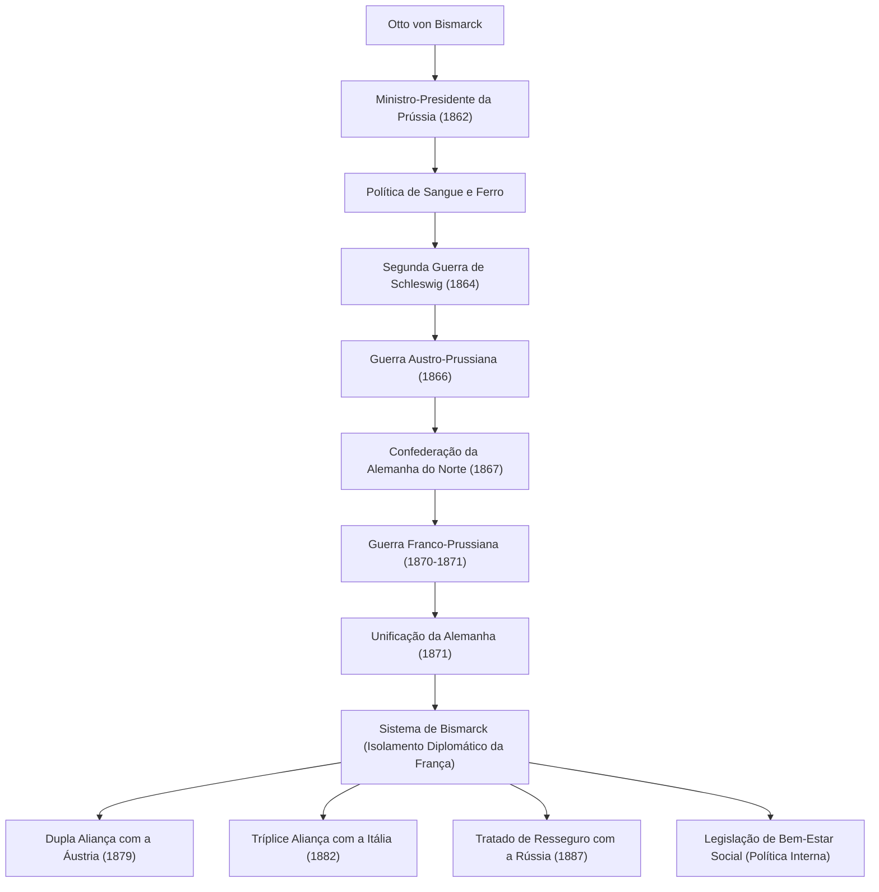

Otto von Bismarck (1815–1898) é um político prussiano e do Império Alemão conhecido pelo apelido de "Chanceler de Ferro", e um realista notável (praticante da Realpolitik) que liderou a diplomacia europeia na segunda metade do século XIX. Sua vida, seus pensamentos e seu impacto nas gerações futuras, ao unificar os estados alemães fragmentados por meio da força militar e de uma diplomacia hábil, criando o poderoso Império Alemão, continuam a fornecer lições cruciais para a política internacional contemporânea. Este artigo traça seus passos, desde uma região rural da Prússia até se tornar um gigante que moveu a história mundial.

### Os Passos de sua Vida: De Junker a Chanceler da Prússia

Bismarck nasceu em 1815 em uma família de nobres proprietários de terras (Junker) na margem leste do rio Elba, no Reino da Prússia. Em seus anos de universidade, ele levou uma vida indisciplinada, cheia de duelos e bebedeiras, mas gradualmente aprofundou seu interesse pela política, destacando-se como um político conservador. Ele apoiava a teoria do direito divino dos reis e opunha-se fortemente ao liberalismo e à democracia.

O ponto de virada ocorreu em 1862. O rei da Prússia, Guilherme I, que estava em conflito com o parlamento sobre reformas militares, nomeou Bismarck como primeiro-ministro como sua cartada decisiva para suprimir a oposição. Logo após assumir o cargo, Bismarck ignorou o direito do parlamento de debater o orçamento e fez seu famoso discurso de "Sangue e Ferro". Declarando que "as grandes questões do nosso tempo não serão resolvidas por discursos e resoluções de maiorias, mas por ferro e sangue", ele forçou uma expansão militar imprudente. Essa forte liderança tornou-se a força motriz para o subsequente projeto de unificação.

### O Caminho para a Unificação Alemã: Três Guerras e Diplomacia Hábil

A maior conquista de Bismarck foi unificar a região alemã, que estava fragmentada desde a Idade Média, em um império massivo em menos de dez anos. Baseando-se em cálculos meticulosos e em uma estratégia diplomática fria, ele provocou intencionalmente três guerras para alcançar a unificação.

1. **Guerra dos Ducados do Elba (1864)**: Primeiro, ele se aliou ao rival de longa data, a Áustria, e lutou contra a Dinamarca para capturar os ducados de Schleswig e Holstein.
2. **Guerra Austro-Prussiana (1866)**: Em seguida, ele aprofundou o conflito com a Áustria sobre a administração dos territórios adquiridos e iniciou uma guerra relâmpago. Utilizando armamento moderno e transporte ferroviário, o exército prussiano obteve uma vitória esmagadora em apenas sete semanas, estabelecendo a "Confederação da Alemanha do Norte", excluindo a Áustria.
3. **Guerra Franco-Prussiana (1870-1871)**: Para integrar os estados remanescentes do sul da Alemanha, era necessário um inimigo externo. Bismarck usou o Incidente do Despacho de Ems para provocar Napoleão III da França a declarar guerra. Tendo esmagado o exército francês, a Prússia proclamou orgulhosamente o estabelecimento do "Império Alemão", com Guilherme I como imperador, no Salão dos Espelhos do Palácio de Versalhes, o símbolo do inimigo francês (1871).

### O Sistema de Bismarck e a "Cenoura e o Bastão" na Política Interna

Após alcançar o tão desejado objetivo da unificação alemã, Bismarck transformou-se no "defensor da paz europeia". Para que o poderoso Império Alemão, nascido no centro da Europa, sobrevivesse, era essencial isolar diplomaticamente a França, que havia sido privada de território e ardia por vingança. Ele desenvolveu uma **Realpolitik** (política realista) livre de ideologia e emoção, construindo alianças complexas (o chamado "Sistema de Bismarck") com Áustria, Rússia, Itália e outros. A manutenção desse hábil equilíbrio de poder trouxe cerca de 40 anos de paz duradoura à Europa.

Na política interna, ele implementou a famosa política da "cenoura e o bastão". Enquanto suprimia impiedosamente a oposição (o bastão) por meio da luta cultural (Kulturkampf) contra a Igreja Católica e as Leis Antissocialistas, ele foi pioneiro no mundo ao criar um sistema de seguro social (seguro saúde, seguro contra acidentes e seguro de invalidez e velhice), o que pode ser chamado de socialismo de Estado (a cenoura). Esta política, que visava apaziguar a insatisfação da classe trabalhadora e integrá-la ao sistema estatal, foi uma tentativa histórica e inovadora que pode ser vista como a origem do moderno Estado de bem-estar social.

### Filosofia e Profundo Impacto nas Gerações Futuras

A base da filosofia política de Bismarck é a busca pelo pragmatismo implacável e pela razão de Estado. Ele deixou a frase "a política é a arte do possível", priorizando a maximização dos interesses nacionais e o equilíbrio de poder real acima da moralidade e do idealismo.

No entanto, em 1890, ele entrou em conflito com o jovem imperador Guilherme II, que havia subido ao trono, e foi forçado a renunciar ao cargo de chanceler, para o lamento de muitos. Após a partida de Bismarck e de seu genial senso de equilíbrio, a complexa rede de alianças que ele havia construído entrou gradualmente em colapso. A política expansionista de Guilherme II, conhecida como "Weltpolitik" (Política Mundial), provocou o alarme da Grã-Bretanha e da Rússia, resultando no isolamento da Alemanha e precipitando-a no fim desastroso da Primeira Guerra Mundial.

Ainda há prós e contras em relação ao legado deixado por Bismarck. Embora suas grandes conquistas de construir um Estado unificado forte e estabelecer um sistema de bem-estar social sejam reconhecidas, é também apontado que seu desrespeito à política parlamentar e a consolidação de um regime autoritário liderado pelo imperador contribuíram para a imaturidade da democracia na sociedade alemã subsequente. No entanto, sua brilhante habilidade diplomática e realismo frio continuam a brilhar como um texto atemporal do qual os líderes nacionais devem aprender na cada vez mais complexa comunidade internacional de hoje.

### Ilustração de Conquistas e Rede Diplomática

Abaixo está um fluxograma que ilustra o processo de unificação alemã liderado pela Prússia, sob a direção de Bismarck, e a rede de alianças (Sistema de Bismarck) construída após a unificação.

