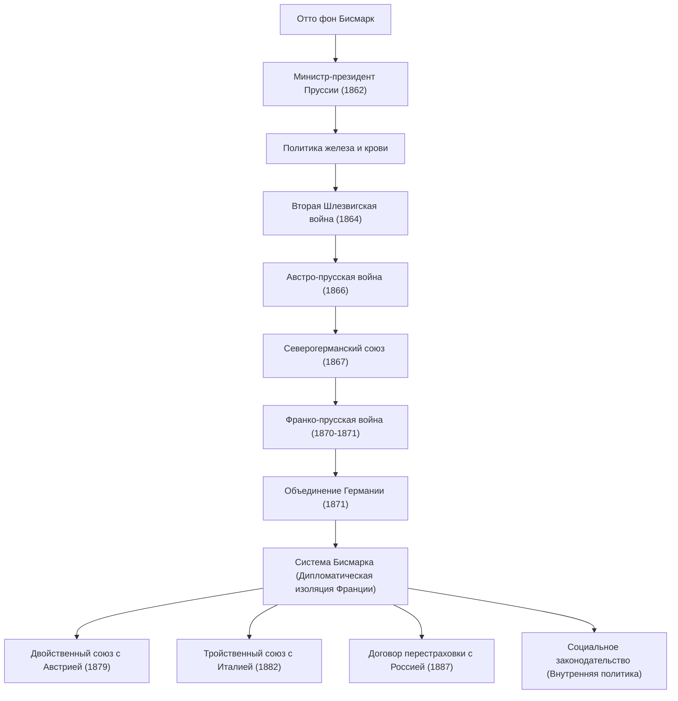

Отто фон Бисмарк (1815–1898), известный как «Железный канцлер», был прусским и немецким государственным деятелем и выдающимся реалистом, который руководил европейской дипломатией во второй половине 19 века. Он объединил разрозненные немецкие государства с помощью военной силы и искусной дипломатии, построив могущественную Германскую империю. Его жизнь, мысли и влияние на последующие поколения продолжают преподносить чрезвычайно важные уроки в современной международной политике. Эта статья прослеживает его путь от провинциального прусского дворянина до великого лидера, изменившего ход мировой истории.

### Жизненный путь: от юнкера до канцлера Пруссии

Бисмарк родился в 1815 году в семье землевладельческой знати (юнкеров) на восточном берегу Эльбы в Королевстве Пруссия. Хотя в студенческие годы он вел разгульную жизнь, полную дуэлей и пьянства, он постепенно заинтересовался политикой и стал видным консервативным политиком. Он поддерживал теорию божественного права королей и решительно выступал против либерализма и демократии.

Поворотный момент наступил в 1862 году. Король Пруссии Вильгельм I, который конфликтовал с парламентом из-за военных реформ, назначил Бисмарка министром-президентом в качестве последнего средства для контроля над парламентом. Вскоре после вступления в должность Бисмарк произнес свою знаменитую речь «Железом и кровью», проигнорировав право парламента обсуждать бюджет. Он заявил, что «великие вопросы времени будут решаться не речами и резолюциями большинства, а железом и кровью», и продвинул вперед военную экспансию, которая в то время считалась безрассудной. Это сильное руководство позже стало движущей силой процесса объединения.

### Путь к объединению Германии: три войны и искусная дипломатия

Величайшим достижением Бисмарка стало объединение немецких регионов, которые были разделены со времен Средневековья, в одну огромную империю менее чем за десять лет. Основываясь на тщательных расчетах и реалистичной дипломатической стратегии, он намеренно спровоцировал три войны для достижения объединения.

1. **Датская война (1864)**: Во-первых, он объединился со своим давним соперником Австрией и сразился с Данией, чтобы захватить герцогства Шлезвиг и Гольштейн.
2. **Австро-прусская война (1866)**: Затем он углубил свой конфликт с Австрией из-за управления приобретенными территориями и начал внезапную войну. Используя современное оружие и железнодорожный транспорт, прусская армия одержала сокрушительную победу всего за семь недель, исключив Австрию и создав «Северогерманский союз».
3. **Франко-прусская война (1870–1871)**: Чтобы объединить оставшиеся южногерманские государства, нужен был внешний враг. Бисмарк использовал инцидент с Эмсской депешей, чтобы спровоцировать французского императора Наполеона III объявить войну. После разгрома французской армии Пруссия гордо провозгласила создание «Германской империи» под властью императора Вильгельма I в Зеркальной галерее Версальского дворца, символа враждебной Франции (1871).

### Система Бисмарка и политика «кнута и пряника» во внутренних делах

Достигнув своей заветной мечты об объединении Германии, Бисмарк внезапно превратился в «защитника мира в Европе». Чтобы могущественная Германская империя, недавно возникшая в центре Европы, выжила, было необходимо дипломатически изолировать Францию, которая была лишена своих территорий и горела жаждой мести. Он практиковал **реальную политику (Realpolitik)**, свободную от идеологий и эмоций, и построил сложную сеть альянсов (так называемую «систему Бисмарка») с Австрией, Россией, Италией и другими странами. Благодаря поддержанию этого искусного баланса сил в Европе наступил длительный мирный период, длившийся почти 40 лет.

Во внутренней политике он проводил знаменитую политику «кнута и пряника». С одной стороны, он безжалостно подавлял антисистемную оппозицию посредством «культуркампфа» (Kulturkampf) для подавления католической церкви и с помощью антисоциалистических законов (кнут). С другой стороны, он первым в мире создал систему социального страхования (государственный социализм), которая включала медицинское страхование, страхование от несчастных случаев на производстве, а также страхование по старости и инвалидности (пряник). Эта политика, направленная на смягчение недовольства рабочего класса и интеграцию его в государственную систему, стала исторической и новаторской попыткой, считающейся истоком современного государства всеобщего благосостояния.

### Философия и глубокое влияние на последующие поколения

В основе политической философии Бисмарка лежали абсолютный прагматизм и стремление к государственным интересам. Он оставил после себя изречение «политика — искусство возможного», отдавая приоритет максимизации национальных интересов и реальному балансу сил, а не морали или идеализму.

Однако после конфликта с молодым императором Вильгельмом II, вступившим на престол в 1890 году, Бисмарк был вынужден к большому сожалению уйти в отставку с поста канцлера. Как только Бисмарк, обладавший гениальным чувством равновесия, ушел, созданная им сложная сеть альянсов начала постепенно рушиться. Экспансионистская «мировая политика» (Weltpolitik) Вильгельма II вызвала настороженность Великобритании и России, что в конечном итоге привело к изоляции Германии и подтолкнуло ее к катастрофическому финалу Первой мировой войны.

Наследие Бисмарка и сегодня остается противоречивым. Хотя ему приписывают создание мощного объединенного государства и системы социального обеспечения, также отмечается, что его пренебрежение к парламентской политике и создание авторитарной системы управления сверху вниз во главе с императором привели к незрелости демократии в последующем немецком обществе. Тем не менее, его исключительные дипломатические навыки и холодный реализм продолжают сиять как вневременные уроки, которые национальные лидеры должны извлечь в сложном современном международном сообществе.

### Достижения и схема дипломатической сети

Ниже приведена блок-схема, показывающая процесс объединения Германии под руководством Пруссии, возглавляемый Бисмарком, а также сеть союзов (систему Бисмарка), которую он построил после объединения.

