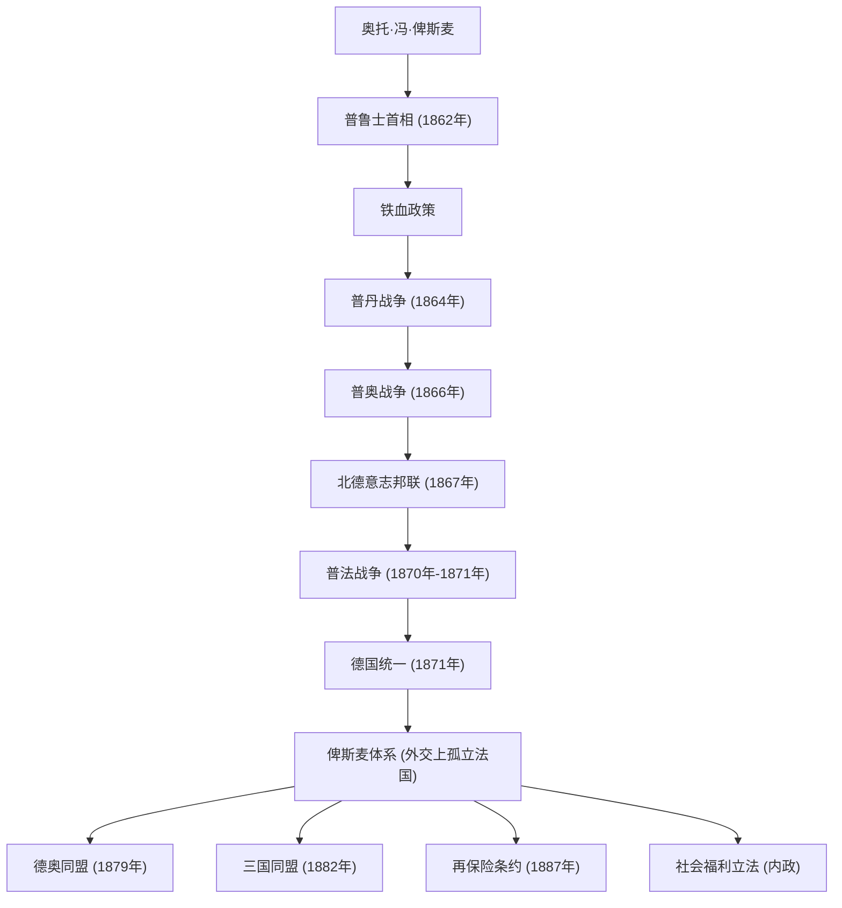

奥托·冯·俾斯麦（1815年～1898年），以“铁血宰相”的称号闻名，是普鲁士及德意志帝国的政治家，也是引领19世纪后半叶欧洲外交的罕见现实主义者（现实政治家）。他通过武力和巧妙的外交，将四分五裂的德意志各邦统一起来，建立了一个强大的德意志帝国。他的一生、思想以及对后世的影响，至今仍在现代国际政治中提供着极为重要的教训。本文将追溯他的足迹，看他如何从普鲁士的偏远乡村成长为推动世界历史的巨头。

### 传奇一生：从容克到普鲁士首相

1815年，俾斯麦出生于普鲁士王国易北河东岸的一个地主贵族（容克）家庭。大学时期，他过着沉湎于决斗和饮酒的放荡生活，但逐渐加深了对政治的兴趣，并作为保守派政治家崭露头角。他支持君权神授，强烈反对自由主义和民主主义。

转机出现在1862年。因军队改革问题与议会发生对立的普鲁士国王威廉一世，任命俾斯麦为首相，以此作为压制议会的王牌。就任伊始，俾斯麦无视议会的预算审议权，发表了著名的“铁血演说”。他宣称：“当代的重大问题不是通过演说和多数决议所能解决的……而是要用铁和血来解决”，并强行推动了看似鲁莽的军备扩张。这种强烈的领导力成为了日后统一大业的动力。

### 德国统一之路：三次王朝战争与巧妙外交

俾斯麦最大的功绩在于，他在短短不到十年的时间里，将自中世纪以来就四分五裂的德意志地区整合成了一个庞大的帝国。他基于精密的计算和冷酷的外交战略，蓄意挑起了三场战争，最终完成了统一。

1. **普丹战争（1864年）**：首先，他与长期的竞争对手奥地利联手，对丹麦开战，夺取了石勒苏益格和荷尔斯泰因两公国。
2. **普奥战争（1866年）**：接着，围绕所获领土的管理问题，他加深了与奥地利的对立，并以闪电战的方式开战。利用现代武器和铁路运输，普鲁士军队仅用七周便取得大胜，建立了一个将奥地利排除在外的“北德意志邦联”。
3. **普法战争（1870年～1871年）**：为了整合最后剩下的南德意志诸邦，需要一个外部敌人。俾斯麦以埃姆斯密电事件为契机，挑衅法国皇帝拿破仑三世，从而引发战争。粉碎法军后，普鲁士在敌国法国象征性的凡尔赛宫镜厅里，高调宣布以威廉一世为皇帝的“德意志帝国”成立（1871年）。

### 俾斯麦体系与内政上的“胡萝卜加大棒”

在实现了德国统一的夙愿之后，俾斯麦摇身一变，成为了“欧洲和平的捍卫者”。因为要在欧洲中心维持一个强大的德意志帝国的存在，就必须在外交上孤立被夺走领土、渴望复仇的法国。他推行不拘泥于意识形态或情感的**现实政治（Realpolitik）**，与奥地利、俄罗斯、意大利等国构建了复杂的同盟关系（即“俾斯麦体系”）。这种维持势力均衡（Balance of Power）的巧妙做法，为欧洲带来了长达约40年的和平。

在内政方面，他实施了著名的“胡萝卜加大棒”政策。一方面，他通过镇压天主教会的“文化斗争”以及《镇压社会主义法》彻底压制反体制派（大棒）；另一方面，他在世界上率先创立了疾病保险、工伤保险、养老及残疾保险等社会保险制度（胡萝卜）。这项旨在缓解工人阶级不满、将其纳入国家体制的政策，可以说是现代福利国家发端的具有历史性及划时代意义的尝试。

### 哲学思想及其对后世的深远影响

俾斯麦政治哲学的根基是彻底的实用主义（Pragmatism）和对国家理性的追求。他曾留下一句名言：“政治是可能性的艺术”，将国家利益最大化和现实的力量平衡置于道德或理想主义之上。

然而，由于与1890年即位的年轻皇帝威廉二世发生冲突，他被迫辞去宰相职务，令人惋惜。拥有天才般平衡感的俾斯麦离去后，他所构建的复杂同盟网络逐渐崩溃。威廉二世扩张性的“世界政策”引起了英国和俄罗斯的警惕，最终导致德国陷入孤立，并走向了第一次世界大战的毁灭性结局。

关于俾斯麦留下的遗产，至今仍存在争议。在建设强大统一国家和创立福利制度这些伟业的同时，他轻视议会政治、确立了以皇帝为顶点的自上而下的威权主义体制，这被指出是导致后来德国社会民主主义不成熟的原因。尽管如此，在日益复杂的现代国际社会中，他卓越的外交手腕和冷酷的现实主义，依然作为国家领导人应该学习的不朽教材而熠熠生辉。

### 功绩与外交网络图解

以下是俾斯麦主导的由普鲁士领导的德国统一进程，以及统一后构建的同盟网络（俾斯麦体系）的流程图。

