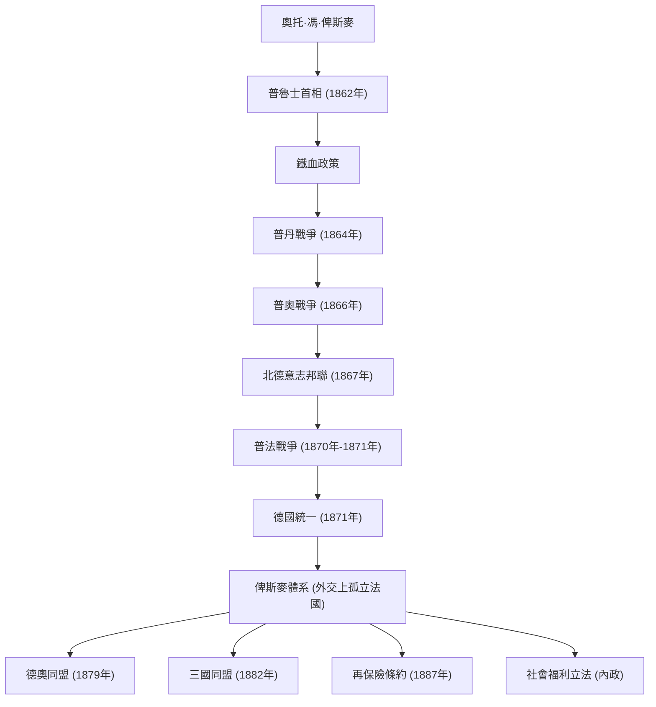

奧托·馮·俾斯麥（1815年～1898年），以「鐵血宰相」的稱號聞名，是普魯士及德意志帝國的政治家，也是引領19世紀後半葉歐洲外交的罕見現實主義者（現實政治家）。他透過武力和巧妙的外交，將四分五裂的德意志各邦統一起來，建立了一個強大的德意志帝國。他的一生、思想以及對後世的影響，至今仍在現代國際政治中提供著極為重要的教訓。本文將追溯他的足跡，看他如何從普魯士的偏遠鄉村成長為推動世界歷史的巨頭。

### 傳奇一生：從容克到普魯士首相

1815年，俾斯麥出生於普魯士王國易北河東岸的一個地主貴族（容克）家庭。大學時期，他過著沉湎於決鬥和飲酒的放蕩生活，但逐漸加深了對政治的興趣，並作為保守派政治家嶄露頭角。他支持君權神授，強烈反對自由主義和民主主義。

轉機出現在1862年。因軍隊改革問題與議會發生對立的普魯士國王威廉一世，任命俾斯麥為首相，以此作為壓制議會的王牌。就任伊始，俾斯麥無視議會的預算審議權，發表了著名的「鐵血演說」。他宣稱：「當代的重大問題不是透過演說和多數決議所能解決的……而是要用鐵和血來解決」，並強行推動了看似魯莽的軍備擴張。這種強烈的領導力成為了日後統一大業的動力。

### 德國統一之路：三次王朝戰爭與巧妙外交

俾斯麥最大的功績在於，他在短短不到十年的時間裡，將自中世紀以來就四分五裂的德意志地區整合成了另一個龐大的帝國。他基於精密的計算和冷酷的外交戰略，蓄意挑起了三場戰爭，最終完成了統一。

1. **普丹戰爭（1864年）**：首先，他與長期的競爭對手奧地利聯手，對丹麥開戰，奪取了什勒斯維希和霍爾斯坦兩公國。
2. **普奧戰爭（1866年）**：接著，圍繞所獲領土的管理問題，他加深了與奧地利的對立，並以閃電戰的方式開戰。利用現代武器和鐵路運輸，普魯士軍隊僅用七週便取得大勝，建立了一個將奧地利排除在外的「北德意志邦聯」。
3. **普法戰爭（1870年～1871年）**：為了整合最後剩下的南德意志諸邦，需要一個外部敵人。俾斯麥以埃姆斯密電事件為契機，挑釁法國皇帝拿破崙三世，從而引發戰爭。粉碎法軍後，普魯士在敵國法國象徵性的凡爾賽宮鏡廳裡，高調宣布以威廉一世為皇帝的「德意志帝國」成立（1871年）。

### 俾斯麥體系與內政上的「胡蘿蔔加棍棒」

在實現了德國統一的夙願之後，俾斯麥搖身一變，成為了「歐洲和平的捍衛者」。因為要在歐洲中心維持一個強大的德意志帝國的存在，就必須在外交上孤立被奪走領土、渴望復仇的法國。他推行不拘泥於意識形態或情感的**現實政治（Realpolitik）**，與奧地利、俄羅斯、義大利等國構建了複雜的同盟關係（即「俾斯麥體系」）。這種維持勢力均衡（Balance of Power）的巧妙做法，為歐洲帶來了長達約40年的和平。

在內政方面，他實施了著名的「胡蘿蔔加棍棒」政策。一方面，他透過鎮壓天主教會的「文化鬥爭」以及《鎮壓社會主義法》徹底壓制反體制派（棍棒）；另一方面，他在世界上率先創立了疾病保險、工傷保險、養老及殘疾保險等社會保險制度（胡蘿蔔）。這項旨在緩解工人階級不滿、將其納入國家體制的政策，可以說是現代福利國家發端的具有歷史性及劃時代意義的嘗試。

### 哲學思想及其對後世的深遠影響

俾斯麥政治哲學的根基是徹底的實用主義（Pragmatism）和對國家理性的追求。他曾留下一句名言：「政治是可能性的藝術」，將國家利益最大化和現實的力量平衡置於道德或理想主義之上。

然而，由於與1890年即位的年輕皇帝威廉二世發生衝突，他被迫辭去宰相職務，令人惋惜。擁有天才般平衡感的俾斯麥離去後，他所構建的複雜同盟網絡逐漸崩潰。威廉二世擴張性的「世界政策」引起了英國和俄羅斯的警惕，最終導致德國陷入孤立，並走向了第一次世界大戰的毀滅性結局。

關於俾斯麥留下的遺產，至今仍存在爭議。在建設強大統一國家和創立福利制度這些偉業的同時，他輕視議會政治、確立了以皇帝為頂點的自上而下的威權主義體制，這被指出是導致後來德國社會民主主義不成熟的原因。儘管如此，在日益複雜的現代國際社會中，他卓越的外交手腕和冷酷的現實主義，依然作為國家領導人應該學習的不朽教材而熠熠生輝。

### 功績與外交網絡圖解

以下是俾斯麥主導的由普魯士領導的德國統一進程，以及統一後構建的同盟網絡（俾斯麥體系）的流程圖。

