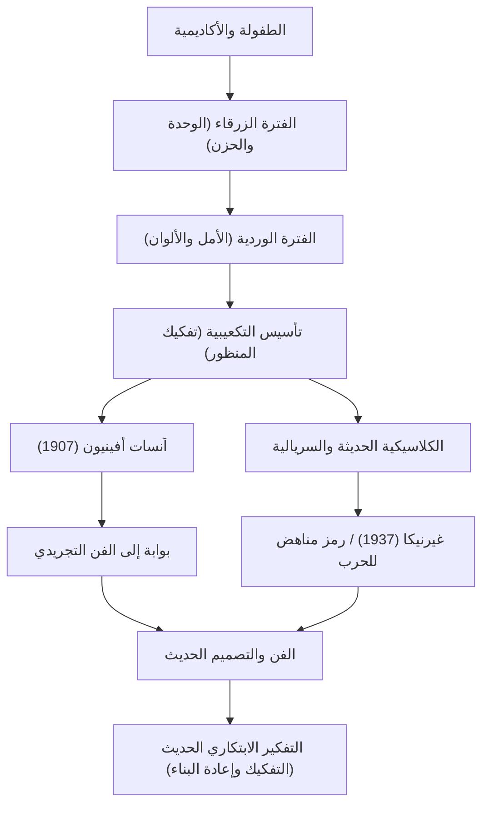

لم يكن بابلو بيكاسو (1881-1973) مجرد رسام، بل كان أحد "أعظم فناني القرن العشرين" الذين أحدثوا ثورة في كل مجال من مجالات الفنون البصرية، بما في ذلك النحت وصناعة الطباعة والسيراميك وحتى تصميم المسرح. لقد ترك وراءه حوالي 150 ألف عمل فني، ويُعرف ليس فقط بغزارة إنتاجه الهائلة، ولكن أيضًا بتغييره المستمر لأسلوبه الفني طوال حياته. يستكشف هذا المقال حياة بيكاسو الاستثنائية، والفلسفة الفريدة التي جلبها إلى العالم، وتأثيره على الأجيال اللاحقة.

## مشهد يعكس العصر: حياة بيكاسو والتحولات الأسلوبية

كانت حياة بيكاسو مليئة بالتغيرات الدراماتيكية التي يمكن القول إنها تمثل تاريخ الفن نفسه. وُلد في ملقة في منطقة الأندلس بإسبانيا، وتلقى تعليمه على يد والده الذي كان مدرسًا للفنون، وأظهر مهارات هائلة في الرسم منذ صغره. كان عبقريًا مبكر النضوج، حيث قال لاحقًا: "في سن الثانية عشرة، كنت أرسم مثل رافائيل".

تحول أسلوب بيكاسو بشكل واضح وفقًا لمراحل حياته، ومشاعره الداخلية، والتغيرات في صداقاته.

- **الفترة الزرقاء (1901-1904)**: بعد وفاة صديق مقرب، كانت هذه فترة صور فيها موضوعات ثقيلة مثل الفقر والموت والوحدة بدرجات اللون الأزرق البارد.
- **الفترة الوردية (1904-1906)**: بعد انتقاله إلى مونتمارتر في باريس، ومن خلال التفاعلات مع حبيبة جديدة وفناني السيرك، تحول أسلوبه إلى أسلوب أكثر إشراقًا باستخدام الألوان الوردية والبرتقالية الدافئة.
- **التكعيبية (منذ عام 1907)**: تأسست جنبًا إلى جنب مع جورج براك، وكانت هذه أعظم ثورة فنية في القرن العشرين. إن تقنية تفكيك الأشياء ثلاثية الأبعاد وإعادة بنائها من وجهات نظر متعددة على قماش ثنائي الأبعاد دمرت المنظور التقليدي تمامًا. كانت لوحة "آنسات أفينيون" في عام 1907 هي الخطوة الأولى الحاسمة.
- **الكلاسيكية الحديثة والسريالية (أواخر العقد الأول من القرن العشرين فصاعدًا)**: بعد الحرب العالمية الأولى، عاد بيكاسو إلى التمثيل الواقعي التقليدي مع دمج العناصر السخيفة والحالمة للسريالية، مما وسّع نطاق تعبيره.

## التدمير هو الخطوة الأولى للإبداع: فلسفة بيكاسو الفنية

إن مقولة بيكاسو: "كل عمل إبداعي هو أولاً عمل تدميري"، ترمز إلى فلسفته الفنية. بالنسبة لبيكاسو، كان كسر القواعد الحالية ومعايير الجمال عملية أساسية لإعادة بناء واقع جديد.

لم يكن تدميره البصري فوضويًا بأي حال من الأحوال. لقد كان نهجًا لكشف جوهر الأشياء والتعبير عن الحقائق التي لا يمكن التقاطها من وجهة نظر واحدة. علاوة على ذلك، قال بيكاسو: "لقد استغرقني الأمر مدى الحياة لأتعلم الرسم مثل طفل". إن الموقف المتمثل في اكتساب تقنيات متقدمة فقط للتخلص منها والعودة إلى التعبير النقي والبديهي كان موضوعًا يتدفق في أساس إبداعه.

من الأعمال التي ظهرت فيها فلسفته بقوة هي اللوحة الجدارية الضخمة "غيرنيكا" التي رُسمت عام 1937. يصور هذا العمل الغضب والحزن على القصف العشوائي لغيرنيكا من قبل ألمانيا النازية خلال الحرب الأهلية الإسبانية باستخدام التقنيات التكعيبية، ويستمر هذا العمل في إرسال رسالة قوية كرمز مناهض للحرب اليوم. أثبت بيكاسو على القماش القوة التي يمكن أن يتمتع بها الفن على المجتمع الحقيقي.

## التأثير الهائل على الأجيال اللاحقة والأهمية اليوم

إن التأثير الذي أحدثه بيكاسو على الأجيال اللاحقة لا يمكن قياسه. أدت ولادة التكعيبية إلى زعزعة أسس الثقافة البصرية بأكملها، من الرسم التجريدي اللاحق والمستقبلية إلى التصميم والهندسة المعمارية الحديثة، مما يشير إلى اتجاهات جديدة.

حتى في صناعة التكنولوجيا ومجالات التصميم اليوم، يحظى نهج بيكاسو المتمثل في "التفكيك مرة واحدة وإعادة البناء" بالتعاطف كمبدأ أساسي للابتكار. إن عملية تقسيم المشكلات المعقدة إلى عناصر وتجميع الحلول من وجهات نظر جديدة يمكن تسميتها حقًا بنسخة حديثة من التفكير التكعيبي.

## تدفق إنجازات بيكاسو وتأثيره

يوجد أدناه مخطط ارتباط يوضح انتقالات أنماط بيكاسو الرئيسية وكيف تؤثر على الوقت الحاضر.

## خاتمة

حتى وفاته عن عمر يناهز 91 عامًا، لم يتوقف بابلو بيكاسو أبدًا عن الإبداع. كانت حياته رحلة من التدمير المستمر حتى للأنماط التي بناها بنفسه، باحثًا دائمًا عن تعبيرات جديدة. بالنسبة لنا، تُعلمنا أعمال بيكاسو وحياته بشكل دائم أهمية الشك في الفطرة السليمة والاحتفاظ بوجهات نظر جديدة.
