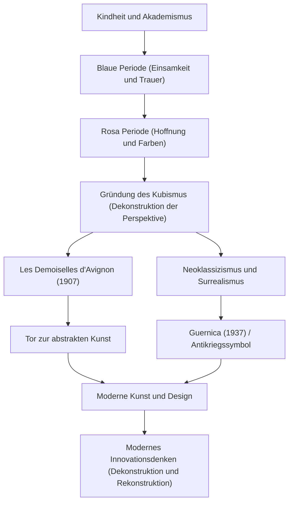

Pablo Picasso (1881–1973) war nicht nur ein Maler, sondern einer der „größten Künstler des 20. Jahrhunderts“, der jeden Bereich der bildenden Kunst revolutionierte, einschließlich Skulptur, Druckgrafik, Keramik und sogar Bühnenbild. Er hinterließ etwa 150.000 Werke und ist nicht nur für seine überwältigende Produktivität bekannt, sondern auch dafür, dass er seinen künstlerischen Stil sein ganzes Leben lang kontinuierlich veränderte. Dieser Artikel untersucht Picassos außergewöhnliches Leben, die einzigartige Philosophie, die er in die Welt brachte, und seinen Einfluss auf spätere Generationen.

## Ein Kaleidoskop, das die Zeit widerspiegelt: Picassos Leben und stilistische Übergänge

Picassos Leben war voller dramatischer Veränderungen, von denen man sagen kann, dass sie die Geschichte der Kunst selbst repräsentieren. Geboren in Málaga in der spanischen Region Andalusien, erhielt er Unterricht von seinem Vater, einem Kunstlehrer, und bewies schon in jungen Jahren überwältigende zeichnerische Fähigkeiten. Er war ein frühreifes Genie und erklärte später: „Mit 12 Jahren konnte ich zeichnen wie Raffael.“

Picassos Stil wandelte sich lebhaft in Übereinstimmung mit seinen Lebensphasen, seinen inneren Emotionen und den Veränderungen in seinen Freundschaften.

- **Blaue Periode (1901–1904)**: Ausgelöst durch den Tod eines engen Freundes, war dies eine Zeit, in der er schwere Themen wie Armut, Tod und Einsamkeit in kalten Blautönen darstellte.
- **Rosa Periode (1904–1906)**: Nach seinem Umzug nach Montmartre in Paris wandelte sich sein Stil durch Interaktionen mit einer neuen Geliebten und Zirkusartisten zu einem helleren Stil unter Verwendung warmer Rosa- und Orangetöne.
- **Kubismus (ab 1907)**: Gemeinsam mit Georges Braque begründet, war dies die größte künstlerische Revolution des 20. Jahrhunderts. Die Technik, dreidimensionale Objekte zu dekonstruieren und sie aus mehreren Blickwinkeln auf einer zweidimensionalen Leinwand zu rekonstruieren, zerstörte die traditionelle Perspektive völlig. „Les Demoiselles d'Avignon“ war 1907 der entscheidende erste Schritt.
- **Neoklassizismus und Surrealismus (ab Ende der 1910er Jahre)**: Nach dem Ersten Weltkrieg kehrte Picasso zur traditionellen realistischen Darstellung zurück, integrierte aber auch die absurden und traumhaften Elemente des Surrealismus und erweiterte so sein Ausdrucksspektrum weiter.

## Zerstörung ist der erste Schritt zur Schöpfung: Picassos Kunstphilosophie

Picassos Worte „Jeder Akt der Schöpfung ist zunächst ein Akt der Zerstörung“ symbolisieren seine künstlerische Philosophie. Für Picasso war das Brechen bestehender Regeln und Schönheitsstandards ein wesentlicher Prozess zur Rekonstruktion einer neuen Realität.

Seine visuelle Zerstörung war keineswegs chaotisch. Es war ein Ansatz, das Wesen der Dinge offenzulegen und Wahrheiten auszudrücken, die nicht von einem einzigen Standpunkt aus erfasst werden konnten. Darüber hinaus sagte Picasso: „Ich habe ein Leben lang gebraucht, um zu lernen, wie ein Kind zu zeichnen.“ Die Haltung, sich fortgeschrittene Techniken anzueignen, nur um sie dann zu verwerfen und zum reinen, intuitiven Ausdruck zurückzukehren, war ein grundlegendes Thema seines Schaffens.

Eines der Werke, in denen seine Philosophie am stärksten zum Ausdruck kam, ist das riesige Wandgemälde „Guernica“, das 1937 gemalt wurde. Dieses Werk, das die Wut und den Kummer über die wahllose Bombardierung von Guernica durch Nazi-Deutschland während des Spanischen Bürgerkriegs mit kubistischen Techniken darstellt, sendet noch heute eine starke Botschaft als Antikriegssymbol. Picasso bewies auf der Leinwand, welche Macht Kunst über die reale Gesellschaft haben kann.

## Immenser Einfluss auf spätere Generationen und heutige Bedeutung

Der Einfluss, den Picasso auf spätere Generationen hatte, ist unermesslich. Die Geburt des Kubismus erschütterte die Grundfesten der gesamten visuellen Kultur, von der nachfolgenden abstrakten Malerei und dem Futurismus bis hin zu modernem Design und Architektur, und wies neue Richtungen.

Auch in der heutigen Technologiebranche und im Designbereich findet Picassos Ansatz „einmal dekonstruieren und dann rekonstruieren“ als Grundprinzip der Innovation Sympathie. Der Prozess, komplexe Probleme in Elemente zu zerlegen und Lösungen aus neuen Perspektiven zusammenzusetzen, kann wahrlich als moderne Version des kubistischen Denkens bezeichnet werden.

## Fluss von Picassos Errungenschaften und Einfluss

Unten sehen Sie ein Korrelationsdiagramm, das die Übergänge von Picassos wichtigsten Stilen zeigt und wie sie die Gegenwart beeinflussen.

## Fazit

Bis zu seinem Tod im Alter von 91 Jahren hörte Pablo Picasso nie auf, kreativ zu sein. Sein Leben war eine Reise, auf der er selbst die von ihm aufgebauten Stile ständig zerstörte und stets nach neuen Ausdrucksformen suchte. Für uns lehren Picassos Werke und sein Leben zeitlos, wie wichtig es ist, den gesunden Menschenverstand anzuzweifeln und neue Perspektiven einzunehmen.
