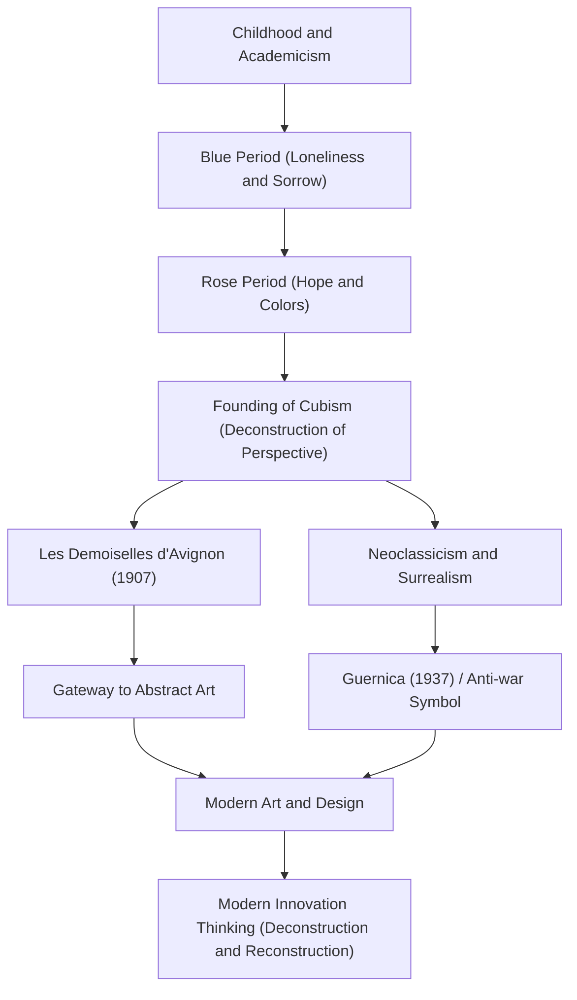

Pablo Picasso (1881–1973) was not merely a painter but one of the "greatest artists of the 20th century" who revolutionized every field of visual arts, including sculpture, printmaking, ceramics, and even stage design. He left behind approximately 150,000 works and is known not only for his overwhelming prolificacy but also for continuously changing his artistic style throughout his life. This article explores Picasso's extraordinary life, the unique philosophy he brought to the world, and his influence on later generations.

## A Kaleidoscope Reflecting the Times: Picasso's Life and Stylistic Transitions

Picasso's life was full of dramatic changes that can be said to represent the history of art itself. Born in Málaga in the Andalusia region of Spain, he received instruction from his father, an art teacher, and demonstrated overwhelming drawing skills from a young age. He was a precocious genius, later stating, "At the age of 12, I could draw like Raphael."

Picasso's style transformed vividly in accordance with the stages of his life, his inner emotions, and changes in his friendships.

- **Blue Period (1901–1904)**: Triggered by the death of a close friend, this was a period where he depicted heavy themes such as poverty, death, and loneliness in cold blue tones.
- **Rose Period (1904–1906)**: After moving to Montmartre in Paris, through interactions with a new lover and circus performers, his style shifted to a brighter one using warm pinks and oranges.
- **Cubism (from 1907)**: Founded alongside Georges Braque, this was the greatest artistic revolution of the 20th century. The technique of deconstructing three-dimensional objects and reconstructing them from multiple viewpoints on a two-dimensional canvas completely destroyed traditional perspective. "Les Demoiselles d'Avignon" in 1907 was the decisive first step.
- **Neoclassicism and Surrealism (Late 1910s onwards)**: After World War I, Picasso returned to traditional realistic representation while also incorporating the absurd and dreamlike elements of Surrealism, further expanding his range of expression.

## Destruction is the First Step to Creation: Picasso's Art Philosophy

Picasso's words, "Every act of creation is first an act of destruction," symbolize his artistic philosophy. For Picasso, breaking existing rules and standards of beauty was an essential process for reconstructing a new reality.

His visual destruction was by no means chaotic. It was an approach to expose the essence of things and express truths that could not be captured from a single viewpoint. Picasso also said, "It took me a lifetime to paint like a child." The attitude of acquiring advanced techniques only to discard them and return to pure, intuitive expression was a theme flowing at the foundation of his creation.

One of the works where his philosophy appeared most strongly is the massive mural "Guernica" painted in 1937. Depicting the anger and sorrow over the indiscriminate bombing of Guernica by Nazi Germany during the Spanish Civil War using Cubist techniques, this work continues to send a powerful message as an anti-war symbol today. Picasso proved the power that art can have on real society on the canvas.

## Immense Influence on Later Generations and Significance Today

The influence Picasso had on later generations is immeasurable. The birth of Cubism shook the foundations of all visual culture, from subsequent abstract painting and Futurism to modern design and architecture, pointing in new directions.

Even in today's tech industry and design fields, Picasso's approach of "deconstruct once and reconstruct" garners sympathy as a fundamental principle of innovation. The process of breaking complex problems into elements and assembling solutions from new perspectives can truly be called a modern version of Cubist thinking.

## Flow of Picasso's Achievements and Influence

Below is a correlation diagram showing the transitions of Picasso's major styles and how they influence the present day.

## Conclusion

Until his passing at the age of 91, Pablo Picasso never stopped creating. His life was a journey of constantly destroying even the styles he had built himself, always seeking new expressions. To us, Picasso's works and life timelessly teach the importance of doubting common sense and holding new perspectives.
