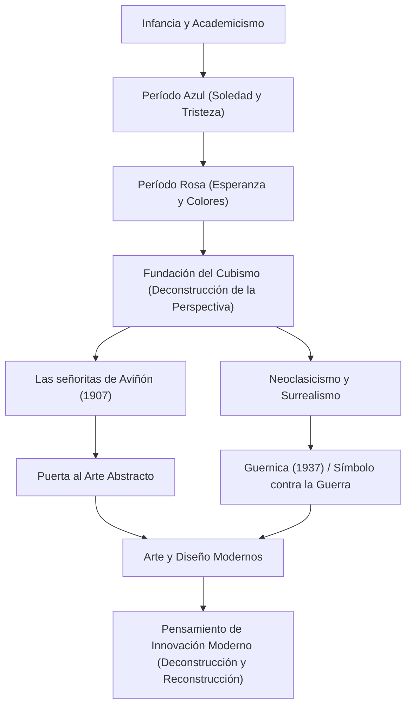

Pablo Picasso (1881–1973) fue más que un pintor; fue uno de los "más grandes artistas del siglo XX" que revolucionó todos los campos de las artes visuales, incluyendo la escultura, el grabado, la cerámica e incluso la escenografía. Dejó aproximadamente 150,000 obras, y es conocido no solo por su abrumadora fecundidad, sino también por transformar continuamente su estilo a lo largo de su vida. Este artículo explora la extraordinaria vida de Picasso, la filosofía única que trajo al mundo y su influencia en las generaciones posteriores.

## Un caleidoscopio que refleja la época: La vida y los cambios de estilo de Picasso

La vida de Picasso estuvo llena de cambios dramáticos que pueden considerarse la historia del arte en sí misma. Nacido en Málaga, Andalucía, España, recibió instrucción de su padre, un profesor de arte, y demostró una abrumadora habilidad para el dibujo desde la infancia. Era un genio precoz, y más tarde dijo: "A los 12 años podía dibujar como Rafael".

El estilo de Picasso se transformó vívidamente en conjunto con las etapas de su vida, sus emociones internas y los cambios en sus amistades.

- **Período Azul (1901–1904)**: Desencadenado por la muerte de un amigo íntimo, este fue un período en el que representó temas pesados como la pobreza, la muerte y la soledad en tonos azules fríos.
- **Período Rosa (1904–1906)**: Después de mudarse a Montmartre en París, a través de las interacciones con una nueva amante y artistas de circo, su estilo cambió a uno brillante utilizando rosas y naranjas cálidos.
- **Cubismo (desde 1907)**: Fundado junto a Georges Braque, esta fue la mayor revolución artística del siglo XX. La técnica de deconstruir objetos tridimensionales y reconstruirlos desde múltiples puntos de vista en un lienzo bidimensional destruyó por completo la perspectiva tradicional. "Las señoritas de Aviñón" en 1907 fue el primer paso decisivo.
- **Neoclasicismo y Surrealismo (fines de la década de 1910 en adelante)**: Después de la Primera Guerra Mundial, Picasso regresó a la representación realista tradicional al tiempo que incorporó los elementos absurdos y oníricos del surrealismo, ampliando aún más su rango de expresión.

## La destrucción es el primer paso hacia la creación: La filosofía artística de Picasso

Las palabras de Picasso, "Todo acto de creación es primero un acto de destrucción", simbolizan su filosofía artística. Para Picasso, romper las reglas existentes y los estándares de lo que se considera hermoso era un proceso indispensable para reconstruir una nueva realidad.

Su destrucción visual no era en absoluto caótica. Era un enfoque para exponer la esencia de las cosas y expresar verdades que no podían ser capturadas desde un solo punto de vista. Además, Picasso dijo: "Me tomó toda una vida aprender a dibujar como un niño". La actitud de adquirir técnicas avanzadas solo para descartarlas y regresar a una expresión pura e intuitiva fue un tema subyacente en su creación.

Una de las obras donde su filosofía se manifestó más fuertemente es el enorme mural "Guernica" pintado en 1937. Representando la ira y la tristeza por el bombardeo indiscriminado de Guernica por la Alemania nazi durante la Guerra Civil española utilizando técnicas cubistas, esta obra sigue enviando un poderoso mensaje como símbolo contra la guerra en la actualidad. Picasso demostró en el lienzo el poder que el arte puede tener sobre la sociedad real.

## Inmensa influencia en las generaciones posteriores y su significado en la actualidad

La influencia de Picasso en las generaciones posteriores es incalculable. El nacimiento del cubismo sacudió los cimientos de toda la cultura visual, desde la pintura abstracta posterior y el futurismo hasta el diseño y la arquitectura modernos, señalando nuevas direcciones.

Incluso en la industria tecnológica y los campos del diseño actuales, el enfoque de Picasso de "descomponer una vez y reconstruir" genera simpatía como principio básico de la innovación. El proceso de dividir problemas complejos en elementos y ensamblar soluciones desde nuevas perspectivas puede llamarse verdaderamente una versión moderna del pensamiento cubista.

## Flujo de los logros y la influencia de Picasso

A continuación se muestra un diagrama de correlación que muestra las transiciones de los principales estilos de Picasso y cómo influyen en el presente.

## Conclusión

Hasta su muerte a los 91 años, Pablo Picasso nunca dejó de crear. Su vida fue un viaje en el que destruyó constantemente incluso los estilos que había construido, siempre buscando nuevas expresiones. Para nosotros, las obras y la vida de Picasso enseñan de manera perdurable la importancia de dudar del sentido común y mantener nuevas perspectivas.
