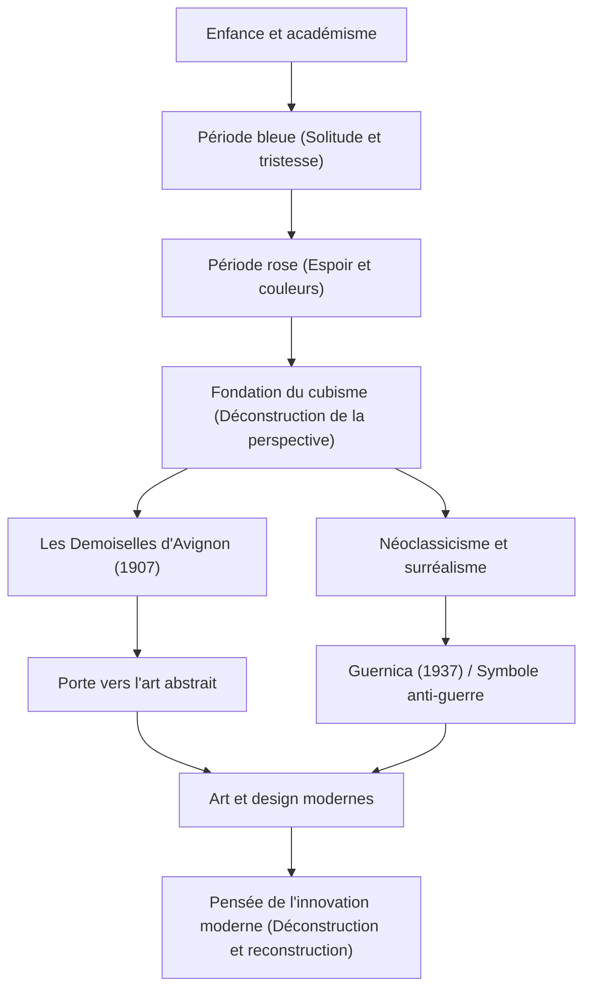

Pablo Picasso (1881-1973) n'était pas seulement un peintre, mais l'un des « plus grands artistes du 20e siècle » qui a révolutionné tous les domaines des arts visuels, y compris la sculpture, la gravure, la céramique et même la scénographie. Il a laissé derrière lui environ 150 000 œuvres et est connu non seulement pour sa prolixité écrasante, mais aussi pour avoir continuellement changé de style artistique tout au long de sa vie. Cet article explore la vie extraordinaire de Picasso, la philosophie unique qu'il a apportée au monde et son influence sur les générations suivantes.

## Un kaléidoscope reflétant l'époque : la vie et les transitions stylistiques de Picasso

La vie de Picasso a été pleine de changements dramatiques que l'on peut considérer comme l'histoire de l'art elle-même. Né à Malaga dans la région d'Andalousie en Espagne, il a reçu l'enseignement de son père, professeur d'art, et a fait preuve de compétences en dessin écrasantes dès son plus jeune âge. C'était un génie précoce, déclarant plus tard : « À 12 ans, je pouvais dessiner comme Raphaël. »

Le style de Picasso s'est transformé de manière frappante en fonction des étapes de sa vie, de ses émotions intérieures et des changements dans ses amitiés.

- **Période bleue (1901-1904)** : Déclenchée par la mort d'un ami proche, ce fut une période où il a représenté des thèmes lourds tels que la pauvreté, la mort et la solitude dans des tons bleus froids.
- **Période rose (1904-1906)** : Après s'être installé à Montmartre à Paris, grâce à des interactions avec une nouvelle amante et des artistes de cirque, son style s'est transformé en un style plus lumineux utilisant des roses et des oranges chauds.
- **Cubisme (à partir de 1907)** : Fondé avec Georges Braque, ce fut la plus grande révolution artistique du 20e siècle. La technique consistant à déconstruire des objets tridimensionnels et à les reconstruire à partir de multiples points de vue sur une toile bidimensionnelle a complètement détruit la perspective traditionnelle. « Les Demoiselles d'Avignon » en 1907 a été le premier pas décisif.
- **Néoclassicisme et surréalisme (à partir de la fin des années 1910)** : Après la Première Guerre mondiale, Picasso est revenu à une représentation réaliste traditionnelle tout en intégrant les éléments absurdes et oniriques du surréalisme, élargissant encore son champ d'expression.

## La destruction est le premier pas vers la création : la philosophie artistique de Picasso

Les mots de Picasso, « Tout acte de création est d'abord un acte de destruction », symbolisent sa philosophie artistique. Pour Picasso, briser les règles existantes et les normes de beauté était un processus essentiel pour reconstruire une nouvelle réalité.

Sa destruction visuelle n'était en aucun cas chaotique. C'était une approche pour exposer l'essence des choses et exprimer des vérités qui ne pouvaient être saisies d'un seul point de vue. De plus, Picasso a dit : « Il m'a fallu toute une vie pour apprendre à dessiner comme un enfant. » L'attitude consistant à acquérir des techniques avancées pour ensuite les rejeter et revenir à une expression pure et intuitive était un thème récurrent à la base de sa création.

L'une des œuvres où sa philosophie est apparue le plus fortement est l'immense fresque murale « Guernica » peinte en 1937. Représentant la colère et le chagrin face au bombardement aveugle de Guernica par l'Allemagne nazie pendant la guerre civile espagnole à l'aide de techniques cubistes, cette œuvre continue d'envoyer un message puissant en tant que symbole anti-guerre aujourd'hui. Picasso a prouvé sur la toile le pouvoir que l'art peut avoir sur la société réelle.

## Une immense influence sur les générations ultérieures et son importance aujourd'hui

L'influence que Picasso a eue sur les générations suivantes est incommensurable. La naissance du cubisme a ébranlé les fondements de toute la culture visuelle, de la peinture abstraite ultérieure et du futurisme au design et à l'architecture modernes, indiquant de nouvelles directions.

Même dans l'industrie technologique et les domaines du design d'aujourd'hui, l'approche de Picasso consistant à « déconstruire une fois et reconstruire » suscite la sympathie en tant que principe fondamental de l'innovation. Le processus consistant à décomposer des problèmes complexes en éléments et à assembler des solutions à partir de nouvelles perspectives peut véritablement être qualifié de version moderne de la pensée cubiste.

## Flux des réalisations et de l'influence de Picasso

Voici un diagramme de corrélation montrant les transitions des principaux styles de Picasso et comment ils influencent le présent.

## Conclusion

Jusqu'à son décès à l'âge de 91 ans, Pablo Picasso n'a jamais cessé de créer. Sa vie a été un voyage consistant à détruire constamment même les styles qu'il avait lui-même construits, cherchant toujours de nouvelles expressions. Pour nous, les œuvres et la vie de Picasso enseignent de manière intemporelle l'importance de douter du bon sens et d'avoir de nouvelles perspectives.
