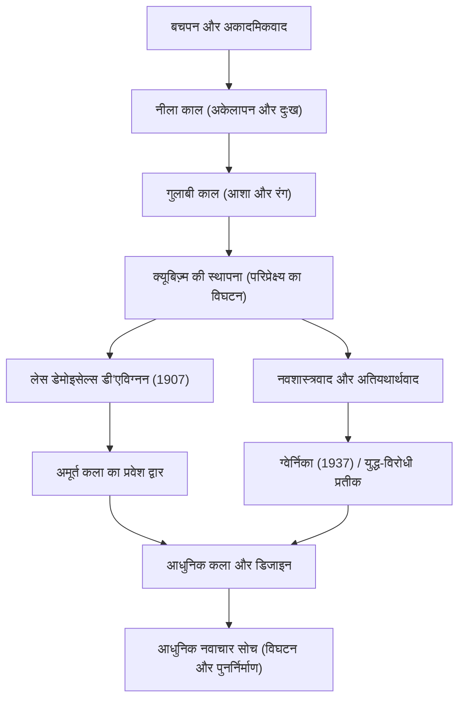

पाब्लो पिकासो (1881-1973) केवल एक चित्रकार ही नहीं थे, बल्कि "20वीं सदी के सबसे महान कलाकारों" में से एक थे, जिन्होंने मूर्तिकला, प्रिंटमेकिंग, मिट्टी के बर्तन और यहां तक कि मंच कला सहित दृश्य कला के हर क्षेत्र में क्रांति ला दी। उन्होंने लगभग 150,000 रचनाएँ पीछे छोड़ी हैं, और वे अपनी भारी रचनात्मकता के साथ-साथ जीवन भर अपनी कला शैली को लगातार बदलने के लिए जाने जाते हैं। यह लेख पिकासो के असाधारण जीवन, उनके द्वारा दुनिया में लाए गए अनूठे दर्शन और बाद की पीढ़ियों पर उनके प्रभाव का अन्वेषण करता है।

## समय को दर्शाने वाला कैलिडोस्कोप: पिकासो का जीवन और शैलीगत परिवर्तन

पिकासो का जीवन नाटकीय परिवर्तनों से भरा था जिसे कला का इतिहास ही कहा जा सकता है। स्पेन के अंडालूसिया क्षेत्र के मलागा में जन्मे, उन्होंने एक कला शिक्षक, अपने पिता से शिक्षा प्राप्त की, और बचपन से ही जबरदस्त ड्राइंग कौशल का प्रदर्शन किया। वह एक प्रारंभिक प्रतिभाशाली व्यक्ति थे, जिन्होंने बाद में कहा, "12 साल की उम्र में, मैं राफेल की तरह चित्र बना सकता था।"

पिकासो की शैली उनके जीवन के चरणों, आंतरिक भावनाओं और उनकी दोस्ती में बदलाव के अनुसार स्पष्ट रूप से बदल गई।

- **नीला काल (1901–1904)**: एक करीबी दोस्त की मृत्यु के बाद, यह एक ऐसा समय था जब उन्होंने ठंडे नीले स्वर में गरीबी, मृत्यु और अकेलेपन जैसे भारी विषयों को चित्रित किया।
- **गुलाबी काल (1904–1906)**: पेरिस में मोंटमार्ट्रे जाने के बाद, एक नई प्रेमिका और सर्कस कलाकारों के साथ बातचीत के माध्यम से, उनकी शैली गर्म गुलाबी और नारंगी रंगों का उपयोग करते हुए एक उज्जवल शैली में बदल गई।
- **क्यूबिज़्म (1907 से)**: जॉर्जेस ब्रैक के साथ स्थापित, यह 20वीं सदी की सबसे बड़ी कला क्रांति थी। त्रि-आयामी वस्तुओं को विघटित करने और दो-आयामी कैनवास पर कई दृष्टिकोणों से उनका पुनर्निर्माण करने की तकनीक ने पारंपरिक परिप्रेक्ष्य को पूरी तरह से नष्ट कर दिया। 1907 में "लेस डेमोइसेल्स डी'एविग्नन" निर्णायक पहला कदम था।
- **नवशास्त्रवाद और अतियथार्थवाद (1910 के दशक के अंत से)**: प्रथम विश्व युद्ध के बाद, पिकासो पारंपरिक यथार्थवादी प्रतिनिधित्व में लौट आए, जबकि अतियथार्थवाद के बेतुके और सपने जैसे तत्वों को शामिल करते हुए, अपनी अभिव्यक्ति की सीमा का और विस्तार किया।

## विनाश सृजन का पहला कदम है: पिकासो का कला दर्शन

पिकासो के शब्द, "सृजन का प्रत्येक कार्य पहले विनाश का कार्य है," उनके कला दर्शन का प्रतीक है। पिकासो के लिए, मौजूदा नियमों और सुंदर माने जाने वाले मानकों को तोड़ना एक नई वास्तविकता के पुनर्निर्माण के लिए एक आवश्यक प्रक्रिया थी।

उनका दृश्य विनाश किसी भी तरह से अराजक नहीं था। यह चीजों के सार को उजागर करने और उन सच्चाइयों को व्यक्त करने का एक दृष्टिकोण था जिन्हें एक ही दृष्टिकोण से नहीं देखा जा सकता था। इसके अलावा, पिकासो ने कहा, "एक बच्चे की तरह चित्र बनाना सीखने में मुझे जीवन भर का समय लगा।" उन्नत तकनीक हासिल करने के बाद उन्हें त्याग देना और शुद्ध, सहज अभिव्यक्ति पर लौटना, उनके निर्माण की नींव पर चलने वाला एक विषय था।

जिन कार्यों में उनका दर्शन सबसे अधिक दृढ़ता से प्रकट हुआ, उनमें से एक 1937 में चित्रित विशाल भित्ति चित्र "ग्वेर्निका" है। स्पेनिश गृहयुद्ध के दौरान नाजी जर्मनी द्वारा ग्वेर्निका पर अंधाधुंध बमबारी पर क्यूबिस्ट तकनीकों का उपयोग करते हुए क्रोध और दुख को दर्शाते हुए, यह काम आज भी युद्ध-विरोधी प्रतीक के रूप में एक शक्तिशाली संदेश भेजना जारी रखता है। पिकासो ने कैनवास पर वास्तविक समाज पर कला की शक्ति को साबित किया।

## बाद की पीढ़ियों पर भारी प्रभाव और आज इसका महत्व

बाद की पीढ़ियों पर पिकासो का प्रभाव अथाह है। क्यूबिज़्म के जन्म ने दृश्य संस्कृति की नींव को हिला दिया, जिसमें बाद की अमूर्त पेंटिंग और भविष्यवाद से लेकर आधुनिक डिजाइन और वास्तुकला तक शामिल है, जो नई दिशाओं को इंगित करता है।

यहां तक कि आज के तकनीकी उद्योग और डिजाइन क्षेत्रों में, पिकासो का "एक बार विघटित और पुनर्निर्माण" का दृष्टिकोण नवाचार के मूल सिद्धांत के रूप में सहानुभूति प्राप्त करता है। जटिल समस्याओं को तत्वों में तोड़ने और नए दृष्टिकोणों से समाधानों को इकट्ठा करने की प्रक्रिया को वास्तव में क्यूबिस्ट सोच का आधुनिक संस्करण कहा जा सकता है।

## पिकासो की उपलब्धियों और प्रभाव का प्रवाह

नीचे एक सहसंबंध आरेख है जो पिकासो की प्रमुख शैलियों के संक्रमण और वे वर्तमान को कैसे प्रभावित करते हैं, इसे दर्शाता है।

## निष्कर्ष

91 वर्ष की आयु में अपने निधन तक, पाब्लो पिकासो ने कभी भी निर्माण करना बंद नहीं किया। उनका जीवन लगातार उन शैलियों को नष्ट करने की यात्रा थी जो उन्होंने स्वयं बनाई थीं, हमेशा नई अभिव्यक्तियों की तलाश में थीं। हमारे लिए, पिकासो के कार्य और जीवन सामान्य ज्ञान पर संदेह करने और नए दृष्टिकोण रखने के महत्व को कालातीत रूप से सिखाते हैं।
