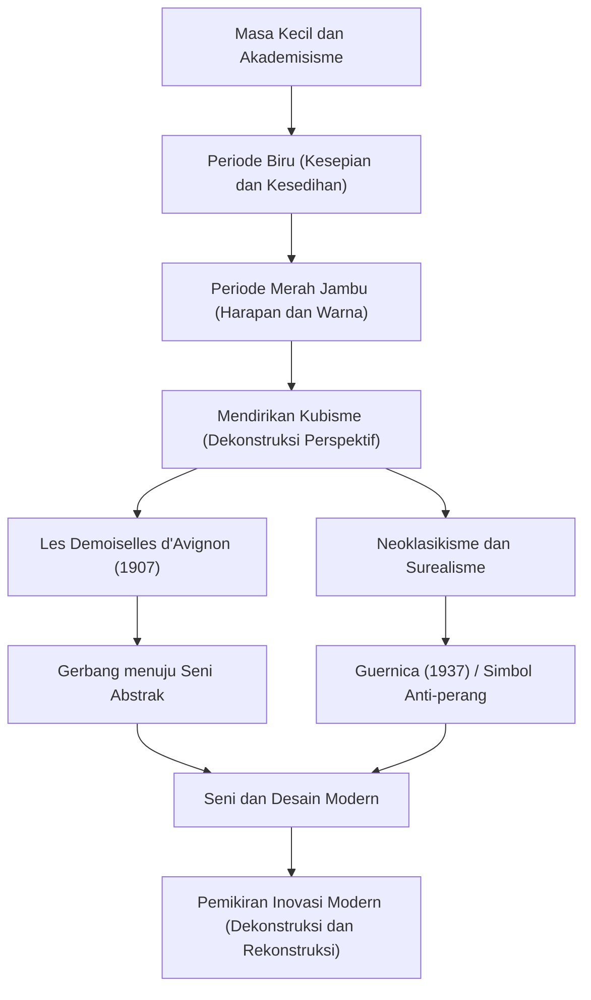

Pablo Picasso (1881–1973) bukan sekadar pelukis, melainkan salah satu "seniman terbesar abad ke-20" yang merevolusi setiap bidang seni visual, termasuk patung, seni grafis, keramik, dan bahkan desain panggung. Dia meninggalkan sekitar 150.000 karya dan dikenal bukan hanya karena produktivitasnya yang luar biasa, tetapi juga karena terus-menerus mengubah gaya artistiknya sepanjang hidupnya. Artikel ini mengeksplorasi kehidupan Picasso yang luar biasa, filosofi unik yang ia bawa ke dunia, dan pengaruhnya pada generasi-generasi selanjutnya.

## Kaleidoskop yang Mencerminkan Zaman: Kehidupan Picasso dan Transisi Gaya

Kehidupan Picasso penuh dengan perubahan dramatis yang dapat dikatakan mewakili sejarah seni itu sendiri. Lahir di Málaga di wilayah Andalusia, Spanyol, ia menerima instruksi dari ayahnya, seorang guru seni, dan menunjukkan keterampilan menggambar yang luar biasa sejak usia muda. Dia adalah seorang jenius dewasa sebelum waktunya, yang kemudian menyatakan, "Pada usia 12 tahun, saya bisa menggambar seperti Raphael."

Gaya Picasso berubah secara nyata sesuai dengan tahap-tahap kehidupannya, emosi batinnya, dan perubahan dalam persahabatannya.

- **Periode Biru (1901–1904)**: Dipicu oleh kematian seorang teman dekat, ini adalah periode di mana ia menggambarkan tema-tema berat seperti kemiskinan, kematian, dan kesepian dalam nada biru dingin.
- **Periode Merah Jambu (1904–1906)**: Setelah pindah ke Montmartre di Paris, melalui interaksi dengan kekasih baru dan pemain sirkus, gayanya beralih ke gaya yang lebih cerah menggunakan warna merah muda dan oranye yang hangat.
- **Kubisme (dari tahun 1907)**: Didirikan bersama Georges Braque, ini adalah revolusi artistik terbesar abad ke-20. Teknik mendekonstruksi objek tiga dimensi dan merekonstruksinya dari berbagai sudut pandang di atas kanvas dua dimensi sepenuhnya menghancurkan perspektif tradisional. "Les Demoiselles d'Avignon" pada tahun 1907 adalah langkah pertama yang menentukan.
- **Neoklasikisme dan Surealisme (Akhir 1910-an dan seterusnya)**: Setelah Perang Dunia I, Picasso kembali ke representasi realistis tradisional sambil juga menggabungkan elemen-elemen Surealisme yang absurd dan seperti mimpi, yang selanjutnya memperluas jangkauan ekspresinya.

## Kehancuran adalah Langkah Pertama Menuju Penciptaan: Filosofi Seni Picasso

Kata-kata Picasso, "Setiap tindakan penciptaan pertama-tama adalah tindakan penghancuran," melambangkan filosofi artistiknya. Bagi Picasso, melanggar aturan dan standar keindahan yang ada adalah proses penting untuk merekonstruksi realitas baru.

Kehancuran visualnya sama sekali tidak kacau. Itu adalah pendekatan untuk mengungkap esensi benda-benda dan mengungkapkan kebenaran yang tidak dapat ditangkap dari satu sudut pandang. Selain itu, Picasso berkata, "Butuh seumur hidup bagi saya untuk belajar menggambar seperti anak kecil." Sikap memperoleh teknik-teknik tingkat lanjut hanya untuk membuangnya dan kembali ke ekspresi murni dan intuitif adalah tema yang mengalir di dasar penciptaannya.

Salah satu karya di mana filosofinya paling kuat muncul adalah lukisan dinding besar "Guernica" yang dilukis pada tahun 1937. Menggambarkan kemarahan dan kesedihan atas pengeboman membabi buta Guernica oleh Nazi Jerman selama Perang Saudara Spanyol menggunakan teknik Kubisme, karya ini terus mengirimkan pesan yang kuat sebagai simbol anti-perang hingga saat ini. Picasso membuktikan kekuatan yang dapat dimiliki seni terhadap masyarakat nyata di atas kanvas.

## Pengaruh Besar pada Generasi Selanjutnya dan Signifikansinya Saat Ini

Pengaruh yang dimiliki Picasso pada generasi selanjutnya tidak terukur. Lahirnya Kubisme mengguncang fondasi seluruh budaya visual, mulai dari lukisan abstrak dan Futurisme hingga desain dan arsitektur modern, yang menunjuk ke arah baru.

Bahkan dalam industri teknologi dan bidang desain saat ini, pendekatan Picasso untuk "mendekonstruksi sekali dan merekonstruksi" mengumpulkan simpati sebagai prinsip dasar inovasi. Proses memecah masalah kompleks menjadi elemen-elemen dan merakit solusi dari perspektif baru benar-benar dapat disebut versi modern dari pemikiran Kubisme.

## Aliran Pencapaian dan Pengaruh Picasso

Di bawah ini adalah diagram korelasi yang menunjukkan transisi gaya utama Picasso dan bagaimana mereka memengaruhi masa kini.

## Kesimpulan

Sampai kepergiannya pada usia 91 tahun, Pablo Picasso tidak pernah berhenti berkarya. Hidupnya adalah perjalanan menghancurkan gaya yang telah ia bangun sendiri secara konstan, selalu mencari ekspresi baru. Bagi kita, karya dan kehidupan Picasso secara abadi mengajarkan pentingnya meragukan akal sehat dan memegang perspektif baru.
