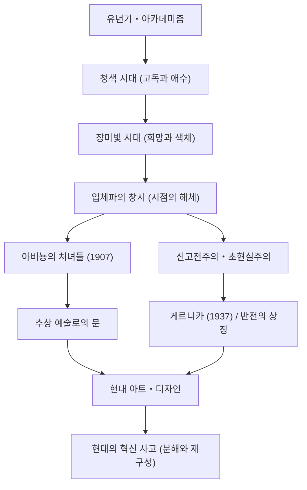

파블로 피카소(Pablo Picasso, 1881년 - 1973년)는 단순한 화가라는 틀에 얽매이지 않고 조각, 판화, 도예, 나아가 무대 미술에 이르기까지 모든 시각 예술 영역에서 혁명을 일으킨 '20세기 최대의 예술가' 중 한 명입니다. 그가 남긴 작품 수는 약 15만 점에 달하며, 압도적인 다작과 함께 평생에 걸쳐 끊임없이 화풍을 변화시킨 것으로 유명합니다. 본 기사에서는 피카소의 기구한 생애와 그가 세계에 가져온 독자적인 철학, 그리고 후세에 미친 영향에 대해 탐구합니다.

## 시대를 비추는 만화경: 피카소의 생애와 화풍의 변천

피카소의 생애는 미술사 그 자체라고 할 수 있을 정도로 극적인 변화로 가득 차 있습니다. 스페인 안달루시아 지방 말라가에서 태어난 그는 미술 교사였던 아버지에게 가르침을 받았으며, 유년기부터 압도적인 데생력을 발휘했습니다. "12살 때 이미 라파엘로처럼 그릴 수 있었다"고 훗날 본인이 말할 정도의 조숙한 천재였습니다.

피카소의 화풍은 그의 인생 단계나 내면적인 감정, 그리고 교우 관계의 변화에 따라 선명하게 변모했습니다.

- **청색 시대(1901–1904년)**: 친한 친구의 죽음을 계기로 빈곤이나 죽음, 고독과 같은 무거운 주제를 차가운 청색 톤으로 그린 시기입니다.
- **장미빛 시대(1904–1906년)**: 파리 몽마르트르로 이주한 후 새로운 연인이나 서커스단원들과의 교류를 통해 따뜻한 분홍색과 주황색을 사용한 밝은 화풍으로 전환했습니다.
- **입체파(큐비즘, 1907년 이후)**: 조르주 브라크와 함께 창시한 20세기 최대의 미술 혁명입니다. 3차원의 대상을 분해하여 2차원의 캔버스 위에 다각적인 시점에서 재구성하는 기법은 전통적인 원근법을 완전히 파괴했습니다. 1907년의 『아비뇽의 처녀들』은 그 결정적인 첫걸음이 되었습니다.
- **신고전주의와 초현실주의(1910년대 후반 이후)**: 제1차 세계대전 후, 피카소는 전통적인 사실 표현으로 회귀하면서도 초현실주의의 부조리하고 몽환적인 요소도 도입하여 표현의 폭을 더욱 넓혀갔습니다.

## 파괴는 창조의 첫걸음: 피카소의 예술 철학

"모든 창조 활동은 처음에는 파괴 활동이다"라는 피카소의 말은 그의 예술 철학을 상징합니다. 피카소에게 기존의 규칙이나 아름답다고 여겨지는 기준을 부수는 것은 새로운 현실을 재구성하기 위한 필수 불가결한 과정이었습니다.

그의 시각적인 파괴는 결코 무질서한 것이 아니었습니다. 그것은 사물의 본질을 드러내고, 단일한 시점으로는 포착할 수 없는 진실을 표현하기 위한 접근 방식이었습니다. 또한 피카소는 "어린아이처럼 그리기 위해 평생을 바쳤다"고 말했습니다. 고도의 기술을 습득한 후에 굳이 그것을 버리고 순수하고 직관적인 표현으로 회귀하려는 태도는 그의 창작의 근저에 흐르는 주제였습니다.

그의 철학이 가장 강하게 나타난 작품 중 하나가 1937년에 그려진 거대한 벽화 『게르니카』입니다. 스페인 내전 중 나치 독일에 의한 게르니카 무차별 폭격에 대한 분노와 슬픔을 입체파 기법으로 그린 이 작품은 반전의 상징으로서 오늘날에도 강렬한 메시지를 계속 발신하고 있습니다. 예술이 현실 사회에 가질 수 있는 힘을 피카소는 캔버스 위에서 증명한 것입니다.

## 후세에 미친 지대한 영향과 현대에서의 의의

피카소가 후세에 미친 영향은 헤아릴 수 없습니다. 입체파의 탄생은 그 후의 추상 회화나 미래파, 나아가 현대의 디자인이나 건축에 이르기까지 모든 시각 문화의 기반을 뒤흔들며 새로운 방향성을 제시했습니다.

현대의 테크 업계나 디자인 분야에서도 피카소의 "한번 분해하고 재구성한다"는 접근 방식은 혁신의 기본 원리로서 공감을 얻고 있습니다. 복잡한 문제를 요소로 분해하고 새로운 시점에서 솔루션을 조립하는 과정은 바로 입체파적 사고의 현대판이라고 할 수 있을 것입니다.

## 피카소의 업적과 영향의 흐름

다음은 피카소의 주요 화풍의 변천과 그것이 현대에 어떠한 영향을 미치고 있는지를 보여주는 상관도입니다.

## 맺음말

파블로 피카소는 91세로 세상을 떠날 때까지 결코 걸음을 멈추지 않고 창작을 계속했습니다. 그의 인생은 스스로 구축한 스타일조차도 차례로 파괴하며 끊임없이 새로운 표현을 모색하는 여정이었습니다. 우리에게 피카소의 작품과 생애는 상식을 의심하고 새로운 시점을 갖는 것의 중요성을 퇴색하지 않고 가르쳐 줍니다.
