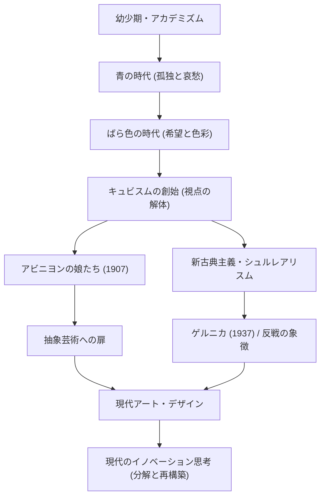

パブロ・ピカソ（Pablo Picasso、1881年 - 1973年）は、単なる画家という枠に収まらず、彫刻、版画、陶芸、さらには舞台美術にいたるまで、あらゆる視覚芸術の領域において革命を起こした「20世紀最大の芸術家」の一人です。彼の残した作品数は約15万点にものぼり、その圧倒的な多作さと共に、生涯にわたって次々と作風を変化させたことで知られています。本記事では、ピカソの数奇な生涯と、彼が世界にもたらした独自の哲学、そして後世への影響について探求します。

## 時代を映し出す万華鏡：ピカソの生涯と作風の変遷

ピカソの生涯は、まさに美術史そのものと言えるほどの劇的な変化に満ちています。スペインのアンダルシア地方マラガに生まれた彼は、美術教師であった父から手ほどきを受け、幼少期から圧倒的なデッサン力を発揮しました。「12歳の時にはラファエロのように描けた」と後に本人が語るほどの早熟な天才でした。

ピカソの作風は、彼の人生の段階や内面的な感情、そして交友関係の変化に伴って鮮やかに変貌を遂げました。

- **青の時代（1901–1904年）**: 親友の死をきっかけに、貧困や死、孤独といった重苦しいテーマを、冷たい青色のトーンで描いた時期です。
- **ばら色の時代（1904–1906年）**: パリのモンマルトルに移住し、新しい恋人やサーカス団員たちとの交流を通じて、暖かなピンクやオレンジを用いた明るい作風へと転換しました。
- **キュビスム（1907年以降）**: ジョルジュ・ブラックと共に創始した、20世紀最大の美術革命です。三次元の対象を分解し、二次元のキャンバス上に多視点から再構成する手法は、伝統的な遠近法を完全に破壊しました。1907年の『アビニヨンの娘たち』は、その決定的な第一歩となりました。
- **新古典主義とシュルレアリスム（1910年代後半以降）**: 第一次世界大戦後、ピカソは伝統的な写実表現へと回帰しつつ、シュルレアリスムの不条理で夢幻的な要素も取り入れ、表現の幅をさらに広げていきました。

## 破壊は創造の第一歩：ピカソの芸術哲学

「いかなる創造活動も、はじめは破壊活動だ」というピカソの言葉は、彼の芸術哲学を象徴しています。ピカソにとって、既存のルールや美しいとされる基準を壊すことは、新しい現実を再構築するための不可欠なプロセスでした。

彼の視覚的な破壊は、決して無秩序なものではありませんでした。それは物事の本質をむき出しにし、一つの視点では捉えきれない真実を表現するためのアプローチでした。また、ピカソは「子供のように描くためには一生を費やした」と語っています。高度な技術を身につけた後に、あえてそれを捨て去り、純粋で直感的な表現へと回帰しようとする姿勢は、彼の創作の根底に流れるテーマでした。

彼の哲学が最も強く現れた作品の一つが、1937年に描かれた巨大な壁画『ゲルニカ』です。スペイン内戦中、ナチス・ドイツによるゲルニカ無差別爆撃に対する怒りと悲しみを、キュビスム的手法で描いたこの作品は、反戦のシンボルとして今日でも強烈なメッセージを発し続けています。芸術が現実社会に対して持ち得る力を、ピカソはキャンバスの上で証明したのです。

## 後世への多大な影響と現代における意義

ピカソが後世に与えた影響は計り知れません。キュビスムの誕生は、その後の抽象絵画や未来派、さらには現代のデザインや建築にいたるまで、あらゆる視覚文化の基盤を揺るがし、新しい方向性を示しました。

現代のテック業界やデザインの分野においても、ピカソの「一度分解して再構築する」というアプローチは、イノベーションの基本原理として共感を集めています。複雑な問題を要素に分解し、新たな視点からソリューションを組み立てるプロセスは、まさにキュビスム的思考の現代版と言えるでしょう。

## ピカソの功績と影響のフロー

以下は、ピカソの主要な作風の変遷と、それが現代にどのような影響を与えているかを示す相関図です。

## 終わりに

パブロ・ピカソは、91歳でこの世を去るまで、決して歩みを止めることなく創作を続けました。彼の人生は、自らが築き上げたスタイルすらも次々と破壊し、常に新しい表現を模索し続ける旅でした。私たちにとってピカソの作品と生涯は、常識を疑い、新しい視点を持つことの重要性を、色褪せることなく教えてくれます。
