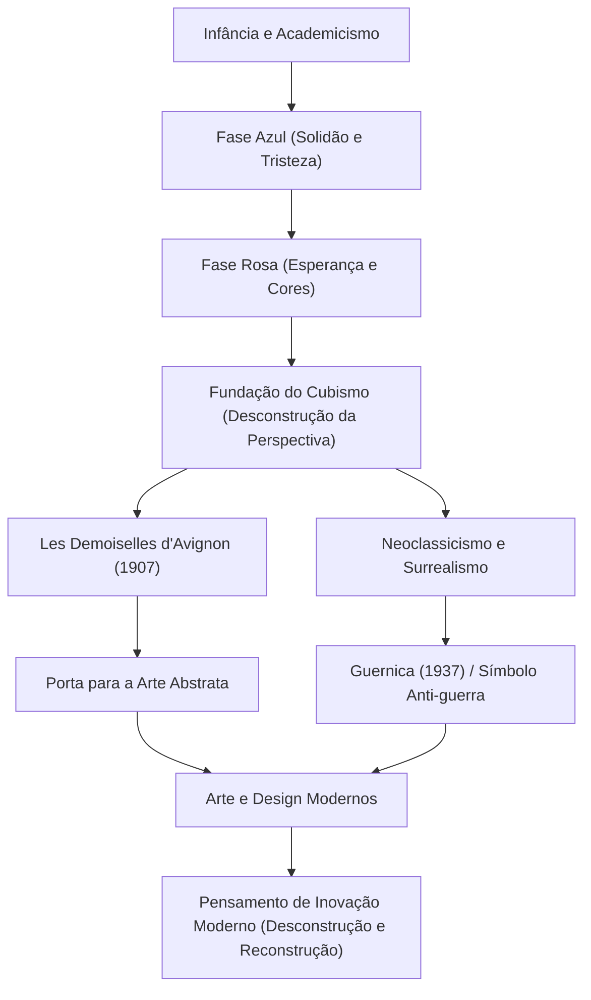

Pablo Picasso (1881–1973) não foi apenas um pintor, mas um dos "maiores artistas do século XX" que revolucionou todos os campos das artes visuais, incluindo escultura, gravura, cerâmica e até cenografia. Ele deixou para trás cerca de 150.000 obras e é conhecido não apenas por sua prolífica produção, mas também por mudar continuamente seu estilo artístico ao longo da vida. Este artigo explora a vida extraordinária de Picasso, a filosofia única que ele trouxe ao mundo e sua influência nas gerações posteriores.

## Um caleidoscópio refletindo a época: A vida de Picasso e as transições de estilo

A vida de Picasso foi cheia de mudanças dramáticas que podem ser consideradas a própria história da arte. Nascido em Málaga, na região da Andaluzia, na Espanha, ele recebeu instruções de seu pai, um professor de arte, e demonstrou habilidades esmagadoras de desenho desde muito jovem. Ele era um gênio precoce, declarando mais tarde: "Aos 12 anos, eu sabia desenhar como Rafael".

O estilo de Picasso transformou-se vividamente de acordo com as fases de sua vida, suas emoções interiores e as mudanças em suas amizades.

- **Fase Azul (1901–1904)**: Desencadeado pela morte de um amigo próximo, este foi um período em que ele retratou temas pesados como pobreza, morte e solidão em tons azuis frios.
- **Fase Rosa (1904–1906)**: Depois de se mudar para Montmartre, em Paris, através de interações com uma nova amante e artistas de circo, seu estilo mudou para um mais brilhante, usando rosas e laranjas quentes.
- **Cubismo (a partir de 1907)**: Fundado ao lado de Georges Braque, esta foi a maior revolução artística do século XX. A técnica de desconstruir objetos tridimensionais e reconstruí-los a partir de múltiplos pontos de vista em uma tela bidimensional destruiu completamente a perspectiva tradicional. "Les Demoiselles d'Avignon" em 1907 foi o primeiro passo decisivo.
- **Neoclassicismo e Surrealismo (final da década de 1910 em diante)**: Após a Primeira Guerra Mundial, Picasso retornou à representação realista tradicional, incorporando também os elementos absurdos e oníricos do Surrealismo, expandindo ainda mais seu leque de expressão.

## A destruição é o primeiro passo para a criação: A filosofia de arte de Picasso

As palavras de Picasso, "Todo ato de criação é antes de tudo um ato de destruição", simbolizam sua filosofia artística. Para Picasso, quebrar as regras existentes e os padrões de beleza era um processo essencial para a reconstrução de uma nova realidade.

Sua destruição visual não era de forma alguma caótica. Era uma abordagem para expor a essência das coisas e expressar verdades que não podiam ser capturadas a partir de um único ponto de vista. Além disso, Picasso disse: "Levei uma vida inteira para aprender a desenhar como uma criança". A atitude de adquirir técnicas avançadas apenas para descartá-las e retornar à expressão pura e intuitiva era um tema subjacente à sua criação.

Uma das obras em que sua filosofia apareceu com mais força é o enorme mural "Guernica", pintado em 1937. Retratando a raiva e a tristeza pelo bombardeio indiscriminado de Guernica pela Alemanha nazista durante a Guerra Civil Espanhola usando técnicas cubistas, este trabalho continua a enviar uma mensagem poderosa como símbolo anti-guerra hoje. Picasso provou na tela o poder que a arte pode ter sobre a sociedade real.

## Imensa influência sobre as gerações posteriores e significado hoje

A influência que Picasso teve nas gerações posteriores é imensurável. O nascimento do Cubismo abalou os fundamentos de toda a cultura visual, desde a subsequente pintura abstrata e Futurismo até o design e arquitetura modernos, apontando em novas direções.

Mesmo na indústria de tecnologia e nos campos de design de hoje, a abordagem de Picasso de "desconstruir uma vez e reconstruir" atrai simpatia como um princípio fundamental da inovação. O processo de dividir problemas complexos em elementos e reunir soluções a partir de novas perspectivas pode ser verdadeiramente chamado de uma versão moderna do pensamento cubista.

## Fluxo das conquistas e influência de Picasso

Abaixo está um diagrama de correlação mostrando as transições dos principais estilos de Picasso e como eles influenciam o presente.

## Conclusão

Até seu falecimento aos 91 anos, Pablo Picasso nunca parou de criar. Sua vida foi uma jornada de destruição constante até mesmo dos estilos que ele mesmo havia construído, sempre buscando novas expressões. Para nós, as obras e a vida de Picasso ensinam de forma atemporal a importância de duvidar do senso comum e manter novas perspectivas.
