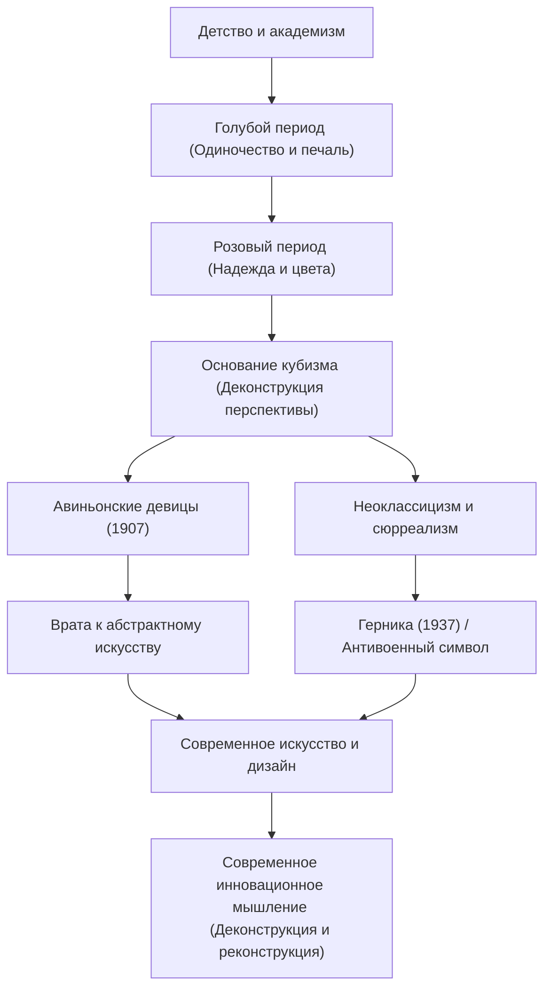

Пабло Пикассо (1881–1973) был не просто художником, а одним из «величайших творцов 20-го века», который произвел революцию во всех областях визуального искусства, включая скульптуру, гравюру, керамику и даже сценографию. Он оставил после себя около 150 000 работ и известен не только своей потрясающей плодовитостью, но и тем, что на протяжении всей жизни постоянно менял свой художественный стиль. В этой статье исследуется необычная жизнь Пикассо, уникальная философия, которую он принес в мир, и его влияние на последующие поколения.

## Калейдоскоп, отражающий время: жизнь Пикассо и стилистические переходы

Жизнь Пикассо была полна драматических изменений, которые можно назвать историей самого искусства. Родившись в Малаге в регионе Андалусия в Испании, он получил образование у своего отца, учителя рисования, и с юных лет демонстрировал потрясающие навыки рисования. Он был не по годам развитым гением, позже заявив: «В 12 лет я умел рисовать, как Рафаэль».

Стиль Пикассо ярко трансформировался в соответствии с этапами его жизни, его внутренними эмоциями и изменениями в его дружбе.

- **Голубой период (1901–1904)**: Вызванный смертью близкого друга, это был период, когда он изображал тяжелые темы, такие как бедность, смерть и одиночество, в холодных синих тонах.
- **Розовый период (1904–1906)**: После переезда на Монмартр в Париже, благодаря общению с новой возлюбленной и артистами цирка, его стиль сменился на более яркий с использованием теплых розовых и оранжевых оттенков.
- **Кубизм (с 1907 года)**: Основанный вместе с Жоржем Браком, это была величайшая художественная революция 20-го века. Техника разрушения трехмерных объектов и их реконструкции с нескольких точек зрения на двухмерном холсте полностью уничтожила традиционную перспективу. «Авиньонские девицы» в 1907 году стали решающим первым шагом.
- **Неоклассицизм и сюрреализм (с конца 1910-х годов)**: После Первой мировой войны Пикассо вернулся к традиционному реалистическому изображению, одновременно включив в него абсурдные и сказочные элементы сюрреализма, еще больше расширив свой диапазон самовыражения.

## Разрушение — первый шаг к созиданию: философия искусства Пикассо

Слова Пикассо «Каждый акт созидания — это сначала акт разрушения» символизируют его философию искусства. Для Пикассо нарушение существующих правил и стандартов красоты было важным процессом для реконструкции новой реальности.

Его визуальное разрушение ни в коем случае не было хаотичным. Это был подход к раскрытию сути вещей и выражению истин, которые невозможно уловить с одной точки зрения. Кроме того, Пикассо сказал: «Мне понадобилась целая жизнь, чтобы научиться рисовать, как ребенок». Позиция приобретения передовых техник только для того, чтобы отказаться от них и вернуться к чистому, интуитивному выражению, была темой, лежащей в основе его творчества.

Одним из произведений, где его философия проявилась наиболее сильно, является массивная фреска «Герника», написанная в 1937 году. Изображая гнев и скорбь по поводу неизбирательной бомбардировки Герники нацистской Германией во время гражданской войны в Испании с использованием методов кубизма, эта работа продолжает посылать мощный сигнал как антивоенный символ и сегодня. Пикассо доказал на холсте ту силу, которую искусство может иметь над реальным обществом.

## Огромное влияние на последующие поколения и значение сегодня

Влияние, которое Пикассо оказал на последующие поколения, неизмеримо. Рождение кубизма потрясло основы всей визуальной культуры, от последующей абстрактной живописи и футуризма до современного дизайна и архитектуры, указав новые направления.

Даже в современной технологической индустрии и сферах дизайна подход Пикассо «один раз разрушить и восстановить» вызывает симпатию как фундаментальный принцип инноваций. Процесс разбиения сложных проблем на элементы и сборки решений с новых точек зрения можно поистине назвать современной версией кубистического мышления.

## Поток достижений и влияния Пикассо

Ниже приведена диаграмма корреляции, показывающая переходы основных стилей Пикассо и то, как они влияют на сегодняшний день.

## Заключение

До самой своей кончины в возрасте 91 года Пабло Пикассо никогда не прекращал творить. Его жизнь была путешествием постоянного разрушения даже тех стилей, которые он создал сам, всегда ища новые формы выражения. Для нас произведения и жизнь Пикассо вне времени учат важности сомнения в здравом смысле и сохранения новых точек зрения.
