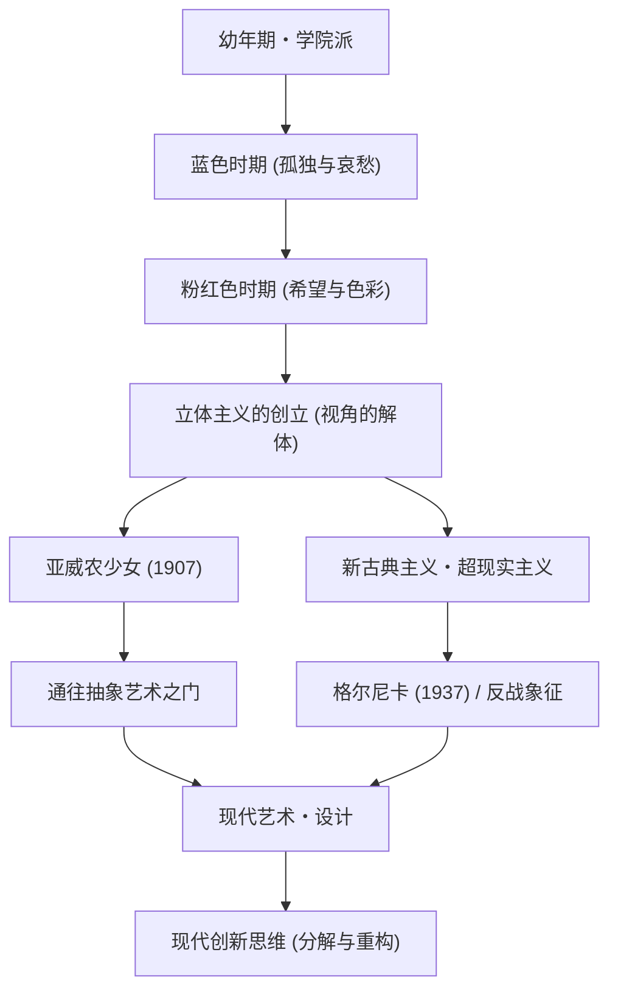

巴勃罗·毕加索（Pablo Picasso，1881年 - 1973年）不仅是一位画家，他还在雕塑、版画、陶瓷甚至舞台美术等各个视觉艺术领域掀起了革命，被誉为“20世纪最伟大的艺术家”之一。他留下的作品数量高达约15万件，除了令人惊叹的多产之外，他一生中不断改变画风的特点也广为人知。本文将探讨毕加索传奇的一生、他给世界带来的独特哲学以及对后世的影响。

## 映照时代的万花筒：毕加索的一生与画风的演变

毕加索的一生充满了戏剧性的变化，堪称艺术史的缩影。他出生于西班牙安达卢西亚地区的马拉加，在担任美术教师的父亲的指导下，从幼年起就展现出了惊人的素描天赋。他是一位早熟的天才，后来他自己曾说：“我12岁时就能画得像拉斐尔一样。”

毕加索的画风随着他人生的不同阶段、内心真实情感以及交友关系的变化而发生了鲜明的转变。

- **蓝色时期（1901–1904年）**: 以挚友的去世为契机，这是一个用冷峻的蓝色调描绘贫困、死亡和孤独等沉重主题的时期。
- **粉红色时期（1904–1906年）**: 移居巴黎蒙马特后，通过与新恋人及马戏团成员的交往，他的画风转向了使用温暖的粉色和橙色的明快风格。
- **立体主义（1907年以后）**: 与乔治·布拉克共同创立，是20世纪最大的美术革命。将三维对象分解，并在二维画布上从多视角重新构建的手法，彻底打破了传统的透视法。1907年的《亚威农少女》成为了决定性的第一步。
- **新古典主义与超现实主义（1910年代后期以后）**: 第一次世界大战后，毕加索在回归传统写实表现的同时，也融入了超现实主义荒诞而梦幻的元素，进一步拓宽了表现的领域。

## 破坏是创造的第一步：毕加索的艺术哲学

“任何创造活动，最初都是破坏活动”，毕加索的这句话象征着他的艺术哲学。对毕加索而言，打破现有的规则和所谓的美的基准，是重新构建新现实不可或缺的过程。

他在视觉上的破坏绝非无序。这是一种旨在揭示事物本质、表现无法从单一视角捕捉的真实的方法。此外，毕加索曾说：“我花了一辈子的时间去学习像孩子那样画画。”在掌握了高超技巧之后，刻意将其抛弃，回归纯粹而直觉的表现，这种态度贯穿了他创作的始终。

他哲学表现得最强烈的一件作品，是1937年创作的巨幅壁画《格尔尼卡》。在西班牙内战期间，这件以立体主义手法描绘对纳粹德国无差别轰炸格尔尼卡的愤怒与悲伤的作品，作为反战的象征，至今依然散发着强烈的信息。毕加索在画布上证明了艺术对现实社会所能拥有的力量。

## 对后世的深远影响及在现代的意义

毕加索对后世的影响是不可估量的。立体主义的诞生动摇了此后抽象绘画、未来派乃至现代设计和建筑等所有视觉文化的根基，并指明了新的方向。

即使在现代的科技行业和设计领域，毕加索“分解再重构”的方法作为创新的基本原理也引起了共鸣。将复杂问题分解为要素，从全新视角组建解决方案的过程，简直可以说就是立体主义思维的现代版。

## 毕加索的功绩与影响流程

以下是展示毕加索主要画风演变及其对现代产生何种影响的相关图。

## 结语

巴勃罗·毕加索直到91岁离开人世，从未停止过创作的脚步。他的一生，是一场不断打破自己建立的风格，始终探索新表现形式的旅程。对我们而言，毕加索的作品和一生，永不褪色地教会了我们质疑常识和拥有新视角的重要性。
