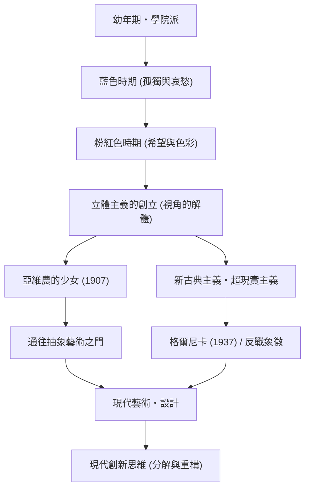

巴勃羅·畢卡索（Pablo Picasso，1881年 - 1973年）不僅是一位畫家，他還在雕塑、版畫、陶瓷甚至舞台美術等各個視覺藝術領域掀起了革命，被譽為「20世紀最偉大的藝術家」之一。他留下的作品數量高達約15萬件，除了令人驚嘆的多產之外，他一生中不斷改變畫風的特點也廣為人知。本文將探討畢卡索傳奇的一生、他給世界帶來的獨特哲學以及對後世的影響。

## 映照時代的萬花筒：畢卡索的一生與畫風的演變

畢卡索的一生充滿了戲劇性的變化，堪稱藝術史的縮影。他出生於西班牙安達盧西亞地區的馬拉加，在擔任美術教師的父親的指導下，從幼年起就展現出了驚人的素描天賦。他是一位早熟的天才，後來他自己曾說：「我12歲時就能畫得像拉斐爾一樣。」

畢卡索的畫風隨著他人生的不同階段、內心真實情感以及交友關係的變化而發生了鮮明的轉變。

- **藍色時期（1901–1904年）**: 以摯友的去世為契機，這是一個用冷峻的藍色調描繪貧困、死亡和孤獨等沉重主題的時期。
- **粉紅色時期（1904–1906年）**: 移居巴黎蒙馬特後，透過與新戀人及馬戲團成員的交往，他的畫風轉向了使用溫暖的粉色和橙色的明快風格。
- **立體主義（1907年以後）**: 與喬治·布拉克共同創立，是20世紀最大的美術革命。將三維對象分解，並在二維畫布上從多視角重新構建的手法，徹底打破了傳統的透視法。1907年的《亞維農的少女》成為了決定性的第一步。
- **新古典主義與超現實主義（1910年代後期以後）**: 第一次世界大戰後，畢卡索在回歸傳統寫實表現的同時，也融入了超現實主義荒誕而夢幻的元素，進一步拓寬了表現的領域。

## 破壞是創造的第一步：畢卡索的藝術哲學

「任何創造活動，最初都是破壞活動」，畢卡索的這句話象徵著他的藝術哲學。對畢卡索而言，打破現有的規則和所謂的美的基準，是重新構建新現實不可或缺的過程。

他在視覺上的破壞絕非無序。這是一種旨在揭示事物本質、表現無法從單一視角捕捉的真實的方法。此外，畢卡索曾說：「我花了一輩子的時間去學習像孩子那樣畫畫。」在掌握了高超技巧之後，刻意將其拋棄，回歸純粹而直覺的表現，這種態度貫穿了他創作的始終。

他哲學表現得最強烈的一件作品，是1937年創作的巨幅壁畫《格爾尼卡》。在西班牙內戰期間，這件以立體主義手法描繪對納粹德國無差別轟炸格爾尼卡的憤怒與悲傷的作品，作為反戰的象徵，至今依然散發著強烈的信息。畢卡索在畫布上證明了藝術對現實社會所能擁有的力量。

## 對後世的深遠影響及在現代的意義

畢卡索對後世的影響是不可估量的。立體主義的誕生動搖了此後抽象繪畫、未來派乃至現代設計和建築等所有視覺文化的根基，並指明了新的方向。

即使在現代的科技行業和設計領域，畢卡索「分解再重構」的方法作為創新的基本原理也引起了共鳴。將複雜問題分解為要素，從全新視角組建解決方案的過程，簡直可以說就是立體主義思維的現代版。

## 畢卡索的功績與影響流程

以下是展示畢卡索主要畫風演變及其對現代產生何種影響的相關圖。

## 結語

巴勃羅·畢卡索直到91歲離開人世，從未停止過創作的腳步。他的一生，是一場不斷打破自己建立的風格，始終探索新表現形式的旅程。對我們而言，畢卡索的作品和一生，永不褪色地教會了我們質疑常識和擁有新視角的重要性。
