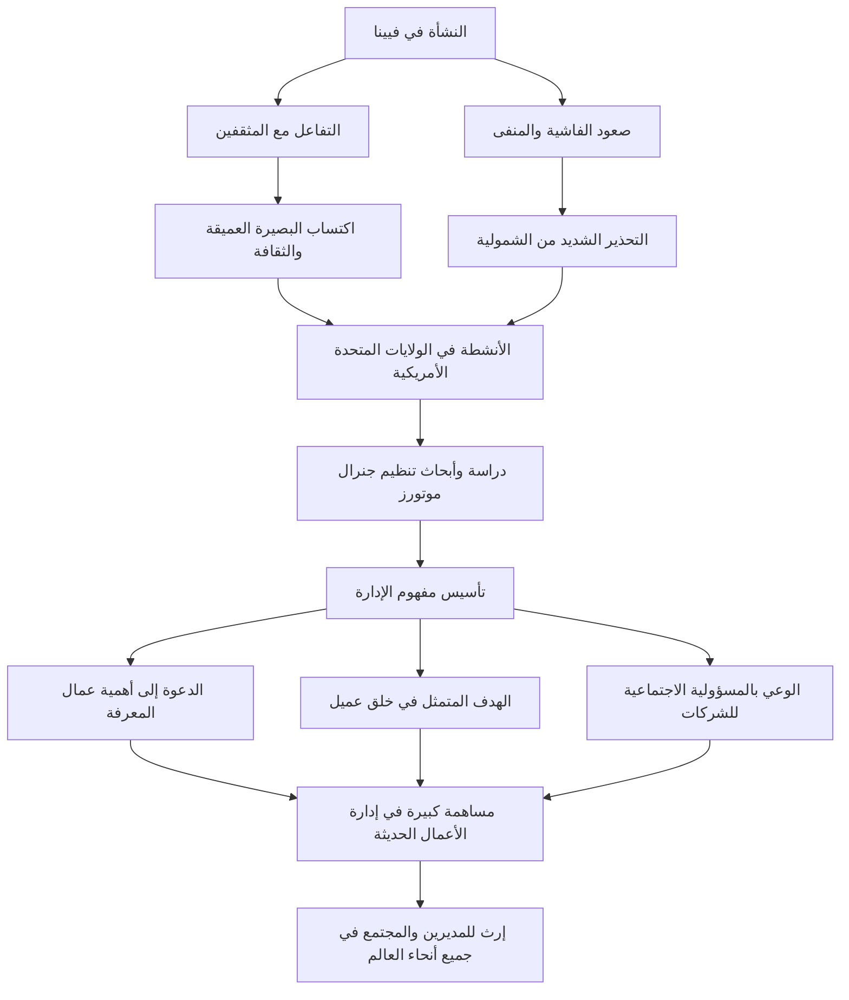

بيتر ف. دراكر، الذي يُلقب بـ "أبو الإدارة الحديثة"، والذي ترك أثراً بالغاً ليس فقط في مجال الأعمال، بل أيضاً في مجالات علم الاجتماع والعلوم السياسية. إن الرؤى والفلسفات العديدة التي تركها لا تزال تحتفظ ببريقها حتى يومنا هذا، وتستمر في تقديم إرشادات للمديرين والقادة في جميع أنحاء العالم. في هذا المقال، سنتعمق في حياته الاستثنائية وفكر الإدارة الذي أرسى قواعده.

## المشهد الفكري الأول في فيينا

وُلد بيتر فرديناند دراكر عام 1909 في فيينا، عاصمة الإمبراطورية النمساوية المجرية. كانت فيينا في ذلك الوقت واحدة من المراكز الثقافية والفكرية في أوروبا، وكانت بيئته الأسرية أيضاً فكرية للغاية. كان والده مسؤولاً حكومياً رفيع المستوى، ووالدته مثقفة درست الطب، وكان منزلهم يتردد عليه باستمرار كبار المفكرين في ذلك العصر، مثل الخبير الاقتصادي جوزيف شومبيتر والمحلل النفسي سيغموند فرويد. إن نشأته تحت هذا الوابل من المعرفة العميقة والحوار كانت بمثابة نقطة الانطلاق لرؤية دراكر الواسعة وبصيرته العميقة في وقت لاحق.

ومع ذلك، تغيرت حياته تماماً بسبب الهزيمة في الحرب العالمية الأولى وانهيار الإمبراطورية. سافر دراكر الشاب إلى ألمانيا، حيث بدأ حياته المهنية كصحفي أثناء دراسة القانون الدولي في جامعة فرانكفورت. وهناك، شهد المأساة التاريخية المتمثلة في صعود ألمانيا النازية. وبسبب شعوره القوي بالخطر تجاه الشمولية، فر إلى بريطانيا في عام 1933، وبعد ذلك هاجر إلى الولايات المتحدة الأمريكية بحثاً عن الحرية والفرص الجديدة.

## دراسة جنرال موتورز وولادة الإدارة

بعد انتقاله إلى الولايات المتحدة، كثف دراكر أنشطته في الكتابة أثناء التدريس في الجامعة. كانت نقطة التحول في حياته المهنية هي طلب إجراء دراسة تنظيمية تلقاه في عام 1943 من شركة جنرال موتورز (GM)، التي كانت في ذلك الوقت أكبر صانع للسيارات في العالم. في ذلك الوقت، لم تكن هناك أي سابقة لمحاولة دراسة الهيكل الداخلي وطبيعة تنظيم الشركات الكبيرة أكاديمياً.

تعمق دراكر داخل جنرال موتورز وأجرى مقابلات وملاحظات شاملة، بدءاً من الإدارة العليا وصولاً إلى العمال في الموقع. ونتيجة لهذا البحث، نُشر كتاب "مفهوم الشركة" (Concept of the Corporation) في عام 1946. في هذا العمل، أكد على أهمية "اللامركزية" وأوضح لأول مرة أن الشركة ليست مجرد أداة للسعي وراء الربح، بل هي مجتمع يعمل فيه البشر ومؤسسة مهمة تشكل المجتمع. كانت هذه هي اللحظة التي وُلد فيها المفهوم الحديث لـ "الإدارة".

## فلسفة دراكر الأساسية

في صميم فلسفة دراكر، كان هناك دائماً بصيرة عميقة تجاه "الإنسان". يمكن تلخيص جوهر فكره الإداري في النقاط التالية.

### 1. صعود عامل المعرفة
لقد توقع في وقت مبكر انتقال الدور الرئيسي في الاقتصاد من العمل البدني إلى العمل المعرفي. وأوضح أن عمال المعرفة يعملون بشكل مستقل وهم كيانات تخلق القيمة بأنفسهم، وأكد أن هناك حاجة إلى التحفيز من خلال الهدف وتحقيق الذات بدلاً من الإدارة التقليدية القائمة على الأوامر والتحكم.

### 2. خلق العميل
"الغرض من الشركة هو خلق عميل". هذه واحدة من أشهر مقولات دراكر. إن الفكرة القائلة بأن الربح ليس هو هدف الشركة، بل هو مجرد شرط ناتج عن تقديم قيمة للعملاء من خلال الابتكار والتسويق، أصبحت مبدأً أساسياً في الأعمال التجارية الحديثة.

### 3. المسؤولية الاجتماعية
جادل بأن الشركات هي مؤسسات اجتماعية ويجب أن تتحمل المسؤولية تجاه المجتمع. لقد قدم حساً أخلاقياً عالياً بأن الإدارة لا تقتصر على تحسين أداء المؤسسة فحسب، بل هي عنصر لا غنى عنه لجعل المجتمع يعمل بشكل أفضل.

## التأثير على الأجيال القادمة والإرث

حتى وفاته عن عمر يناهز 95 عاماً في عام 2005، نشر دراكر أكثر من 30 كتاباً وقدم استشارات للعديد من الشركات. في مجتمع الشركات الياباني أيضاً، تغلغلت أفكاره بعمق، ومنذ فترة النمو الاقتصادي السريع وحتى الوقت الحاضر، يعتبر العديد من المديرين كتبه بمثابة الكتاب المقدس.

يوضح المخطط الانسيابي التالي ملخصاً لحياته وأفكاره وإنجازاته.

ولعل أعظم إرث تركه بيتر دراكر هو الارتقاء بـ "الإدارة" من مجرد تقنية أعمال إلى "فنون ليبرالية" تخدم كرامة الإنسان وتطور المجتمع. وفي عصرنا الحالي الذي يشهد تغيرات سريعة ومستقبلاً غامضاً، أصبحت فلسفته التي استمرت في التساؤل عن الجوهر بمثابة منارة ثابتة تضيء الطريق الذي يجب أن نسلكه.
