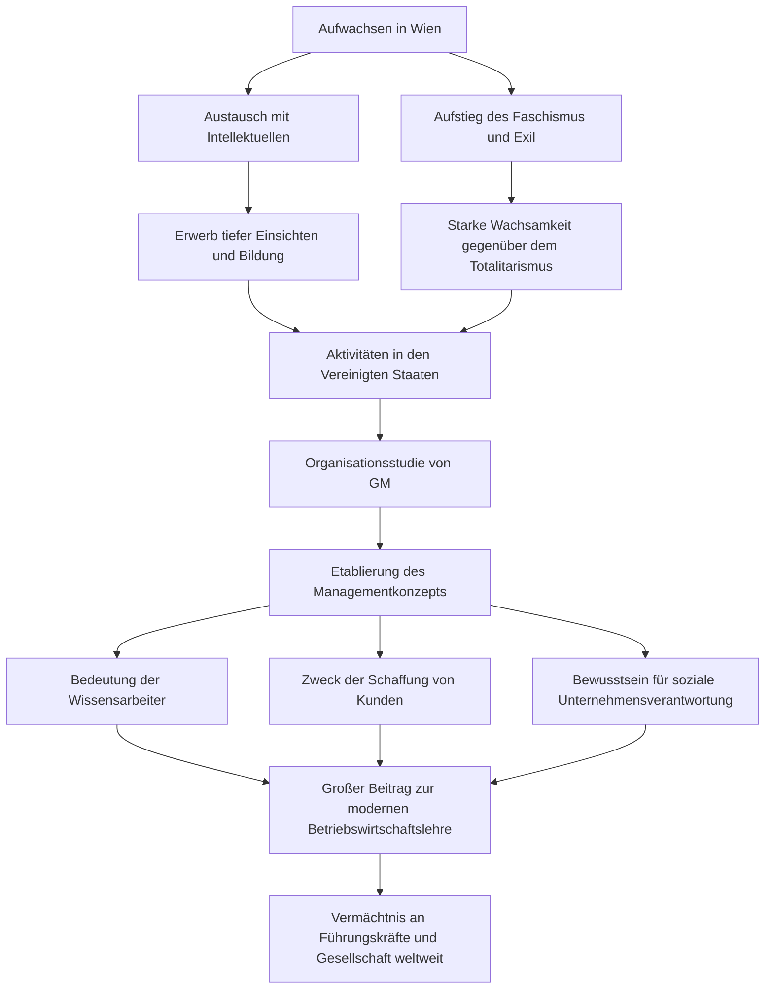

Peter F. Drucker, oft als „Vater des modernen Managements“ bezeichnet, hat nicht nur die Geschäftswelt, sondern auch die Bereiche Soziologie und Politikwissenschaft tiefgreifend geprägt. Die zahlreichen Erkenntnisse und Philosophien, die er hinterlassen hat, haben bis heute nicht an Relevanz verloren und dienen Führungskräften und Managern weltweit weiterhin als Leitstern. In diesem Artikel tauchen wir tief in sein bemerkenswertes Leben und die von ihm begründete Managementphilosophie ein.

## Die intellektuellen Wurzeln in Wien

Peter Ferdinand Drucker wurde 1909 in Wien, der Hauptstadt von Österreich-Ungarn, geboren. Das damalige Wien war eines der kulturellen und intellektuellen Zentren Europas, und sein familiäres Umfeld war äußerst gebildet. Sein Vater war ein hoher Regierungsbeamter und seine Mutter eine Intellektuelle, die Medizin studiert hatte. Die Spitzenintellektuellen jener Zeit, wie der Ökonom Joseph Schumpeter und der Psychoanalytiker Sigmund Freud, waren häufig zu Gast im Hause Drucker. Das Aufwachsen inmitten dieses Reichtums an Wissen und Dialogen wurde zur Grundlage von Druckers späterer Weitsicht und tiefer Einsicht.

Mit der Niederlage im Ersten Weltkrieg und dem Zusammenbruch des Reiches veränderte sich sein Leben jedoch schlagartig. Der junge Drucker zog nach Deutschland, begann ein Studium des internationalen Rechts an der Universität Frankfurt und startete gleichzeitig seine Karriere als Journalist. Hier wurde er Zeuge der historischen Tragödie des Aufstiegs von Nazi-Deutschland. Mit einem starken Sinn für die vom Totalitarismus ausgehende Gefahr floh er 1933 nach England und emigrierte später in die Vereinigten Staaten, auf der Suche nach Freiheit und neuen Möglichkeiten.

## Die GM-Studie (General Motors) und die Geburt des Managements

Nach seiner Ankunft in Amerika nahm Drucker seine Lehrtätigkeit an Universitäten auf und intensivierte seine Schreibtätigkeit. Der Wendepunkt in seiner Karriere war 1943 ein Auftrag von General Motors (GM), dem damals größten Automobilhersteller der Welt, zur Untersuchung der Unternehmensorganisation. Zu dieser Zeit gab es keinen Präzedenzfall für die wissenschaftliche Untersuchung der internen Strukturen und der Organisation eines großen Unternehmens.

Drucker tauchte tief in das Innere von GM ein und führte ausführliche Interviews und Beobachtungen durch – vom Management bis hin zu den Arbeitern in den Fabriken. Das Ergebnis dieser Studie wurde 1946 unter dem Titel „Concept of the Corporation“ veröffentlicht. In diesem Werk betonte er die Bedeutung der „Dezentralisierung“ und verdeutlichte zum ersten Mal, dass ein Unternehmen nicht nur ein Instrument zur Gewinnmaximierung ist, sondern eine Gemeinschaft arbeitender Menschen und eine wichtige Institution der Gesellschaft. Dies war der Moment, in dem das moderne Konzept des „Managements“ geboren wurde.

## Druckers Kernphilosophie

Im Mittelpunkt von Druckers Philosophie stand immer ein tiefes Verständnis für den „Menschen“. Der Kern seiner Managementgedanken lässt sich in den folgenden Punkten zusammenfassen:

### 1. Der Aufstieg des Wissensarbeiters
Er sagte frühzeitig voraus, dass sich der wirtschaftliche Schwerpunkt von der körperlichen Arbeit zur Wissensarbeit verlagern würde. Wissensarbeiter handeln autonom und schaffen selbst Werte; er argumentierte, dass anstelle der traditionellen Führung durch Kontrolle eine Motivation durch Sinnstiftung und Selbstverwirklichung erforderlich sei.

### 2. Die Erschaffung eines Kunden
„Der Zweck eines Unternehmens ist es, einen Kunden zu erschaffen.“ Dies ist eines von Druckers berühmtesten Zitaten. Der Gedanke, dass Gewinn nicht der Zweck eines Unternehmens ist, sondern lediglich die Voraussetzung, die sich aus der Schaffung von Werten für den Kunden durch Innovation und Marketing ergibt, ist zu einem Grundprinzip der modernen Geschäftswelt geworden.

### 3. Soziale Verantwortung
Er vertrat die Ansicht, dass Unternehmen Institutionen der Gesellschaft sind und eine Verantwortung ihr gegenüber tragen. Er präsentierte einen hohen ethischen Standard, demnach Management nicht nur die Leistung der Organisation verbessern, sondern auch ein wesentliches Element für das bessere Funktionieren der Gesellschaft sein muss.

## Einfluss auf die Nachwelt und Vermächtnis

Bis zu seinem Tod im Alter von 95 Jahren im Jahr 2005 verfasste Drucker mehr als 30 Bücher und war als Berater für zahlreiche Unternehmen tätig. Seine Gedanken haben auch in der japanischen Unternehmensgesellschaft tiefe Wurzeln geschlagen; viele Führungskräfte betrachten seine Bücher von der Zeit des rasanten Wirtschaftswachstums bis heute als ihre Bibel.

Das folgende Flussdiagramm fasst sein Leben, seine Philosophie und seine Errungenschaften zusammen.

Das größte Vermächtnis, das Peter Drucker hinterlassen hat, ist wohl die Tatsache, dass er „Management“ von einer bloßen Geschäftsmethode zu einer der „Liberalen Künste“ erhoben hat, die der Menschenwürde und der Entwicklung der Gesellschaft dient. Gerade in unserer heutigen Zeit, die von rasanten Veränderungen und Unsicherheit geprägt ist, bleibt seine Philosophie, die stets das Wesentliche hinterfragte, ein unerschütterlicher Leuchtturm, der uns den Weg weist.
