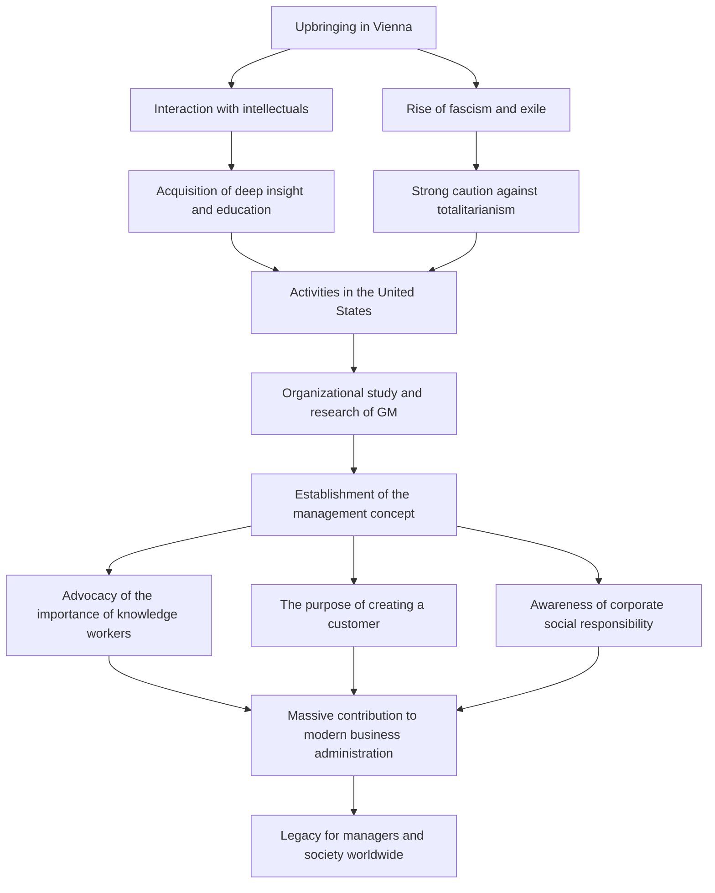

Peter F. Drucker, known as the "father of modern management," had a profound impact not only on business but also on the fields of sociology and political science. The numerous insights and philosophy he left behind continue to provide a guiding light for executives and leaders around the world today without fading. In this article, we delve deeply into his remarkable life and the management philosophy he established.

## Intellectual Origins in Vienna

Peter Ferdinand Drucker was born in Vienna, the capital of the Austro-Hungarian Empire, in 1909. Vienna at the time was one of the cultural and intellectual centers of Europe, and his family environment was also highly intellectual. His father was a high-ranking government official, and his mother was an intellectual who studied medicine. Some of the greatest intellects of the time, such as economist Joseph Schumpeter and psychoanalyst Sigmund Freud, frequently visited their home. Growing up showered in this rich knowledge and dialogue became the origin of Drucker's broad perspective and deep insight later in life.

However, his life changed completely due to the defeat in World War I and the collapse of the empire. The young Drucker moved to Germany, started his career as a journalist while studying international law and other subjects at the University of Frankfurt. Here, he witnessed the historical tragedy of the rise of Nazi Germany. Harboring a strong sense of crisis toward totalitarianism, he fled to the United Kingdom in 1933 and later immigrated to the United States in search of freedom and new possibilities.

## GM (General Motors) Study and the Birth of Management

After moving to America, Drucker began writing in earnest while teaching at a university. His turning point came in 1943 when he received a request from General Motors (GM), then the world's largest automaker, to conduct an organizational study. At the time, attempting to academically study the internal structure and organization of a large corporation was unprecedented.

Drucker deeply penetrated the interior of GM, conducting thorough interviews and observations from management to factory workers. The result of this research was published in 1946 as "Concept of the Corporation." In this book, he preached the importance of "decentralization" and revealed for the first time that a corporation is not merely a device for pursuing profit, but a community where human beings work, and an important institution constituting society. This was the exact moment the modern concept of "management" was born.

## Drucker's Core Philosophy

At the root of Drucker's philosophy was always a deep insight into "human beings." The core of his management thought can be summarized in the following points.

### 1. The Rise of the Knowledge Worker
He predicted early on that the main actors of the economy would shift from manual labor to knowledge work. He argued that knowledge workers are beings who work autonomously and create value themselves, requiring motivation through purpose and self-realization rather than traditional command-and-control management.

### 2. Creation of a Customer
"The purpose of a business is to create a customer." This is one of Drucker's most famous quotes. The idea that profit is not the purpose of a business, but merely a condition brought about as a result of providing value to customers through innovation and marketing, has become a fundamental principle of modern business.

### 3. Social Responsibility
He asserted that a business is an organ of society and should bear responsibility toward it. He presented a high ethical standard that management is not merely about improving an organization's performance, but is an essential element for making society function better.

## Legacy and Impact on Later Generations

Until he passed away at the age of 95 in 2005, Drucker sent more than 30 books out into the world and consulted for many companies. His ideas are deeply ingrained in Japanese corporate society as well, with many executives treating his books as bibles from the period of rapid economic growth to the present day.

A flowchart summarizing his life, philosophy, and achievements is as follows:

Perhaps the greatest legacy left by Peter Drucker is that he elevated "management" from a mere business technique to one of the "liberal arts" that serves human dignity and the development of society. Especially in today's world, which is characterized by rapid change and uncertainty, his philosophy of constantly questioning the essence serves as an unwavering beacon illuminating the path we should take.
