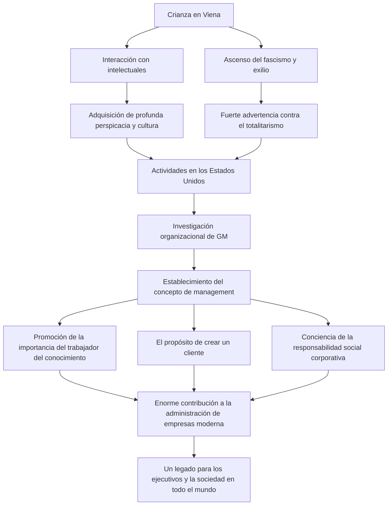

Conocido como el "padre del management moderno", Peter F. Drucker tuvo un profundo impacto no solo en los negocios, sino también en los campos de la sociología y la ciencia política. Las numerosas percepciones y filosofías que dejó atrás no se han desvanecido en la actualidad y continúan sirviendo de guía para ejecutivos y líderes en todo el mundo. En este artículo, profundizaremos en su extraordinaria vida y las ideas de gestión que estableció.

## El panorama intelectual de su infancia en Viena

Peter Ferdinand Drucker nació en 1909 en Viena, la capital del Imperio Austrohúngaro. En esa época, Viena era uno de los centros culturales e intelectuales de Europa, y su entorno familiar era muy intelectual. Su padre era un alto funcionario del gobierno y su madre una intelectual que había estudiado medicina. En su casa, con frecuencia recibían la visita de las mentes más brillantes de la época, como el economista Joseph Schumpeter y el psicoanalista Sigmund Freud. Crecer inmerso en esta riqueza de conocimientos y diálogos fue el punto de partida de la amplia perspectiva y profunda perspicacia de Drucker en su madurez.

Sin embargo, su vida cambió drásticamente tras la derrota en la Primera Guerra Mundial y el colapso del imperio. El joven Drucker se trasladó a Alemania, donde comenzó su carrera como periodista mientras estudiaba derecho internacional en la Universidad de Frankfurt. Allí fue testigo de la tragedia histórica del ascenso de la Alemania nazi. Con un fuerte sentido de urgencia frente al totalitarismo, huyó a Inglaterra en 1933 y, posteriormente, emigró a los Estados Unidos de América en busca de libertad y nuevas oportunidades.

## La investigación en GM (General Motors) y el nacimiento del management

Al llegar a Estados Unidos, Drucker comenzó a enseñar en la universidad al mismo tiempo que intensificaba su labor como escritor. Su punto de inflexión fue en 1943, cuando General Motors (GM), el mayor fabricante de automóviles del mundo en ese momento, le pidió que realizara un estudio de su organización. Hasta entonces, los intentos de estudiar académicamente la estructura interna y la organización de las grandes corporaciones no tenían precedentes.

Drucker se adentró en el funcionamiento interno de GM, realizando exhaustivas entrevistas y observaciones, desde la dirección hasta los trabajadores de las fábricas. El resultado de esta investigación se publicó en 1946 bajo el título de "El concepto de corporación". En este libro, predicó la importancia de la "descentralización" y reveló por primera vez que una empresa no es simplemente un mecanismo para buscar beneficios, sino una comunidad donde las personas trabajan y una institución crucial que conforma la sociedad. Este fue, precisamente, el momento en que nació el concepto moderno de "management".

## La filosofía central de Drucker

En el fondo de la filosofía de Drucker, siempre hubo una profunda comprensión del "ser humano". El núcleo de su pensamiento de gestión puede resumirse en los siguientes puntos:

### 1. El auge del trabajador del conocimiento
Fue uno de los primeros en predecir que el actor principal de la economía pasaría del trabajo manual al trabajo del conocimiento. Argumentó que los trabajadores del conocimiento trabajan de forma autónoma, creando valor por sí mismos, y requieren motivación a través del propósito y la autorrealización, en lugar de los métodos de gestión convencionales de orden y control.

### 2. La creación del cliente
"El propósito de una empresa es crear un cliente". Esta es una de las frases más famosas de Drucker. La idea de que el beneficio no es el propósito de una empresa, sino simplemente una condición resultante de proporcionar valor a los clientes a través de la innovación y el marketing, se ha convertido en un principio fundamental de los negocios modernos.

### 3. Responsabilidad social
Argumentó que una empresa es una institución de la sociedad y debe asumir responsabilidades hacia ella. Presentó un alto nivel ético, sosteniendo que la gestión no se trata simplemente de mejorar el rendimiento organizacional, sino de ser un elemento indispensable para que la sociedad funcione mejor.

## Influencia en la posteridad y legado

Hasta su fallecimiento a la edad de 95 años en 2005, Drucker publicó más de 30 libros y fue consultor de muchas empresas. Su pensamiento también ha penetrado profundamente en la sociedad corporativa japonesa, donde muchos líderes empresariales han considerado sus libros como una biblia, desde la época del alto crecimiento económico hasta nuestros días.

A continuación se presenta un diagrama de flujo que resume su vida, pensamiento y logros:

Quizás el mayor legado que dejó Peter Drucker fue elevar el "management" de ser una mera técnica de negocios a un "arte liberal" que sirve a la dignidad humana y al desarrollo de la sociedad. Especialmente en los tiempos modernos, de rápidos cambios e incertidumbre sobre el futuro, su filosofía, que continuamente cuestionó la esencia de las cosas, sirve como un faro inquebrantable que ilumina el camino que debemos tomar.
