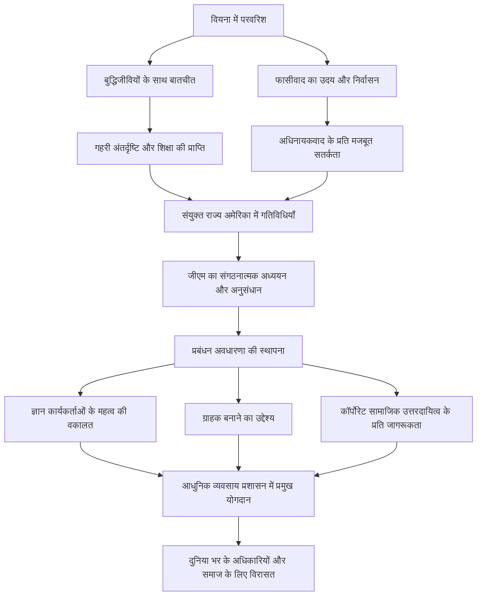

"आधुनिक प्रबंधन के जनक" के रूप में जाने जाने वाले, पीटर एफ. ड्रकर ने न केवल व्यापार को बल्कि समाजशास्त्र और राजनीति विज्ञान के क्षेत्रों को भी बहुत प्रभावित किया। उनके द्वारा छोड़ी गई कई अंतर्दृष्टि और दर्शन आज भी प्रासंगिक हैं, जो दुनिया भर के अधिकारियों और नेताओं को मार्गदर्शन प्रदान करते हैं। इस लेख में, हम उनके असाधारण जीवन और उनके द्वारा स्थापित प्रबंधन दर्शन की गहराई से पड़ताल करेंगे।

## वियना में बौद्धिक उत्पत्ति

पीटर फर्डिनेंड ड्रकर का जन्म 1909 में ऑस्ट्रो-हंगेरियन साम्राज्य की राजधानी वियना में हुआ था। उस समय का वियना यूरोप में संस्कृति और विचार के केंद्रों में से एक था, और उनका पारिवारिक परिवेश भी अत्यधिक बौद्धिक था। उनके पिता एक उच्च पदस्थ सरकारी अधिकारी थे, और उनकी माँ चिकित्सा की शिक्षा प्राप्त एक बुद्धिजीवी थीं। अर्थशास्त्री जोसेफ शुम्पीटर और मनोविश्लेषक सिगमंड फ्रायड जैसे उस समय के शीर्ष बुद्धिजीवी अक्सर उनके घर आते थे। ज्ञान और संवाद के इस समृद्ध माहौल में पले-बढ़े होने के कारण, बाद में ड्रकर के व्यापक दृष्टिकोण और गहरी अंतर्दृष्टि की नींव पड़ी।

हालाँकि, प्रथम विश्व युद्ध में हार और साम्राज्य के पतन के साथ उनका जीवन बदल गया। युवा ड्रकर जर्मनी चले गए, जहाँ उन्होंने फ्रैंकफर्ट विश्वविद्यालय में अंतरराष्ट्रीय कानून आदि का अध्ययन करते हुए एक पत्रकार के रूप में अपना करियर शुरू किया। यहाँ उन्होंने नाजी जर्मनी के उदय की ऐतिहासिक त्रासदी को देखा। अधिनायकवाद के प्रति खतरे की तीव्र भावना के साथ, वह 1933 में इंग्लैंड भाग गए, और बाद में स्वतंत्रता और नई संभावनाओं की तलाश में संयुक्त राज्य अमेरिका में बस गए।

## जीएम (जनरल मोटर्स) का अध्ययन और प्रबंधन का जन्म

अमेरिका जाने के बाद, ड्रकर ने विश्वविद्यालय में पढ़ाते हुए अपने लेखन करियर को पूरी तरह से शुरू किया। उनके लिए महत्वपूर्ण मोड़ 1943 में आया जब उन्हें दुनिया की सबसे बड़ी ऑटोमेकर, जनरल मोटर्स (जीएम) द्वारा एक संगठनात्मक अध्ययन करने के लिए कहा गया। उस समय, किसी बड़े निगम की आंतरिक संरचना और संगठन का अकादमिक रूप से अध्ययन करने का प्रयास अभूतपूर्व था।

ड्रकर जीएम के अंदर गहराई तक गए, और प्रबंधन से लेकर कारखाने के कर्मचारियों तक सभी का गहन साक्षात्कार और अवलोकन किया। इस शोध का परिणाम 1946 में प्रकाशित 'कॉन्सेप्ट ऑफ द कॉर्पोरेशन' (Concept of the Corporation) था। इस काम में, उन्होंने "विकेंद्रीकरण" के महत्व पर जोर दिया और पहली बार यह स्पष्ट किया कि कोई कंपनी केवल लाभ कमाने का साधन नहीं है, बल्कि एक समुदाय है जहां लोग काम करते हैं और समाज का एक महत्वपूर्ण संस्थान है। यह वह क्षण था जब आधुनिक "प्रबंधन" की अवधारणा का जन्म हुआ।

## ड्रकर का मुख्य दर्शन

ड्रकर के दर्शन की जड़ में हमेशा "मनुष्य" की गहरी समझ रही है। उनके प्रबंधन दर्शन का सार निम्नलिखित बिंदुओं में संक्षेपित किया जा सकता है।

### 1. ज्ञान कार्यकर्ताओं का उदय
उन्होंने अर्थव्यवस्था के मुख्य चालक के शारीरिक श्रम से ज्ञान कार्य में स्थानांतरित होने की भविष्यवाणी सबसे पहले की थी। उन्होंने तर्क दिया कि ज्ञान कार्यकर्ता स्वायत्त रूप से काम करते हैं और स्वयं मूल्य बनाते हैं, और उन्हें पारंपरिक आदेश-और-नियंत्रण प्रबंधन के बजाय उद्देश्य और आत्म-साक्षात्कार के माध्यम से प्रेरित होने की आवश्यकता है।

### 2. ग्राहक का निर्माण
"किसी व्यवसाय का उद्देश्य ग्राहक बनाना है।" यह ड्रकर के सबसे प्रसिद्ध कथनों में से एक है। यह विचार कि लाभ व्यवसाय का उद्देश्य नहीं है, बल्कि केवल एक शर्त है जो नवाचार और विपणन के माध्यम से ग्राहकों को मूल्य प्रदान करने के परिणामस्वरूप उत्पन्न होती है, आधुनिक व्यापार का एक मूल सिद्धांत बन गया है।

### 3. सामाजिक उत्तरदायित्व
उन्होंने तर्क दिया कि कंपनियाँ समाज की संस्थाएँ हैं और उन्हें समाज के प्रति जिम्मेदार होना चाहिए। उन्होंने यह उच्च नैतिक दृष्टिकोण प्रस्तुत किया कि प्रबंधन केवल किसी संगठन के प्रदर्शन में सुधार करने के बारे में नहीं है, बल्कि समाज को बेहतर ढंग से काम करने के लिए एक अनिवार्य तत्व है।

## बाद की पीढ़ियों पर प्रभाव और विरासत

2005 में 95 वर्ष की आयु में अपने निधन तक, ड्रकर ने 30 से अधिक पुस्तकें प्रकाशित कीं और कई कंपनियों को परामर्श दिया। उनके विचार जापानी कॉर्पोरेट समाज में भी गहराई से प्रवेश कर चुके हैं, और तेजी से आर्थिक विकास की अवधि से लेकर आज तक, कई अधिकारियों ने उनकी पुस्तकों को अपनी बाइबिल माना है।

उनके जीवन, विचारों और उपलब्धियों को संक्षेप में प्रस्तुत करने वाला एक प्रवाह आरेख नीचे दिया गया है।

शायद पीटर ड्रकर की सबसे बड़ी विरासत "प्रबंधन" को केवल एक व्यावसायिक तकनीक से एक "उदार कला" (liberal art) के रूप में ऊंचा करना है जो मानव गरिमा और समाज के विकास की सेवा करता है। आज की तेजी से बदलती और अनिश्चित दुनिया में, उनका दर्शन जो निरंतर मूल बातों पर सवाल उठाता है, हमारे रास्ते को रोशन करने वाले एक अटूट प्रकाशस्तंभ के रूप में कार्य करता है।
