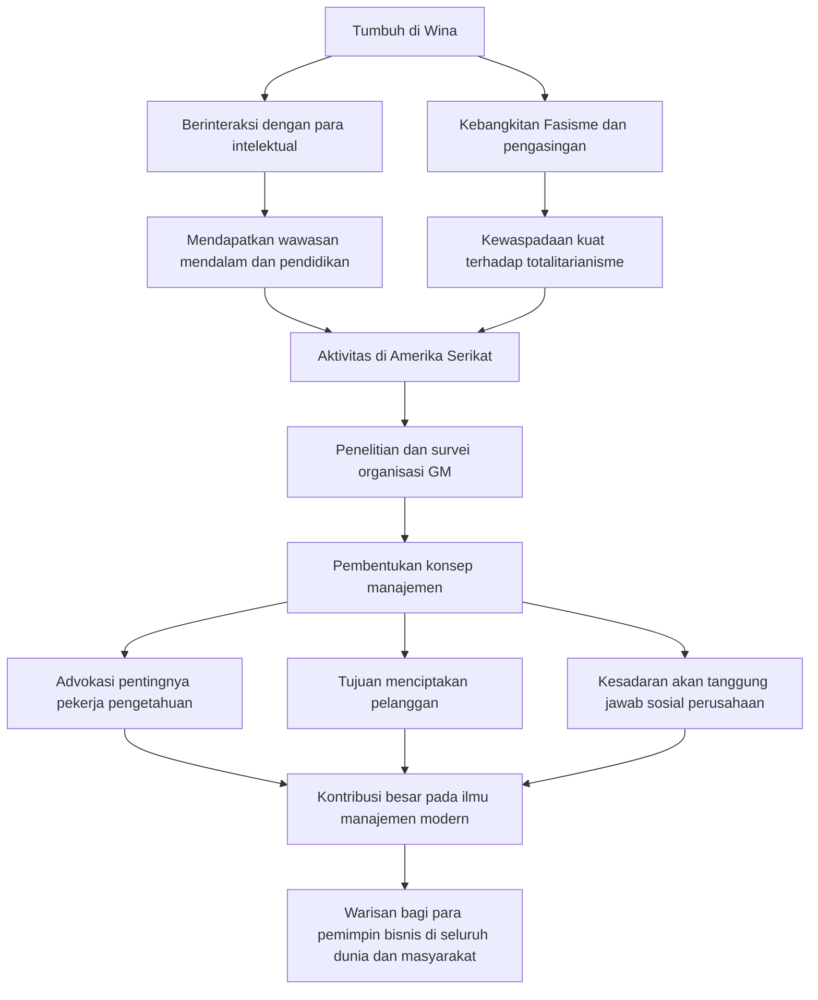

Peter F. Drucker, yang dijuluki sebagai "Bapak Manajemen Modern", tidak hanya memberikan pengaruh besar pada dunia bisnis, tetapi juga pada bidang sosiologi dan ilmu politik. Banyak wawasan dan filosofi yang ia tinggalkan tidak memudar hingga hari ini, dan terus memberikan panduan bagi para eksekutif dan pemimpin di seluruh dunia. Dalam artikel ini, kita akan menggali lebih dalam tentang kehidupannya yang luar biasa dan pemikiran manajemen yang ia bangun.

## Latar Belakang Intelektual di Wina

Peter Ferdinand Drucker lahir di Wina, ibu kota Kekaisaran Austro-Hungaria pada tahun 1909. Wina pada saat itu adalah salah satu pusat budaya dan intelektual di Eropa, dan lingkungan keluarganya juga sangat intelektual. Ayahnya adalah seorang pejabat tinggi pemerintah, ibunya adalah seorang intelektual yang belajar kedokteran, dan rumah mereka sering dikunjungi oleh para intelektual terkemuka saat itu, seperti ekonom Joseph Schumpeter dan psikoanalis Sigmund Freud. Tumbuh dengan siraman pengetahuan yang kaya dan dialog inilah yang menjadi titik awal dari pandangan yang luas dan wawasan yang mendalam dari seorang Drucker di kemudian hari.

Namun, dengan kekalahan dalam Perang Dunia I dan runtuhnya kekaisaran, kehidupannya berubah drastis. Drucker muda pindah ke Jerman, belajar hukum internasional di Universitas Frankfurt, sambil memulai kariernya sebagai seorang jurnalis. Di sinilah ia menyaksikan tragedi sejarah kebangkitan Nazi Jerman. Merasakan krisis yang kuat terhadap totalitarianisme, ia melarikan diri ke Inggris pada tahun 1933, dan kemudian berimigrasi ke Amerika Serikat mencari kebebasan dan kemungkinan-kemungkinan baru.

## Penelitian di GM (General Motors) dan Lahirnya Manajemen

Setelah pindah ke Amerika Serikat, Drucker mengajar di universitas sambil meningkatkan aktivitas menulisnya. Titik baliknya adalah pada tahun 1943 ketika ia menerima permintaan dari General Motors (GM), produsen mobil terbesar di dunia saat itu, untuk melakukan survei organisasi. Pada saat itu, upaya untuk mempelajari struktur internal dan organisasi perusahaan besar secara akademis belum pernah ada sebelumnya.

Drucker masuk jauh ke dalam GM, melakukan wawancara dan observasi mendalam mulai dari manajemen puncak hingga pekerja di lapangan. Hasil dari penelitian ini diterbitkan pada tahun 1946 dengan judul "Concept of the Corporation" (Konsep Perusahaan). Dalam buku ini, ia menjelaskan pentingnya "desentralisasi", dan untuk pertama kalinya mengungkapkan bahwa perusahaan bukanlah sekadar mesin pencetak keuntungan, melainkan sebuah komunitas tempat manusia bekerja dan merupakan institusi penting yang membentuk masyarakat. Inilah momen lahirnya konsep "manajemen" modern.

## Filosofi Inti Drucker

Di akar filosofi Drucker, selalu ada wawasan yang mendalam tentang "manusia". Inti dari pemikiran manajemennya terangkum dalam poin-poin berikut.

### 1. Bangkitnya Pekerja Pengetahuan (Knowledge Worker)
Ia dengan cepat memprediksi bahwa aktor utama ekonomi akan beralih dari pekerja kasar (manual) menjadi pekerja pengetahuan. Ia menjelaskan bahwa pekerja pengetahuan adalah individu yang bekerja secara mandiri dan menciptakan nilai dengan sendirinya, sehingga mereka membutuhkan motivasi melalui tujuan dan aktualisasi diri, bukan sekadar gaya manajemen komando dan kendali tradisional.

### 2. Menciptakan Pelanggan
"Tujuan dari sebuah perusahaan adalah untuk menciptakan pelanggan." Ini adalah salah satu kutipan Drucker yang paling terkenal. Gagasan bahwa keuntungan bukanlah tujuan perusahaan, melainkan sekadar kondisi yang dihasilkan dari memberikan nilai kepada pelanggan melalui inovasi dan pemasaran, telah menjadi prinsip dasar bisnis modern.

### 3. Tanggung Jawab Sosial
Ia berpendapat bahwa perusahaan adalah organ masyarakat dan harus bertanggung jawab kepada masyarakat. Manajemen tidak hanya sekadar meningkatkan kinerja organisasi, tetapi ia menyajikan standar etika yang tinggi bahwa manajemen adalah elemen penting untuk membuat masyarakat berfungsi lebih baik.

## Pengaruh dan Warisan bagi Generasi Mendatang

Hingga wafatnya pada tahun 2005 di usia 95 tahun, Drucker menerbitkan lebih dari 30 buku dan memberikan konsultasi kepada banyak perusahaan. Pemikirannya juga meresap kuat ke dalam masyarakat korporat Jepang, dan banyak eksekutif terus menjadikan buku-bukunya sebagai pedoman mulai dari periode pertumbuhan ekonomi yang tinggi hingga saat ini.

Bagan alur berikut ini merangkum kehidupan, filosofi, dan pencapaiannya.

Warisan terbesar yang ditinggalkan Peter Drucker mungkin adalah mengangkat "manajemen" dari sekadar teknik bisnis menjadi "seni liberal" (liberal arts) yang melayani martabat manusia dan perkembangan masyarakat. Justru di masa sekarang ini, ketika perubahan begitu cepat dan masa depan tidak pasti, filosofinya yang terus mempertanyakan esensi telah menjadi mercusuar yang tak tergoyahkan, menerangi jalan yang harus kita tempuh.
