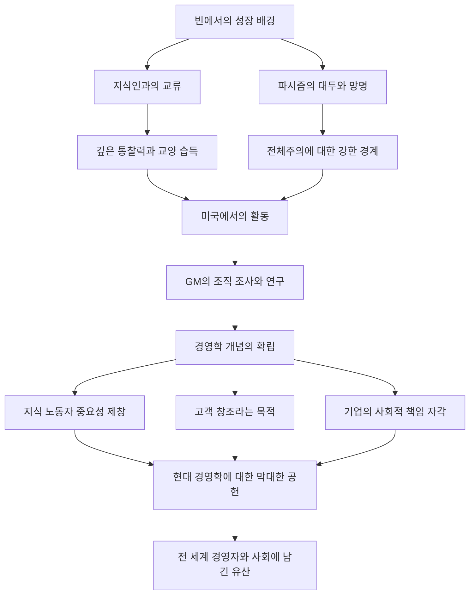

'현대 경영학의 아버지'로 불리며 비즈니스뿐만 아니라 사회학과 정치학 분야에도 막대한 영향을 미친 피터 F. 드러커. 그가 남긴 수많은 통찰과 철학은 오늘날에도 빛을 잃지 않고 전 세계 경영자와 리더들에게 계속해서 이정표를 제시하고 있습니다. 본 기사에서는 그의 기구한 생애와 그가 확립한 경영 철학에 대해 깊이 파헤쳐 봅니다.

## 빈에서의 지적 원풍경

피터 페르디난트 드러커는 1909년 오스트리아-헝가리 제국의 수도 빈에서 태어났습니다. 당시 빈은 유럽 문화와 사상의 중심지 중 하나였으며, 그의 가정 환경 또한 매우 지적이었습니다. 아버지는 정부 고위 관리, 어머니는 의학을 배운 지식인이었으며, 자택에는 경제학자 요제프 슘페터나 정신분석학자 지그문트 프로이트 등 당시 최고의 지성들이 자주 방문했습니다. 이 풍부한 지식과 대화의 샤워를 맞으며 자란 것이 훗날 드러커의 폭넓은 시야와 깊은 통찰력의 원점이 되었습니다.

그러나 제1차 세계대전 패전과 제국의 붕괴로 그의 삶은 완전히 바뀝니다. 젊은 드러커는 독일로 건너가 프랑크푸르트 대학에서 국제법 등을 공부하며 저널리스트로서의 커리어를 시작했습니다. 여기서 그는 나치 독일의 대두라는 역사적 비극을 목격합니다. 전체주의에 대한 강한 위기감을 느낀 그는 1933년 영국으로 피신했고, 이후 자유와 새로운 가능성을 찾아 미국으로 이주했습니다.

## GM(제너럴 모터스) 연구와 경영학의 탄생

미국으로 건너간 드러커는 대학에서 교편을 잡으며 저술 활동을 본격화합니다. 그의 전환점이 된 것은 1943년 세계 최대 자동차 제조업체였던 제너럴 모터스(GM)로부터 받은 조직 조사 의뢰였습니다. 당시 대기업의 내부 구조나 조직의 이상적인 모습을 학술적으로 연구한다는 시도는 전례가 없었습니다.

드러커는 GM 내부에 깊이 들어가 경영진부터 현장 노동자에 이르기까지 철저한 인터뷰와 관찰을 진행했습니다. 이 연구의 성과로 1946년에 출판된 것이 『기업의 개념(Concept of the Corporation)』입니다. 이 저서에서 그는 '분권화'의 중요성을 역설하며, 기업이 단순한 이윤 추구 장치가 아니라 인간이 일하는 공동체이자 사회를 구성하는 중요한 기관임을 처음으로 밝혔습니다. 이것이야말로 현대 '경영학'이라는 개념이 탄생한 순간이었습니다.

## 드러커의 핵심 철학

드러커 철학의 밑바탕에는 항상 '인간'에 대한 깊은 통찰이 있었습니다. 그의 경영 사상의 핵심은 다음의 사항들로 요약됩니다.

### 1. 지식 노동자의 대두
그는 육체노동에서 지식 노동으로 경제의 주역이 이동할 것을 가장 먼저 예측했습니다. 지식 노동자는 자율적으로 일하며 스스로 가치를 창출하는 존재이므로, 기존의 명령 통제형 관리가 아닌 목적과 자아실현을 통한 동기 부여가 필요하다고 설파했습니다.

### 2. 고객의 창조
"기업의 목적은 고객을 창조하는 것이다". 이는 드러커의 가장 유명한 말 중 하나입니다. 이윤은 기업의 목적이 아니라 혁신과 마케팅을 통해 고객에게 가치를 제공한 결과로서 얻어지는 조건에 불과하다는 생각은 현대 비즈니스의 기본 원칙이 되었습니다.

### 3. 사회적 책임
그는 기업이 사회의 기관이며 사회에 대해 책임을 져야 한다고 주장했습니다. 경영은 단순히 조직의 실적을 올리는 것뿐만 아니라 사회를 더 잘 기능하게 만드는 필수 불가결한 요소라는 높은 윤리관을 제시했습니다.

## 후세에 미친 영향과 유산

2005년 95세의 나이로 세상을 떠날 때까지 드러커는 30권이 넘는 저서를 세상에 내놓았고 많은 기업을 컨설팅했습니다. 일본 기업 사회에서도 그의 사상은 깊이 침투해 있어 고도 경제 성장기부터 현재에 이르기까지 많은 경영자가 그의 저서를 바이블로 삼고 있습니다.

그의 생애와 사상, 공적을 요약한 흐름도는 다음과 같습니다.

피터 드러커가 남긴 가장 큰 유산은 '경영'을 단순한 비즈니스 기법에서 인간의 존엄과 사회 발전에 이바지하는 하나의 '리버럴 아츠(교양)'로 승화시킨 것일 것입니다. 변화가 극심하고 앞날이 불투명한 현대에서야말로 본질을 끊임없이 질문한 그의 철학은 우리가 나아가야 할 길을 비추는 흔들림 없는 등대가 되고 있습니다.
