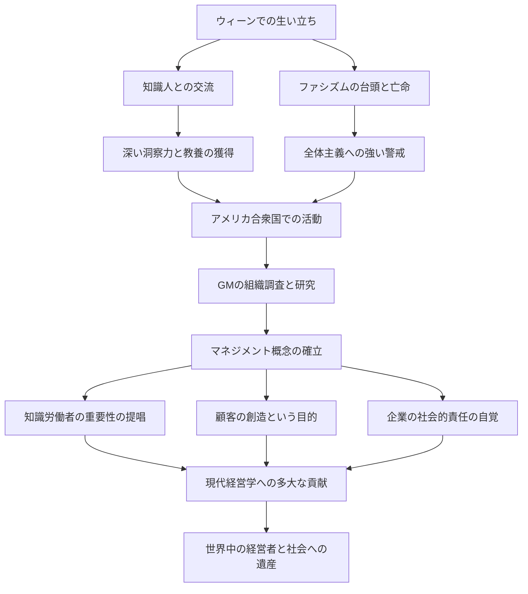

「現代マネジメントの父」と称され、ビジネスのみならず、社会学や政治学の分野にも多大な影響を与えたピーター・F・ドラッカー。彼が残した数々の洞察と哲学は、今日においても色褪せることなく、世界中の経営者やリーダーたちに道標を提供し続けています。本記事では、その数奇な生涯と、彼が確立したマネジメントの思想について深く掘り下げます。

## ウィーンでの知的な原風景

ピーター・フェルディナンド・ドラッカーは、1909年にオーストリア・ハンガリー帝国の首都ウィーンで生まれました。当時のウィーンは、ヨーロッパにおける文化・思想の中心地の一つであり、彼の家庭環境もまた非常に知的なものでした。父親は政府の高官、母親は医学を学んだ知識人であり、自宅には経済学者のヨーゼフ・シュンペーターや精神分析学者のジークムント・フロイトなど、当時の最高峰の知性が頻繁に訪れていました。この豊かな知識と対話のシャワーを浴びて育ったことが、後のドラッカーの幅広い視野と深い洞察力の原点となります。

しかし、第一次世界大戦の敗戦と帝国の崩壊により、彼の生活は一変します。若きドラッカーはドイツへ渡り、フランクフルト大学で国際法などを学びながら、ジャーナリストとしてのキャリアをスタートさせました。ここで彼は、ナチス・ドイツの台頭という歴史的悲劇を目の当たりにします。全体主義への強い危機感を抱いた彼は、1933年にイギリスへ逃れ、その後、自由と新たな可能性を求めてアメリカ合衆国へと移住しました。

## GM（ゼネラル・モーターズ）研究とマネジメントの誕生

アメリカに渡ったドラッカーは、大学で教鞭をとりながら著述活動を本格化させます。彼の転機となったのは、1943年に世界最大の自動車メーカーであったゼネラル・モーターズ（GM）から受けた組織調査の依頼でした。当時、大企業の内部構造や組織のあり方を学術的に研究するという試みは前例がありませんでした。

ドラッカーはGMの内部に深く入り込み、経営陣から現場の労働者に至るまで徹底的なインタビューと観察を行いました。この研究の成果として1946年に出版されたのが『企業とは何か（Concept of the Corporation）』です。この著作の中で彼は、「分権化」の重要性を説き、企業が単なる利益追求の装置ではなく、人間が働くコミュニティであり、社会を構成する重要な機関であることを初めて明らかにしました。これこそが、現代の「マネジメント」という概念が誕生した瞬間でした。

## ドラッカーの核となる哲学

ドラッカーの哲学の根底には、常に「人間」に対する深い洞察がありました。彼のマネジメント思想の核心は、以下の点に集約されます。

### 1. 知識労働者の台頭
彼は、肉体労働から知識労働へと経済の主役が移行することをいち早く予測しました。知識労働者は自律的に働き、自ら価値を創造する存在であり、従来の命令統制型の管理ではなく、目的と自己実現を通じた動機付けが必要であると説きました。

### 2. 顧客の創造
「企業の目的は、顧客の創造である」。これはドラッカーの最も有名な言葉の一つです。利益は企業の目的ではなく、イノベーションとマーケティングを通じて顧客に価値を提供した結果としてもたらされる条件に過ぎないという考え方は、現代ビジネスの基本原則となっています。

### 3. 社会的責任
企業は社会の機関であり、社会に対して責任を負うべきであると彼は主張しました。マネジメントは単に組織の業績を上げるだけでなく、社会をより良く機能させるための不可欠な要素であるという高い倫理観を提示しました。

## 後世への影響と遺産

2005年に95歳で世を去るまで、ドラッカーは30冊を超える著作を世に送り出し、多くの企業のコンサルティングを行いました。日本の企業社会においても彼の思想は深く浸透しており、高度経済成長期から現在に至るまで、多くの経営者が彼の著書をバイブルとしています。

彼の生涯と思想、功績をまとめたフロー図は以下の通りです。

ピーター・ドラッカーが残した最大の遺産は、「マネジメント」を単なるビジネスの手法から、人間の尊厳と社会の発展に奉仕する一つの「リベラル・アーツ（教養）」へと昇華させたことでしょう。変化が激しく、先行きが不透明な現代においてこそ、本質を問い続けた彼の哲学は、私たちが進むべき道を照らす揺るぎない灯台となっています。
