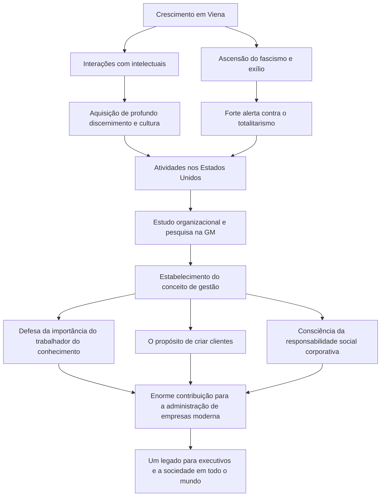

Conhecido como o "pai da gestão moderna", Peter F. Drucker exerceu um impacto profundo não apenas nos negócios, mas também nas áreas da sociologia e da ciência política. Os inúmeros insights e a filosofia que ele deixou continuam tão relevantes hoje como sempre, servindo como um guia para executivos e líderes em todo o mundo. Neste artigo, vamos aprofundar em sua vida notável e na filosofia de gestão que ele estabeleceu.

## A Paisagem Intelectual Original em Viena

Peter Ferdinand Drucker nasceu em 1909 em Viena, a capital do Império Austro-Húngaro. Na época, Viena era um dos principais centros culturais e intelectuais da Europa, e seu ambiente familiar também era profundamente intelectual. Seu pai era um alto funcionário do governo e sua mãe uma intelectual com formação em medicina. A sua casa era frequentemente visitada por algumas das mentes mais brilhantes da época, incluindo o economista Joseph Schumpeter e o psicanalista Sigmund Freud. Crescer imerso nesta riqueza de conhecimento e diálogo foi a base da ampla perspectiva e profundo discernimento que Drucker desenvolveria mais tarde.

No entanto, a derrota na Primeira Guerra Mundial e o colapso do império mudaram sua vida drasticamente. O jovem Drucker mudou-se para a Alemanha, iniciando sua carreira como jornalista enquanto estudava direito internacional na Universidade de Frankfurt. Lá, ele testemunhou a tragédia histórica da ascensão da Alemanha nazista. Sentindo um forte senso de crise em relação ao totalitarismo, ele fugiu para o Reino Unido em 1933 e depois imigrou para os Estados Unidos em busca de liberdade e novas oportunidades.

## O Estudo da GM (General Motors) e o Nascimento da Gestão

Após se mudar para os EUA, Drucker começou a escrever intensivamente enquanto lecionava na universidade. Seu ponto de virada ocorreu em 1943, quando recebeu um convite para realizar um estudo organizacional na General Motors (GM), então a maior montadora do mundo. Naquela época, tentar um estudo acadêmico da estrutura interna e organização de uma grande corporação era sem precedentes.

Drucker mergulhou fundo na GM, conduzindo entrevistas exaustivas e observações, desde a diretoria até os trabalhadores do chão de fábrica. O resultado desta pesquisa foi o livro "Concept of the Corporation" (O Conceito de Corporação), publicado em 1946. Neste trabalho, ele argumentou a importância da "descentralização" e revelou pela primeira vez que uma corporação não é meramente uma máquina para buscar lucro, mas uma comunidade onde os humanos trabalham e uma instituição crucial na sociedade. Este foi o momento em que nasceu o conceito de "gestão" moderna.

## A Filosofia Central de Drucker

No coração da filosofia de Drucker estava sempre uma profunda percepção sobre os "seres humanos". O núcleo de sua filosofia de gestão pode ser resumido nos seguintes pontos:

### 1. A Ascensão do Trabalhador do Conhecimento
Ele previu muito cedo que a força motriz da economia mudaria do trabalho manual para o trabalho do conhecimento. Os trabalhadores do conhecimento operam autonomamente e criam valor por si mesmos. Ele argumentou que, em vez da gestão tradicional de comando e controle, eles exigem motivação através de propósito e autorrealização.

### 2. A Criação de Clientes
"O propósito de uma empresa é criar um cliente." Esta é uma das frases mais famosas de Drucker. A ideia de que o lucro não é o objetivo da empresa, mas apenas uma condição resultante da entrega de valor aos clientes através da inovação e do marketing, tornou-se um princípio fundamental dos negócios modernos.

### 3. Responsabilidade Social
Ele argumentou que as corporações são instituições sociais e devem ser responsáveis perante a sociedade. Apresentou um alto padrão ético em que a gestão não serve apenas para melhorar o desempenho de uma organização, mas é um elemento indispensável para fazer a sociedade funcionar melhor.

## Influência e Legado para as Gerações Futuras

Até falecer aos 95 anos em 2005, Drucker publicou mais de 30 livros e prestou consultoria a inúmeras empresas. Sua filosofia também está profundamente enraizada na sociedade corporativa japonesa; desde o período de rápido crescimento econômico até hoje, muitos executivos consideram seus livros como verdadeiras bíblias.

Um fluxograma resumindo sua vida, filosofia e conquistas é apresentado a seguir:

Talvez o maior legado deixado por Peter Drucker seja ter elevado a "gestão" de uma mera técnica de negócios a uma das "artes liberais", servindo à dignidade humana e ao desenvolvimento social. Numa era de mudanças rápidas e futuro incerto, a sua filosofia, que sempre questionou a essência das coisas, continua a ser um farol inabalável a iluminar o caminho que devemos seguir.
