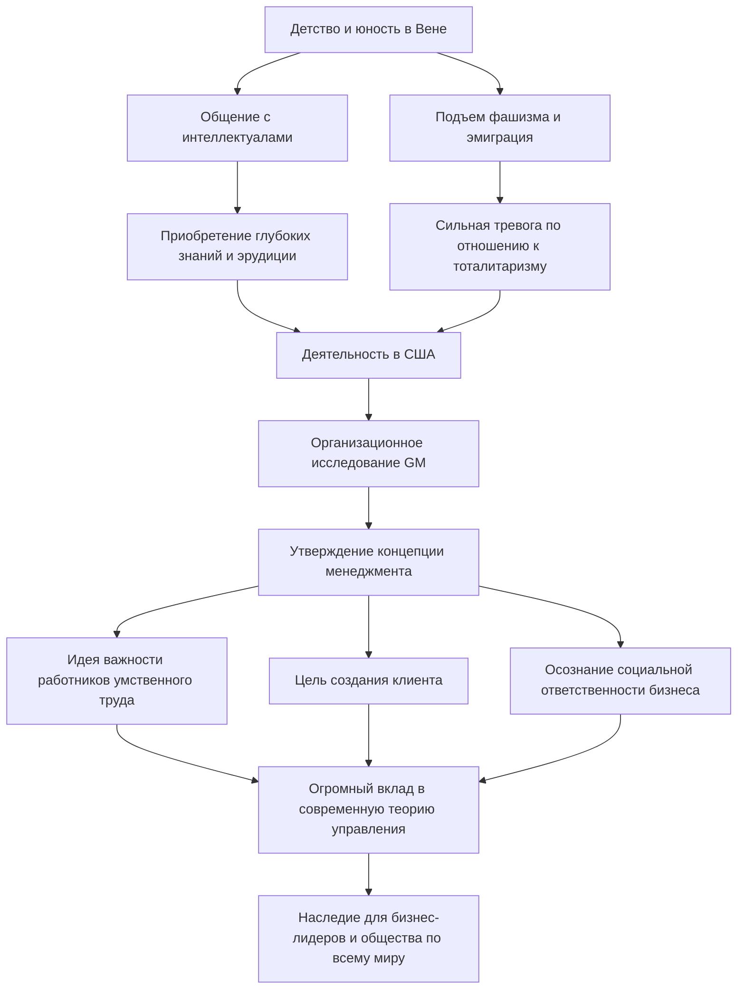

Питер Ф. Друкер, которого называют «отцом современного менеджмента», оказал огромное влияние не только на бизнес, но и на социологию и политологию. Множество его инсайтов и философских концепций не утратили своей актуальности и сегодня, продолжая служить ориентиром для руководителей и лидеров по всему миру. В этой статье мы подробно рассмотрим его необычную жизнь и созданную им философию менеджмента.

## Интеллектуальные истоки в Вене

Питер Фердинанд Друкер родился в 1909 году в Вене, столице Австро-Венгерской империи. В то время Вена была одним из центров культуры и мысли в Европе, и атмосфера в его семье также была исключительно интеллектуальной. Его отец был высокопоставленным правительственным чиновником, а мать — образованной женщиной, изучавшей медицину. В их доме часто гостили величайшие умы того времени, такие как экономист Йозеф Шумпетер и психоаналитик Зигмунд Фрейд. Взросление под таким потоком богатых знаний и диалогов стало отправной точкой для широкого кругозора и глубокой проницательности Друкера в будущем.

Однако поражение в Первой мировой войне и распад империи кардинально изменили его жизнь. Молодой Друкер переехал в Германию, где, изучая международное право во Франкфуртском университете, начал карьеру журналиста. Здесь он стал свидетелем исторической трагедии — прихода к власти нацистской Германии. Испытывая сильное чувство опасности из-за угрозы тоталитаризма, он бежал в Великобританию в 1933 году, а затем, в поисках свободы и новых возможностей, эмигрировал в Соединенные Штаты Америки.

## Исследование GM (General Motors) и рождение менеджмента

Переехав в Америку, Друкер начал преподавать в университете и всерьез занялся писательской деятельностью. Поворотным моментом для него стала просьба провести исследование организации, поступившая в 1943 году от General Motors (GM), крупнейшего на тот момент автопроизводителя в мире. В то время академических исследований внутренней структуры и принципов организации крупных корпораций просто не существовало.

Друкер глубоко погрузился во внутреннюю среду GM, проведя тщательные интервью и наблюдения, охватывающие всех — от топ-менеджмента до рядовых рабочих. Результатом этого исследования стала книга «Концепция корпорации» (Concept of the Corporation), опубликованная в 1946 году. В этом труде он объяснил важность «децентрализации» и впервые показал, что корпорация — это не просто механизм для извлечения прибыли, а сообщество людей и важный институт, составляющий общество. Именно в этот момент родилась концепция современного «менеджмента».

## Ключевая философия Друкера

В основе философии Друкера всегда лежало глубокое понимание «человека». Суть его идей управления сводится к следующим пунктам:

### 1. Возникновение работников умственного труда
Он одним из первых предсказал переход экономики от физического труда к умственному. Работники умственного труда работают автономно и сами создают ценность. Друкер утверждал, что им требуется не традиционное управление командно-административного типа, а мотивация через цели и самореализацию.

### 2. Создание клиента
«Цель бизнеса — создание клиента». Это одно из самых известных высказываний Друкера. Идея о том, что прибыль — это не цель бизнеса, а лишь условие, возникающее как результат предоставления ценности клиентам посредством инноваций и маркетинга, стала базовым принципом современного бизнеса.

### 3. Социальная ответственность
Он утверждал, что корпорация является общественным институтом и должна нести ответственность перед обществом. Менеджмент не только повышает эффективность организации, но и представляет собой высокий этический стандарт — неотъемлемый элемент улучшения функционирования общества.

## Влияние на потомков и наследие

До своей смерти в 2005 году в возрасте 95 лет Друкер написал более 30 книг и консультировал множество компаний. Его идеи глубоко укоренились и в японской корпоративной культуре: со времен высоких темпов экономического роста и до наших дней многие руководители считают его книги своей библией.

Блок-схема, обобщающая его жизнь, философию и достижения, представлена ниже:

Возможно, величайшее наследие, оставленное Питером Друкером, заключается в том, что он возвысил «менеджмент» от простого инструмента бизнеса до одного из видов «свободных искусств» (либеральных искусств), служащих человеческому достоинству и развитию общества. В нашу эпоху стремительных перемен и неопределенности его философия, постоянно ищущая суть вещей, остается непоколебимым маяком, освещающим нам путь.
