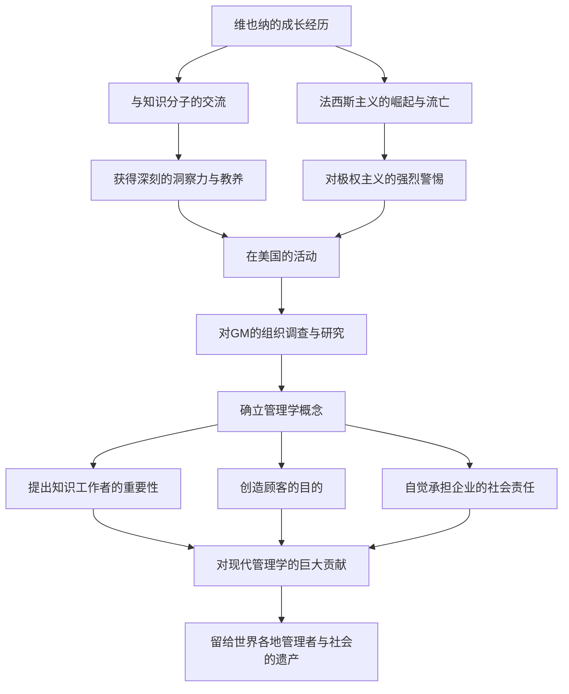

被誉为“现代管理学之父”，彼得·F·德鲁克不仅对商业领域，甚至在社会学和政治学领域都产生了深远的影响。他留下的诸多洞察与哲学，在今天依然历久弥新，继续为世界各地的管理者和领导者指引方向。本文将深入探讨他不平凡的一生以及他所创立的管理学思想。

## 维也纳的知性启蒙

彼得·费迪南德·德鲁克于1909年出生在奥匈帝国首都维也纳。当时的维也纳是欧洲文化与思想的中心之一，他的家庭环境也充满了浓厚的知性氛围。父亲是政府高官，母亲是学过医学的知识分子。在他们的家中，经济学家约瑟夫·熊彼特、精神分析学家西格蒙德·弗洛伊德等当时顶尖的知识精英是常客。在这种丰富知识与对话的熏陶中成长，成为了后来德鲁克广阔视野和深刻洞察力的源泉。

然而，随着第一次世界大战的战败和帝国的崩溃，他的生活发生了巨变。年轻的德鲁克前往德国，在法兰克福大学学习国际法等课程的同时，开启了记者的职业生涯。在这里，他目睹了纳粹德国崛起这一历史悲剧。对极权主义抱有强烈危机感的他，于1933年逃亡英国，随后为了寻求自由与新的可能性，移民到了美国。

## 通用汽车（GM）研究与管理学的诞生

来到美国的德鲁克在大学任教的同时，开始全面投入写作。他的转折点出现在1943年，当时他接受了世界最大的汽车制造商——通用汽车（GM）的组织调查委托。在当时，从学术角度研究大企业内部结构和组织形态的尝试是史无前例的。

德鲁克深入通用汽车内部，对从管理层到一线工人的各个层级进行了彻底的采访与观察。这项研究的成果便是1946年出版的《公司的概念》（Concept of the Corporation）。在这部著作中，他阐述了“分权”的重要性，并首次明确提出：企业不仅仅是追求利润的机器，更是人类工作的社区，是构成社会的重要机构。这正是现代“管理学”概念诞生的瞬间。

## 德鲁克的核心哲学

德鲁克哲学的根基，始终是对“人”的深刻洞察。他的管理学思想的核心，可以归纳为以下几点：

### 1. 知识工作者的崛起
他很早就预测到经济的主角将从体力劳动向知识劳动转移。知识工作者是自主工作、自我创造价值的存在，他主张对他们不能采用传统的命令控制型管理，而是需要通过目标和自我实现来进行激励。

### 2. 创造顾客
“企业的目的是创造顾客。”这是德鲁克最著名的话语之一。利润不是企业的目的，而仅仅是通过创新和营销向顾客提供价值后所带来的结果和条件。这一观点已成为现代商业的基本原则。

### 3. 社会责任
他主张企业是社会的机构，应该对社会负责。他提出了一种崇高的伦理观：管理不仅是为了提升组织的业绩，更是使社会更好运转不可或缺的要素。

## 对后世的影响与遗产

直到2005年以95岁高龄逝世，德鲁克一生出版了30多部著作，并为许多企业提供了咨询服务。他的思想也深深渗透到了日本的企业社会中，从经济高速增长期至今，许多经营者都将他的著作奉为圭臬。

总结他生平、思想与功绩的流程图如下：

彼得·德鲁克留下的最大遗产，或许就是将“管理”从单纯的商业手段，升华为了服务于人类尊严与社会发展的一门“博雅艺术（通识教育）”。正是在这个变化剧烈、前景不明的现代社会，他那始终追问本质的哲学，已成为照亮我们前行道路的坚定灯塔。
