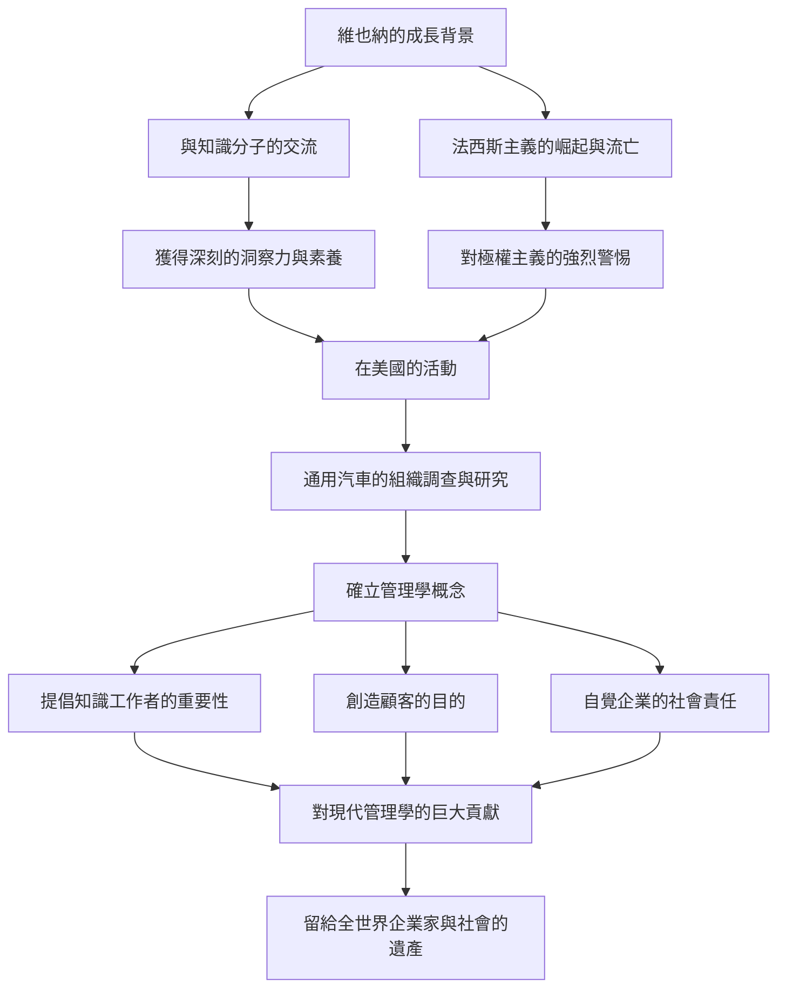

被譽為「現代管理學之父」，不僅在商業領域，甚至對社會學與政治學領域都產生了巨大影響的彼得·F·杜拉克。他留下的無數洞察與哲學，至今依然沒有褪色，持續為世界各地的企業家與領導者提供指引。本文將深入探討他波瀾壯闊的一生以及他所確立的管理學思想。

## 維也納的知性啟蒙

彼得·費迪南·杜拉克於 1909 年出生於奧匈帝國首都維也納。當時的維也納是歐洲文化與思想的中心之一，他的家庭環境也非常具有知性。父親是政府高官，母親是學習過醫學的知識分子，家中經常有當時最頂尖的知識分子來訪，如經濟學家約瑟夫·熊彼特和精神分析學家西格蒙德·佛洛伊德等。在這種豐富知識與對話的薰陶下成長，成為杜拉克日後廣闊視野與深刻洞察力的原點。

然而，隨著第一次世界大戰的戰敗與帝國的瓦解，他的生活發生了巨變。年輕的杜拉克前往德國，在法蘭克福大學學習國際法等課程的同時，開始了他作為記者的職業生涯。在這裡，他親眼目睹了納粹德國崛起的歷史悲劇。對極權主義抱有強烈危機感的他，於 1933 年逃往英國，隨後為尋求自由與新的可能性，移民至美國。

## 通用汽車（GM）研究與管理學的誕生

來到美國的杜拉克，一邊在大學任教，一邊正式展開寫作活動。他的人生轉捩點，是 1943 年接受當時世界最大汽車製造商通用汽車（GM）委託的組織調查。在當時，從學術角度研究大企業內部結構與組織運作方式的嘗試，是史無前例的。

杜拉克深入 GM 內部，從管理層到現場工人，進行了徹底的訪談與觀察。這項研究的成果便是 1946 年出版的《企業的概念》（Concept of the Corporation）。在這本著作中，他闡述了「分權化」的重要性，並首次明確指出企業不僅僅是追求利潤的機器，而是人類工作的社群，也是構成社會的重要機構。這正是現代「管理學」概念誕生的瞬間。

## 杜拉克的核心哲學

杜拉克哲學的根底，始終存在著對「人」的深刻洞察。他的管理思想核心，可以歸結為以下幾點：

### 1. 知識工作者的崛起
他很早便預測到經濟的主角將從體力勞動轉向知識勞動。他主張，知識工作者是自主工作、自我創造價值的存在，需要的不再是傳統的命令與控制型管理，而是透過目標與自我實現來進行激勵。

### 2. 創造顧客
「企業的目的，就是創造顧客」。這是杜拉克最著名的一句話。他認為利潤並非企業的目的，而是透過創新與行銷為顧客提供價值後所帶來的結果，這種觀念已成為現代商業的基本原則。

### 3. 社會責任
他主張企業是社會的機構，應該對社會承擔責任。他提出了一種崇高的道德觀，認為管理學不僅僅是提升組織的業績，更是讓社會更好運作的不可或缺的要素。

## 對後世的影響與遺產

直到 2005 年以 95 歲高齡辭世為止，杜拉克一生留下了超過 30 本著作，並為許多企業提供顧問服務。他的思想在亞洲的企業社會中也深深紮根，從經濟高度成長期到現在，許多經營者依然將他的著作奉為圭臬。

總結他的一生、思想與功績的流程圖如下：

彼得·杜拉克留下的最大遺產，或許就是將「管理學」從單純的商業手法，昇華為一種服務於人類尊嚴與社會發展的「博雅教育」（Liberal Arts）。正是在變化劇烈、前景不明的現代社會中，他那持續探究事物本質的哲學，更成為了照亮我們前進道路的堅定燈塔。
