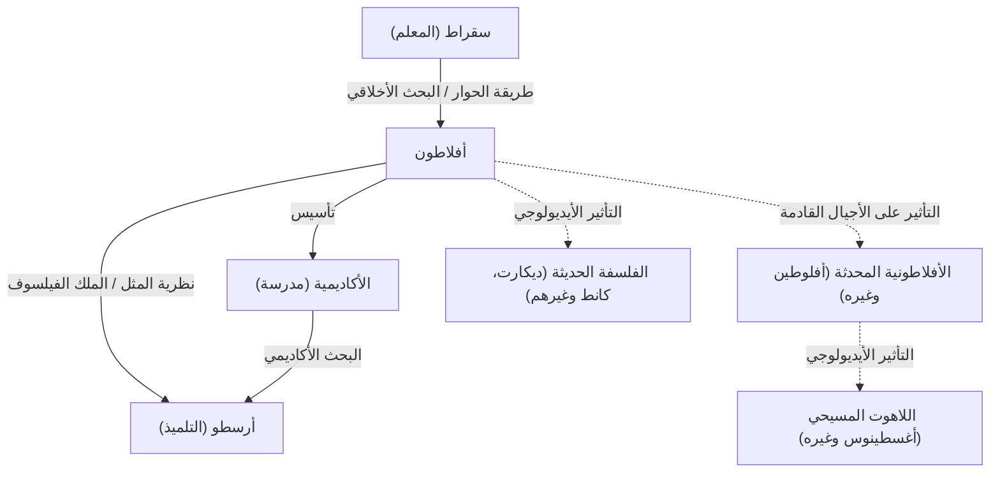

أرسى أفلاطون، أحد أبرز فلاسفة اليونان القديمة، أسس الفلسفة الغربية. وبصفته تلميذًا لسقراط ومعلمًا لأرسطو، ترك وراءه العديد من الأفكار للأجيال القادمة من خلال محاوراته. أثرت مفاهيم مثل "نظرية المثل" (أو الأفكار) بشكل عميق ليس فقط على الفلسفة، بل أيضًا على العلوم السياسية والأخلاق وعلم اللاهوت. كان حضوره طاغيًا لدرجة أن الفيلسوف البريطاني وايتهيد أشار في مقولته الشهيرة إلى أن "التاريخ العام للفلسفة الأوروبية ليس سوى سلسلة من الهوامش على محاورات أفلاطون".

في هذا المقال، نتعمق في حياة أفلاطون، وأفكاره الفلسفية الأساسية، وتأثيره على الأجيال اللاحقة.

## حياة أفلاطون: لقاء سقراط وتأسيس الأكاديمية

وُلد أفلاطون (حوالي 427 ق.م - حوالي 347 ق.م) في عائلة أرستقراطية قوية في أثينا. في شبابه، كان يطمح إلى أن يصبح سياسيًا، لكن حياته تغيرت بشكل حاسم بعد لقائه بالفيلسوف سقراط. تأثر أفلاطون بشدة بأفكار سقراط وأسلوب حياته، وأصبح تلميذه المخلص.

ومع ذلك، في عام 399 ق.م، حوكم معلمه سقراط في محكمة شعبية أثينية بتهمة "إفساد الشباب وعدم الإيمان بآلهة الدولة"، وحُكم عليه بالإعدام. شكل هذا الحدث العبثي صدمة لا تُقاس لأفلاطون الشاب. وإدراكًا منه التام لحدود الديمقراطية (التي كان ينظر إليها في ذلك الوقت على أنها حكم الغوغاء)، تخلى عن مساره في السياسة وصمم على متابعة الفلسفة للبحث عن العدالة الحقيقية.

بعد وفاة سقراط، سافر أفلاطون إلى أماكن مثل مصر وإيطاليا، حيث تعلم الرياضيات والمذاهب الدينية من الفيثاغوريين. بعد عودته إلى أثينا حوالي عام 387 ق.م، أسس "الأكاديمية". غالبًا ما تُعتبر هذه أول مؤسسة للتعليم العالي في التاريخ الغربي، وقد جمعت لاحقًا العديد من العلماء اللامعين، بما في ذلك أرسطو، وساهمت بشكل كبير في تقدم المعرفة.

## الأفكار الفلسفية الأساسية: نظرية المثل والملك الفيلسوف

في صميم فلسفة أفلاطون تكمن "نظرية المثل". اعتقد أفلاطون أن العالم الذي ندركه بحواسنا (العالم الظاهري) هو مجرد ظل مؤقت، وأن هناك عالمًا منفصلًا ومثاليًا وثابتًا أبديًا للحقيقة (عالم المثل).

على سبيل المثال، أوضح أن "الأشياء الجميلة" المختلفة الموجودة في العالم الحقيقي هي جميلة فقط لأنها تشارك بشكل غير كامل في "مثال الجمال" الموجود في عالم المثل. وجادل بأن الروح البشرية كانت تقيم ذات يوم في عالم المثل وأدركت الحقيقة، لكنها نسيتها عند دخولها الجسد المادي. إن السعي وراء الحقيقة من خلال الفلسفة ليس سوى "تذكر" (Anamnesis) لتلك المثل المنسية.

علاوة على ذلك، في فكره السياسي، جعل من "الملك الفيلسوف" نموذجًا مثاليًا. في عمله الرئيسي *الجمهورية*، أكد أفلاطون أنه ما لم يحكم الدولة الحكماء الحقيقيون (الفلاسفة) الذين يمكنهم إدراك المثل، أو يدرس من هم في السلطة الفلسفة بصدق، فلن تنتهي مصائب الدولة أبدًا. كان هذا أيضًا نقدًا لاذعًا للنظام السياسي الأثيني في عصره الذي دفع معلمه سقراط إلى الموت.

## مخطط Mermaid: العلاقات والتأثير حول أفلاطون

يوضح المخطط التالي شبكة الأشخاص المحيطين بأفلاطون وانتشار تأثيره.

## التأثير على الأجيال القادمة: كمصدر للفكر الغربي

معظم الأعمال التي تركها أفلاطون كُتبت في شكل حوار. تحظى أعمال مثل *المأدبة*، *فايدون*، و*الجمهورية* بتقدير كبير ليس فقط من الناحية الفلسفية، ولكن أيضًا كروائع أدبية، وقد قرأها على نطاق واسع المثقفون العامون خارج دائرة الفلاسفة المتخصصين.

لم يقتصر تأثيره على اليونان القديمة. فقد أثرت "الأفلاطونية المحدثة"، التي تطورت خلال الإمبراطورية الرومانية، بشكل كبير على آباء الكنيسة المسيحية الأوائل (مثل القديس أغسطينوس) وشاركت بعمق في تشكيل اللاهوت المسيحي. كانت النظرة الثنائية للعالم بين عالم المثل والعالم الظاهري ذات صلة وثيقة بالإطار المسيحي لمدينة الله والمدينة الأرضية.

علاوة على ذلك، شهد عصر النهضة إحياءً للفلسفة الأفلاطونية، وفي الفلسفة الحديثة، طور مفكرون مثل ديكارت وكانط حججهم من خلال تتبع أسسهم الأيديولوجية إلى أفلاطون. حتى اليوم، وكما نرى في استخدام مصطلح "الأفلاطونية" في المناقشات المتعلقة بأسس الرياضيات والمنطق، لا يزال إطاره الفكري حيًا.

إن فلسفة أفلاطون ليست مجرد بقايا من الماضي. إن الأسئلة التي طرحها - "ما هي الحقيقة؟"، "ماذا يعني أن نعيش حياة صالحة؟"، و"ما هي الدولة المثالية؟" - لا تزال أسئلة أساسية وعالمية بالنسبة لنا نحن الذين نعيش في مجتمع حديث يتسم بتنوع القيم.
