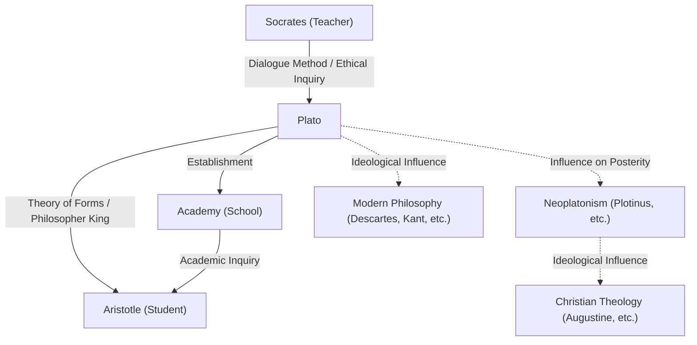

Plato, one of the most prominent philosophers of ancient Greece, laid the foundations of Western philosophy. As a student of Socrates and the teacher of Aristotle, he left behind numerous ideas for future generations through his dialogues. Concepts like the "Theory of Forms" (Ideas) profoundly influenced not only philosophy but also political science, ethics, and theology. His presence is so overwhelming that the British philosopher A.N. Whitehead famously remarked, "The safest general characterization of the European philosophical tradition is that it consists of a series of footnotes to Plato."

In this article, we delve deeply into Plato's life, his core philosophical ideas, and his impact on later generations.

## Plato's Life: Meeting Socrates and Founding the Academy

Plato (c. 427 BC - c. 347 BC) was born into a powerful aristocratic family in Athens. In his youth, he aspired to become a politician, but his life was decisively altered by his encounter with the philosopher Socrates. Deeply impressed by Socrates' thoughts and way of life, Plato became his devoted student.

However, in 399 BC, his teacher Socrates was tried in an Athenian popular court on charges of "corrupting the youth and not believing in the gods of the state," and was sentenced to death. This absurd event was an immeasurable shock to the young Plato. Acutely aware of the limitations of democracy (which he viewed as mob rule at the time), he abandoned his path in politics and resolved to pursue philosophy to seek true justice.

Following the death of Socrates, Plato traveled to places like Egypt and Italy, learning mathematics and religious doctrines from the Pythagoreans. Returning to Athens around 387 BC, he founded the "Academy". This is often considered the first institution of higher learning in Western history, and it later gathered many brilliant scholars, including Aristotle, contributing greatly to the advancement of learning.

## Core Philosophical Ideas: Theory of Forms and Philosopher Kings

At the core of Plato's philosophy is the "Theory of Forms". Plato believed that the world we perceive with our senses (the phenomenal world) is merely a temporary shadow, and that a separate, perfect, and eternally unchanging world of truth (the world of Forms) exists.

For example, he explained that the various "beautiful things" existing in the real world are beautiful only because they imperfectly share in the "Form of Beauty" that exists in the world of Forms. He argued that the human soul once resided in the world of Forms and recognized the truth, but forgot it upon entering the physical body. To seek truth through philosophy is nothing other than "recollecting" (anamnesis) those forgotten Forms.

Furthermore, in his political thought, he idealized the "Philosopher King." In his major work, *The Republic*, Plato asserted that unless true philosophers who can perceive the Forms govern the state, or those in power sincerely study philosophy, the miseries of the state will never end. This was also a stinging critique of the Athenian political system of his time that had driven his teacher Socrates to his death.

## Mermaid Diagram: Relationships and Influence Surrounding Plato

The following diagram illustrates the network of people surrounding Plato and the spread of his influence.

## Influence on Posterity: As the Source of Western Thought

Most of the works Plato left behind were written in dialogue form. Works such as *Symposium*, *Phaedo*, and *The Republic* are highly regarded not only philosophically but also as literary masterpieces, and have been widely read by general intellectuals beyond specialized philosophers.

His influence did not remain confined to ancient Greece. "Neoplatonism," which developed during the Roman Empire, greatly impacted early Christian Church Fathers (such as Augustine) and was deeply involved in the formation of Christian theology. The dualistic worldview of the world of Forms and the phenomenal world had a high affinity with the Christian framework of the City of God and the earthly city.

Furthermore, the Renaissance saw a revival of Platonic philosophy, and in modern philosophy, thinkers like Descartes and Kant developed their arguments by tracing their ideological foundations back to Plato. Even today, as seen in the use of the term "Platonism" in discussions concerning the foundations of mathematics and logic, his framework of thought remains alive.

Plato's philosophy is not merely a relic of the past. The questions he raised—"What is truth?", "What does it mean to live a good life?", and "What is the ideal state?"—continue to be fundamental and universal questions for us living in a modern society with diverse values.
