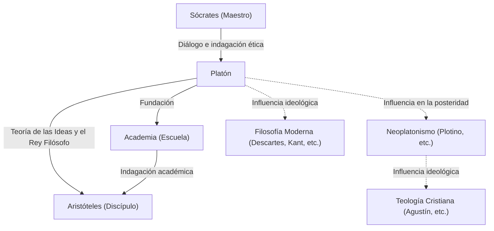

Platón, uno de los filósofos más destacados de la antigua Grecia, sentó las bases de la filosofía occidental. Como estudiante de Sócrates y maestro de Aristóteles, dejó innumerables ideas a las generaciones futuras a través de sus diálogos. Conceptos como la "Teoría de las Ideas" influyeron profundamente no solo en la filosofía, sino también en las ciencias políticas, la ética y la teología. Su presencia es tan abrumadora que el filósofo británico Whitehead comentó: "La historia de la filosofía occidental no es más que una serie de notas a pie de página de Platón".

En este artículo, profundizamos en la vida de Platón, sus ideas filosóficas centrales y su impacto en las generaciones posteriores.

## La vida de Platón: el encuentro con Sócrates y la fundación de la Academia

Platón (c. 427 a. C. - c. 347 a. C.) nació en una poderosa familia aristocrática de Atenas. En su juventud aspiraba a convertirse en político, pero su vida dio un giro decisivo al conocer al filósofo Sócrates. Profundamente impresionado por el pensamiento y la forma de vida de Sócrates, Platón se convirtió en su devoto discípulo.

Sin embargo, en el 399 a. C., su maestro Sócrates fue juzgado en un tribunal popular ateniense acusado de "corromper a los jóvenes y no creer en los dioses del estado", y fue condenado a muerte. Este absurdo evento causó una conmoción incalculable en el joven Platón. Plenamente consciente de las limitaciones de la democracia (que en ese momento veía como el gobierno de la plebe), abandonó la política y decidió dedicarse a la filosofía para buscar la verdadera justicia.

Tras la muerte de Sócrates, Platón viajó a lugares como Egipto e Italia, donde estudió matemáticas y doctrinas religiosas, en parte de los pitagóricos. Al regresar a Atenas alrededor del 387 a. C., fundó la "Academia". A menudo se considera la primera institución de educación superior en la historia occidental y, más tarde, reunió a muchos eruditos brillantes, incluido Aristóteles, contribuyendo en gran medida al desarrollo del conocimiento.

## Ideas filosóficas centrales: la Teoría de las Ideas y el rey filósofo

En el núcleo de la filosofía de Platón se encuentra la "Teoría de las Ideas". Platón creía que el mundo que percibimos a través de nuestros sentidos (el mundo fenoménico) es solo una sombra temporal, y que existe un mundo de la verdad separado, perfecto y eternamente inmutable (el mundo de las Ideas).

Por ejemplo, explicaba que las diversas "cosas hermosas" que existen en el mundo real son hermosas solo porque participan (comparten) imperfectamente de la "Idea de la Belleza" que existe en el mundo de las Ideas. Argumentaba que el alma humana alguna vez residió en el mundo de las Ideas y reconoció la verdad, pero la olvidó al entrar en el cuerpo físico. Buscar la verdad a través de la filosofía no es otra cosa que "recordar" (anamnesis) esas Ideas olvidadas.

Además, en su pensamiento político, idealizó el gobierno del "rey filósofo". En su obra magna, *La República*, Platón afirmó que, a menos que los verdaderos sabios (filósofos) que pueden percibir las Ideas gobiernen el estado, o los gobernantes estudien sinceramente filosofía, las desgracias del estado nunca terminarán. Esto también fue una dura crítica al sistema político ateniense de su tiempo que había llevado a la muerte a su maestro Sócrates.

## Diagrama Mermaid: relaciones e influencia en torno a Platón

El siguiente diagrama ilustra la red de personas que rodean a Platón y la difusión de su influencia.

## Influencia en la posteridad: como fuente del pensamiento occidental

La mayoría de las obras que dejó Platón están escritas en forma de diálogo. Obras como *El Banquete*, *Fedón* y *La República* son muy apreciadas no solo filosóficamente, sino también como obras maestras literarias, y han sido leídas ampliamente por intelectuales más allá de los filósofos especializados.

Su influencia no se limitó a la antigua Grecia. El "Neoplatonismo", que se desarrolló durante el Imperio Romano, tuvo un gran impacto en los primeros Padres de la Iglesia cristiana (como San Agustín) y estuvo profundamente involucrado en la formación de la teología cristiana. La visión del mundo dualista del mundo de las Ideas y el mundo fenoménico tenía una gran afinidad con el marco cristiano de la Ciudad de Dios y la ciudad terrenal.

Además, el Renacimiento vio un renacimiento de la filosofía platónica, y en la filosofía moderna, pensadores como Descartes y Kant desarrollaron sus argumentos rastreando sus bases ideológicas hasta Platón. Incluso hoy en día, como se ve en el uso del término "platonismo" en los debates sobre los fundamentos de las matemáticas y la lógica, su marco de pensamiento sigue vivo.

La filosofía de Platón no es simplemente una reliquia del pasado. Las preguntas que planteó —"¿Qué es la verdad?", "¿Qué significa vivir una buena vida?", y "¿Cuál es el estado ideal?"— siguen siendo preguntas fundamentales y universales para nosotros que vivimos en una sociedad moderna con valores diversos.
