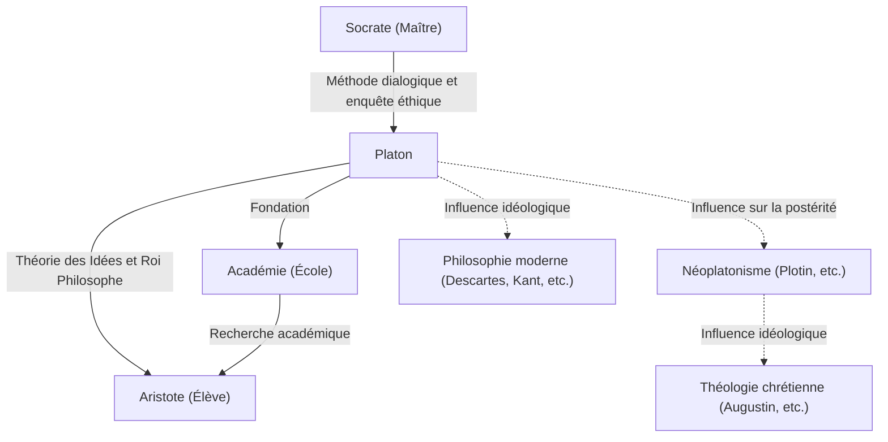

Platon, l'un des philosophes les plus éminents de la Grèce antique, a jeté les bases de la philosophie occidentale. Élève de Socrate et maître d'Aristote, il a laissé de nombreuses idées aux générations futures à travers ses dialogues. Des concepts tels que la « théorie des Idées » ont profondément influencé non seulement la philosophie, mais aussi les sciences politiques, l'éthique et la théologie. Sa présence est si écrasante que le philosophe britannique A.N. Whitehead a fait cette célèbre remarque : « Toute la philosophie occidentale n'est qu'une série de notes de bas de page aux dialogues de Platon. »

Dans cet article, nous plongeons profondément dans la vie de Platon, ses idées philosophiques fondamentales et son impact sur les générations ultérieures.

## La vie de Platon : la rencontre avec Socrate et la fondation de l'Académie

Platon (vers 427 av. J.-C. - vers 347 av. J.-C.) est né dans une puissante famille aristocratique d'Athènes. Dans sa jeunesse, il aspirait à devenir politicien, mais sa vie a été modifiée de manière décisive par sa rencontre avec le philosophe Socrate. Profondément impressionné par les pensées et le mode de vie de Socrate, Platon est devenu son élève dévoué.

Cependant, en 399 av. J.-C., son maître Socrate a été jugé par un tribunal populaire athénien sous l'accusation de « corrompre la jeunesse et de ne pas croire aux dieux de l'État », et a été condamné à mort. Cet événement absurde fut un choc incommensurable pour le jeune Platon. Parfaitement conscient des limites de la démocratie (qu'il considérait alors comme l'ochlocratie, le gouvernement de la foule), il a abandonné la politique et a résolu de se consacrer à la philosophie pour chercher la véritable justice.

Après la mort de Socrate, Platon a voyagé dans des endroits comme l'Égypte et l'Italie, apprenant les mathématiques et les doctrines religieuses auprès des pythagoriciens. De retour à Athènes vers 387 av. J.-C., il fonda l'« Académie ». Celle-ci est souvent considérée comme la première institution d'enseignement supérieur de l'histoire occidentale, et elle a par la suite rassemblé de nombreux savants brillants, dont Aristote, contribuant grandement à l'avancement du savoir.

## Idées philosophiques fondamentales : la théorie des Idées et le roi philosophe

Au cœur de la philosophie de Platon se trouve la « théorie des Idées ». Platon croyait que le monde que nous percevons avec nos sens (le monde sensible) n'est qu'une ombre temporaire, et qu'il existe un monde de la vérité séparé, parfait et éternellement immuable (le monde intelligible ou le monde des Idées).

Par exemple, il expliquait que les diverses « belles choses » existant dans le monde réel ne sont belles que parce qu'elles participent imparfaitement à l'« Idée du Beau » qui existe dans le monde des Idées. Il soutenait que l'âme humaine résidait autrefois dans le monde des Idées et connaissait la vérité, mais l'a oubliée en entrant dans le corps physique. Chercher la vérité à travers la philosophie n'est rien d'autre que se « ressouvenir » (réminiscence ou anamnésis) de ces Idées oubliées.

De plus, dans sa pensée politique, il a idéalisé le « roi philosophe ». Dans son œuvre majeure, *La République*, Platon a affirmé qu'à moins que de véritables sages (philosophes) capables de percevoir les Idées ne gouvernent l'État, ou que ceux au pouvoir n'étudient sincèrement la philosophie, les malheurs de l'État ne prendront jamais fin. C'était aussi une critique cinglante du système politique athénien de son temps qui avait conduit son maître Socrate à la mort.

## Diagramme Mermaid : relations et influence autour de Platon

Le diagramme suivant illustre le réseau de personnes entourant Platon et la diffusion de son influence.

## Influence sur la postérité : comme source de la pensée occidentale

La plupart des œuvres laissées par Platon ont été écrites sous forme de dialogue. Des œuvres telles que *Le Banquet*, *Phédon* et *La République* sont très appréciées non seulement sur le plan philosophique, mais aussi comme des chefs-d'œuvre littéraires, et ont été largement lues par les intellectuels en général, au-delà des philosophes spécialisés.

Son influence n'est pas restée confinée à la Grèce antique. Le « néoplatonisme », qui s'est développé sous l'Empire romain, a eu un impact considérable sur les premiers Pères de l'Église chrétienne (comme saint Augustin) et a été profondément impliqué dans la formation de la théologie chrétienne. La vision du monde dualiste du monde des Idées et du monde sensible avait une forte affinité avec le cadre chrétien de la Cité de Dieu et de la cité terrestre.

De plus, la Renaissance a vu un renouveau de la philosophie platonicienne, et dans la philosophie moderne, des penseurs comme Descartes et Kant ont développé leurs arguments en retraçant leurs fondements idéologiques jusqu'à Platon. Même aujourd'hui, comme on le voit dans l'utilisation du terme « platonisme » dans les discussions concernant les fondements des mathématiques et de la logique, son cadre de pensée reste vivant.

La philosophie de Platon n'est pas simplement une relique du passé. Les questions qu'il a soulevées — « Qu'est-ce que la vérité ? », « Que signifie vivre une bonne vie ? » et « Quel est l'État idéal ? » — continuent d'être des questions fondamentales et universelles pour nous qui vivons dans une société moderne aux valeurs diverses.
