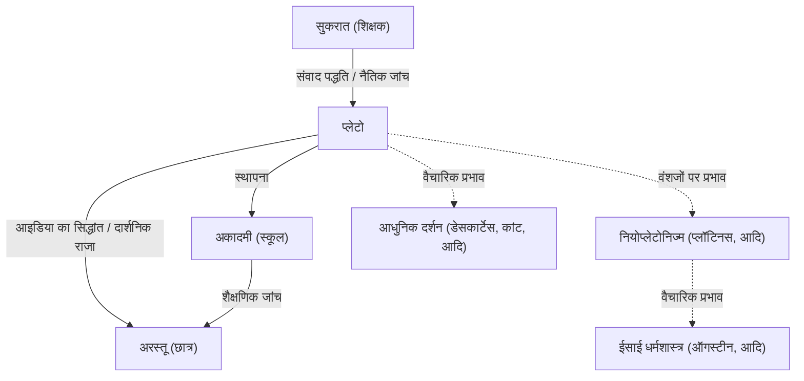

प्राचीन यूनान के सबसे प्रमुख दार्शनिकों में से एक, प्लेटो ने पश्चिमी दर्शन की नींव रखी। सुकरात के छात्र और अरस्तू के शिक्षक के रूप में, उन्होंने अपने संवादों के माध्यम से भविष्य की पीढ़ियों के लिए कई विचार छोड़े। "आइडिया का सिद्धांत" (Theory of Forms) जैसी अवधारणाओं ने न केवल दर्शन को बल्कि राजनीति विज्ञान, नैतिकता और धर्मशास्त्र को भी गहराई से प्रभावित किया। उनकी उपस्थिति इतनी प्रभावशाली है कि ब्रिटिश दार्शनिक ए.एन. व्हाइटहेड ने टिप्पणी की थी, "यूरोपीय दार्शनिक परंपरा की सबसे सुरक्षित सामान्य विशेषता यह है कि इसमें प्लेटो के लिए फुटनोट्स की एक श्रृंखला शामिल है।"

इस लेख में, हम प्लेटो के जीवन, उनके मुख्य दार्शनिक विचारों और बाद की पीढ़ियों पर उनके प्रभाव की गहराई से पड़ताल करेंगे।

## प्लेटो का जीवन: सुकरात से मुलाकात और अकादमी की स्थापना

प्लेटो (लगभग 427 ईसा पूर्व - लगभग 347 ईसा पूर्व) का जन्म एथेंस के एक शक्तिशाली कुलीन परिवार में हुआ था। अपनी युवावस्था में, वे एक राजनेता बनने की आकांक्षा रखते थे, लेकिन दार्शनिक सुकरात के साथ उनकी मुलाकात ने उनके जीवन को निर्णायक रूप से बदल दिया। सुकरात के विचारों और जीवन के तरीके से गहराई से प्रभावित होकर, प्लेटो उनके समर्पित छात्र बन गए।

हालाँकि, 399 ईसा पूर्व में, उनके शिक्षक सुकरात पर "युवाओं को भ्रष्ट करने और राज्य के देवताओं में विश्वास न करने" के आरोप में एथेनियन लोकप्रिय अदालत में मुकदमा चलाया गया और उन्हें मौत की सजा सुनाई गई। यह बेतुकी घटना युवा प्लेटो के लिए एक अथाह सदमा थी। लोकतंत्र की सीमाओं (जिसे वे उस समय भीड़-तंत्र के रूप में देखते थे) से पूरी तरह अवगत होने के कारण, उन्होंने राजनीति में अपना रास्ता छोड़ दिया और सच्चे न्याय की तलाश के लिए दर्शनशास्त्र को आगे बढ़ाने का संकल्प लिया।

सुकरात की मृत्यु के बाद, प्लेटो ने मिस्र और इटली जैसी जगहों की यात्रा की, और पाइथागोरसियों से गणित और धार्मिक सिद्धांतों को सीखा। 387 ईसा पूर्व के आसपास एथेंस लौटकर, उन्होंने "अकादमी" की स्थापना की। इसे अक्सर पश्चिमी इतिहास में उच्च शिक्षा का पहला संस्थान माना जाता है, और बाद में इसने अरस्तू सहित कई शानदार विद्वानों को एक साथ लाया, जिससे सीखने की प्रगति में बहुत योगदान मिला।

## मुख्य दार्शनिक विचार: आइडिया का सिद्धांत और दार्शनिक राजा

प्लेटो के दर्शन के मूल में "आइडिया का सिद्धांत" (Theory of Forms) है। प्लेटो का मानना था कि जिस दुनिया को हम अपनी इंद्रियों (असाधारण दुनिया) से महसूस करते हैं, वह केवल एक अस्थायी छाया है, और सत्य की एक अलग, परिपूर्ण और हमेशा के लिए अपरिवर्तनीय दुनिया (आइडिया या रूपों की दुनिया) मौजूद है।

उदाहरण के लिए, उन्होंने समझाया कि वास्तविक दुनिया में मौजूद विभिन्न "सुंदर चीजें" केवल इसलिए सुंदर हैं क्योंकि वे आइडिया की दुनिया में मौजूद "सुंदरता के विचार" (Form of Beauty) में अपूर्ण रूप से साझा (भाग) करती हैं। उन्होंने तर्क दिया कि मानव आत्मा एक बार आइडिया की दुनिया में रहती थी और सत्य को पहचानती थी, लेकिन भौतिक शरीर में प्रवेश करने पर इसे भूल गई। दर्शन के माध्यम से सत्य की खोज करना उन भूले हुए आइडिया को "याद करने" (anamnesis) के अलावा और कुछ नहीं है।

इसके अलावा, अपने राजनीतिक विचारों में, उन्होंने "दार्शनिक राजा" को आदर्श माना। अपने प्रमुख काम, *द रिपब्लिक* (The Republic) में, प्लेटो ने जोर देकर कहा कि जब तक राज्य पर उन सच्चे विद्वानों (दार्शनिकों) का शासन नहीं होता जो आइडिया को समझ सकते हैं, या सत्ता में रहने वाले लोग ईमानदारी से दर्शन का अध्ययन नहीं करते हैं, तब तक राज्य के दुख कभी समाप्त नहीं होंगे। यह उनके समय की एथेनियन राजनीतिक व्यवस्था की कड़ी आलोचना भी थी जिसने उनके शिक्षक सुकरात को मौत के घाट उतार दिया था।

## Mermaid आरेख: प्लेटो के आसपास के रिश्ते और प्रभाव

निम्नलिखित आरेख प्लेटो के आसपास के लोगों के नेटवर्क और उनके प्रभाव के प्रसार को दर्शाता है।

## वंशजों पर प्रभाव: पश्चिमी विचार के स्रोत के रूप में

प्लेटो द्वारा छोड़े गए अधिकांश कार्य संवाद के रूप में लिखे गए थे। *सिम्पोजियम*, *फेडो* और *द रिपब्लिक* जैसी रचनाओं को न केवल दार्शनिक रूप से बल्कि साहित्यिक उत्कृष्ट कृतियों के रूप में भी अत्यधिक माना जाता है, और उन्हें विशेष दार्शनिकों के अलावा सामान्य बुद्धिजीवियों द्वारा व्यापक रूप से पढ़ा गया है।

उनका प्रभाव केवल प्राचीन यूनान तक ही सीमित नहीं रहा। रोमन साम्राज्य के दौरान विकसित "नियोप्लेटोनिज्म" ने प्रारंभिक ईसाई चर्च के पादरियों (जैसे ऑगस्टीन) को बहुत प्रभावित किया और ईसाई धर्मशास्त्र के निर्माण में गहराई से शामिल था। आइडिया की दुनिया और भौतिक दुनिया के द्वैतवादी विश्वदृष्टि का सिटी ऑफ गॉड और सांसारिक शहर के ईसाई ढांचे के साथ उच्च संबंध था।

इसके अलावा, पुनर्जागरण ने प्लेटोनिक दर्शन का पुनरुद्धार देखा, और आधुनिक दर्शन में, डेसकार्टेस और कांट जैसे विचारकों ने अपने वैचारिक आधारों को प्लेटो में वापस खोजकर अपने तर्कों को विकसित किया। आज भी, जैसा कि गणित और तर्क की नींव के बारे में चर्चाओं में "प्लेटोनिज्म" शब्द के उपयोग में देखा गया है, उनके विचार का ढांचा जीवित है।

प्लेटो का दर्शन केवल अतीत का अवशेष नहीं 단है। उनके द्वारा उठाए गए प्रश्न-"सत्य क्या है?", "अच्छा जीवन जीने का क्या अर्थ है?", और "आदर्श राज्य क्या है?"-आधुनिक समाज में विविध मूल्यों के साथ जीने वाले हमारे लिए मौलिक और सार्वभौमिक प्रश्न बने हुए हैं।
