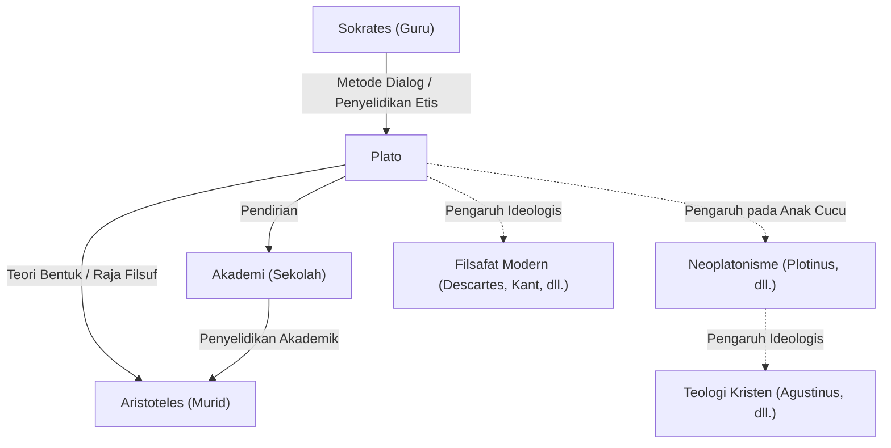

Plato, salah satu filsuf paling terkemuka dari Yunani Kuno, meletakkan dasar filsafat Barat. Sebagai murid Sokrates dan guru Aristoteles, ia meninggalkan banyak pemikiran untuk generasi mendatang melalui dialog-dialognya. Konsep-konsep seperti "Teori Bentuk" (Ide) sangat memengaruhi tidak hanya filsafat tetapi juga ilmu politik, etika, dan teologi. Kehadirannya begitu luar biasa sehingga filsuf Inggris A.N. Whitehead pernah berkata, "Karakterisasi umum yang paling aman dari tradisi filosofis Eropa adalah bahwa itu terdiri dari serangkaian catatan kaki untuk Plato."

Dalam artikel ini, kita mendalami kehidupan Plato, ide-ide filosofis intinya, dan dampaknya pada generasi selanjutnya.

## Kehidupan Plato: Bertemu Sokrates dan Mendirikan Akademi

Plato (sekitar 427 SM - sekitar 347 SM) lahir di keluarga bangsawan yang kuat di Athena. Di masa mudanya, ia bercita-cita menjadi politisi, tetapi hidupnya berubah secara menentukan setelah pertemuannya dengan filsuf Sokrates. Sangat terkesan oleh pemikiran dan cara hidup Sokrates, Plato menjadi muridnya yang setia.

Namun, pada tahun 399 SM, gurunya Sokrates diadili di pengadilan rakyat Athena atas tuduhan "merusak kaum muda dan tidak percaya pada dewa-dewa negara," dan dijatuhi hukuman mati. Peristiwa yang tidak masuk akal ini merupakan kejutan yang tak terukur bagi Plato muda. Sangat menyadari keterbatasan demokrasi (yang ia pandang sebagai kekuasaan massa pada saat itu), ia melepaskan jalannya di bidang politik dan memutuskan untuk mengejar filsafat guna mencari keadilan sejati.

Setelah kematian Sokrates, Plato bepergian ke tempat-tempat seperti Mesir dan Italia, belajar matematika dan doktrin agama dari kelompok Pythagoras. Kembali ke Athena sekitar tahun 387 SM, ia mendirikan "Akademi". Tempat ini sering dianggap sebagai institusi pendidikan tinggi pertama dalam sejarah Barat, dan kemudian mengumpulkan banyak sarjana brilian, termasuk Aristoteles, yang memberikan kontribusi besar pada kemajuan pembelajaran.

## Ide-ide Filosofis Inti: Teori Bentuk dan Raja Filsuf

Inti dari filsafat Plato adalah "Teori Bentuk" (Teori Ide). Plato percaya bahwa dunia yang kita pahami dengan indra kita (dunia fenomenal) hanyalah bayangan sementara, dan bahwa dunia kebenaran yang terpisah, sempurna, dan abadi tidak berubah (dunia Bentuk) itu ada.

Misalnya, ia menjelaskan bahwa berbagai "hal yang indah" yang ada di dunia nyata itu indah hanya karena mereka secara tidak sempurna berbagi (berpartisipasi) dalam "Bentuk Keindahan" yang ada di dunia Bentuk. Ia berargumen bahwa jiwa manusia pernah bersemayam di dunia Bentuk dan mengenali kebenaran, tetapi melupakannya saat memasuki tubuh fisik. Mencari kebenaran melalui filsafat tidak lain adalah "mengingat kembali" (anamnesis) Bentuk-bentuk yang terlupakan itu.

Selain itu, dalam pemikiran politiknya, ia mengidealkan "Raja Filsuf". Dalam karya utamanya, *Republik*, Plato menegaskan bahwa kecuali sarjana sejati (filsuf) yang dapat memahami Bentuk memerintah negara, atau mereka yang berkuasa dengan tulus mempelajari filsafat, kesengsaraan negara tidak akan pernah berakhir. Ini juga merupakan kritik pedas terhadap sistem politik Athena pada masanya yang telah menyebabkan gurunya Sokrates dihukum mati.

## Diagram Mermaid: Hubungan dan Pengaruh Seputar Plato

Diagram berikut mengilustrasikan jaringan orang-orang di sekitar Plato dan penyebaran pengaruhnya.

## Pengaruh pada Anak Cucu: Sebagai Sumber Pemikiran Barat

Sebagian besar karya yang ditinggalkan Plato ditulis dalam bentuk dialog. Karya-karya seperti *Simposium*, *Phaedo*, dan *Republik* sangat dihargai tidak hanya secara filosofis tetapi juga sebagai mahakarya sastra, dan telah banyak dibaca oleh kaum intelektual umum di luar filsuf khusus.

Pengaruhnya tidak terbatas pada Yunani Kuno. "Neoplatonisme," yang berkembang selama Kekaisaran Romawi, sangat memengaruhi Bapak-bapak Gereja Kristen awal (seperti Agustinus) dan sangat terlibat dalam pembentukan teologi Kristen. Pandangan dunia dualistik tentang dunia Bentuk dan dunia fenomenal memiliki kedekatan yang tinggi dengan kerangka kerja Kristen tentang Kota Tuhan dan kota duniawi.

Lebih jauh, Renaisans melihat kebangkitan filsafat Platonis, dan dalam filsafat modern, para pemikir seperti Descartes dan Kant mengembangkan argumen mereka dengan melacak dasar-dasar ideologis mereka kembali ke Plato. Bahkan saat ini, seperti yang terlihat dalam penggunaan istilah "Platonisme" dalam diskusi mengenai dasar-dasar matematika dan logika, kerangka pemikirannya tetap hidup.

Filsafat Plato bukan sekadar peninggalan masa lalu. Pertanyaan-pertanyaan yang diajukannya—"Apa itu kebenaran?", "Apa artinya menjalani kehidupan yang baik?", dan "Apa itu negara yang ideal?"—terus menjadi pertanyaan mendasar dan universal bagi kita yang hidup di masyarakat modern dengan nilai-nilai yang beragam.
