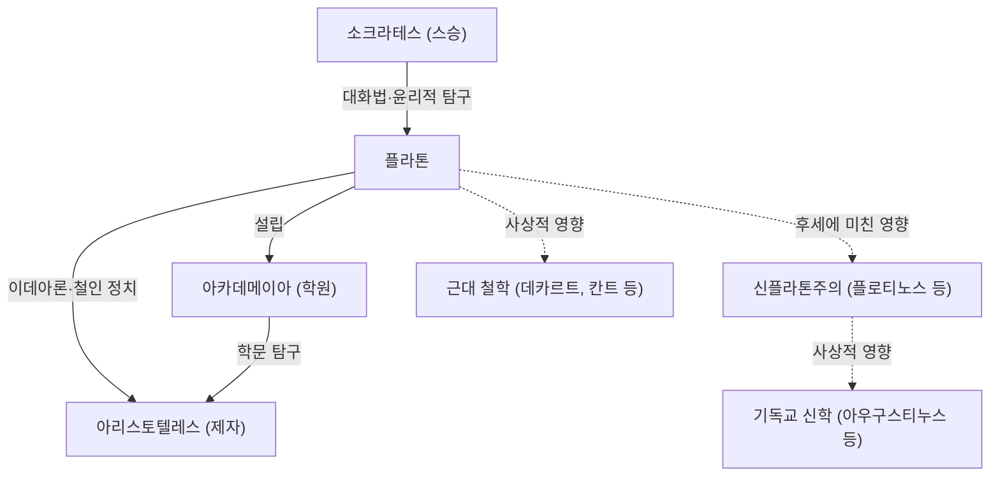

고대 그리스를 대표하는 철학자 중 한 명인 플라톤은 서양 철학의 초석을 다졌습니다. 소크라테스의 제자이자 아리스토텔레스의 스승인 그는 대화편을 통해 수많은 사상을 후세에 남겼으며, "이데아론" 등의 개념으로 철학뿐만 아니라 정치학, 윤리학, 신학에도 지대한 영향을 미쳤습니다. 영국의 철학자 화이트헤드가 "서양 철학의 역사는 플라톤에 대한 일련의 각주에 불과하다"고 평했을 정도로 그의 존재는 압도적입니다.

본 기사에서는 플라톤의 생애, 핵심이 되는 철학 사상, 그리고 후세에 미친 영향에 대해 깊이 있게 살펴봅니다.

## 플라톤의 생애: 소크라테스와의 만남과 아카데메이아 창설

플라톤(기원전 427년경 - 기원전 347년경)은 아테네의 유력한 귀족 가문에서 태어났습니다. 젊은 시절에는 정치가를 지망했지만, 그의 인생을 결정지은 것은 철학자 소크라테스와의 만남이었습니다. 플라톤은 소크라테스의 사상과 삶의 방식에 깊은 감명을 받아 그의 제자가 됩니다.

그러나 기원전 399년, 스승인 소크라테스가 "젊은이들을 타락시키고 국가의 신들을 믿지 않는다"는 죄목으로 아테네의 민중 재판에 회부되어 사형 선고를 받습니다. 이 부조리한 사건은 젊은 플라톤에게 헤아릴 수 없는 충격을 주었습니다. 민주주의(당시의 중우정치)의 한계를 절감한 그는 정치에 대한 뜻을 접고, 진정한 정의를 탐구하는 철학의 길로 나아갈 것을 결심합니다.

소크라테스의 죽음 이후 플라톤은 이집트와 이탈리아 등을 편력하며 피타고라스 학파 등으로부터 수학과 종교적 교의를 배웠습니다. 아테네로 귀환한 그는 기원전 387년경에 학원 "아카데메이아"를 창설합니다. 이곳은 서양 역사상 최초의 고등 교육 기관이라고도 불리며, 훗날 아리스토텔레스를 비롯한 많은 우수한 학자들이 모여 학문의 발전에 기여했습니다.

## 핵심이 되는 철학 사상: 이데아론과 철인 정치

플라톤 철학의 핵심을 이루는 것이 "이데아론"입니다. 플라톤은 우리가 감각으로 파악하고 있는 이 세계(현상계)는 가짜 모습에 불과하며, 완전하고 영원불변하는 진실의 세계(이데아계)가 따로 존재한다고 생각했습니다.

예를 들어, 현실 세계에 존재하는 다양한 "아름다운 것들"은 이데아계에 있는 "미의 이데아"를 불완전하게나마 나누어 가지고(분유하고) 있기 때문에 비로소 아름다운 것이라고 설명합니다. 인간의 영혼은 과거 이데아계에 있었고 진리를 인식하고 있었지만, 육체에 깃들면서 그것을 잊어버리고 말았습니다. 철학을 통해 진리를 탐구하는 것은 그 잊어버린 이데아를 "상기(아남네시스)"하는 것과 다름없다고 설파했습니다.

또한, 정치 사상에 있어서는 "철인 정치"를 이상으로 삼았습니다. 주저 『국가』에서 플라톤은 이데아를 인식할 수 있는 진정한 지자(철학자)가 국가를 통치하거나, 혹은 지배자가 진지하게 철학을 배우지 않는 한 국가의 재앙은 끝나지 않을 것이라고 주장했습니다. 이는 스승 소크라테스를 죽음으로 몰아넣은 당시 아테네의 정치 체제에 대한 통렬한 비판이기도 합니다.

## Mermaid 도해: 플라톤을 둘러싼 상관관계와 영향

다음 그림은 플라톤을 둘러싼 인물 관계와 그 영향의 확산을 보여줍니다.

## 후세에 미친 영향: 서양 사상의 원류로서

플라톤이 남긴 저작은 그 대부분이 대화 형식(대화편)으로 쓰여졌습니다. 『향연』, 『파이돈』, 『국가』 등 문학적으로도 매우 뛰어난 이 작품들은 철학을 전공하는 사람뿐만 아니라 널리 일반 지식인들에게도 읽혀왔습니다.

그의 영향은 고대 그리스에만 머물지 않습니다. 로마 제국 시대에 발전한 "신플라톤주의"는 초기 기독교의 교부들(아우구스티누스 등)에게 지대한 영향을 미쳐 기독교 신학의 형성에 깊이 관여했습니다. 이데아계와 현상계라는 이원론적 세계관은 신의 도성과 지상의 도성이라는 기독교의 틀과 친화성이 높았던 것입니다.

나아가 르네상스 시기에는 플라톤 철학의 부흥이 일어났고, 근대 철학에서도 데카르트나 칸트 등이 그 사상적 기반을 플라톤으로 거슬러 올라가 논의를 전개했습니다. 현대에 있어서도 수학이나 논리학의 기초 짓기에 관한 논의에서 "플라톤주의"라는 말이 사용되는 것처럼, 그의 사고의 틀은 지금도 여전히 살아 숨 쉬고 있습니다.

플라톤의 철학은 단순한 과거의 유물이 아닙니다. "진리란 무엇인가", "선하게 산다는 것은 어떤 것인가", "이상적인 국가란 무엇인가"라는 그가 던진 질문은, 가치관이 다양화되는 현대 사회를 살아가는 우리에게도 근본적이고 보편적인 질문으로 계속 남아 있습니다.
